# Codex Worker Capsule — Approved Architecture Integrated into `codex-orchestrator` Implementation Plan

**Status:** Approved architecture + implementation-plan expansion  
**Target project:** `codex-orchestrator`  
**Created:** 2026-07-02  
**Purpose:** Preserve all approved Worker Capsule reflections, additions, corrections, graphs, phase plans, risks, and implementation details in one large markdown file without compressing the approved content.

---

# 0. Executive Summary

This document integrates the approved **Codex Worker Capsule** architecture into the `codex-orchestrator` implementation plan.

The governing principle is:

```text
Codex is not the owner of truth.
Codex is a worker that must leave durable evidence.
The wrapper/orchestrator decides whether the work is valid.
```

The Worker Capsule is a per-`codex exec` evidence container. It adds a concrete, run-local filesystem surface around every Codex worker attempt.

It is designed to improve the currently proven orchestrator by adding:

```text
1. Run-local durable memory.
2. Run-local stage artifacts.
3. Orchestrator-owned lifecycle events.
4. Machine-written wrapper gates.
5. Transaction group cross-check matrices.
6. Global verification proof matrices.
```

The capsule does **not** replace the existing orchestrator state machine, patchlet reports, durable probes, diff guard, worktree execution, transaction verifier, global verifier, repair planner, rediscovery, real-Codex smoke harness, or run manifest.

It wraps and strengthens them.

---

# 1. Approved Source Reflections Preserved Verbatim

The following section preserves the approved Worker Capsule reflection and implementation plan content that this document expands. This is included so the approved ideas are not lost, shortened, or compressed.

---

Below is my detailed review and implementation plan for adding the **Codex Worker Capsule** architecture into `codex-orchestrator`.

The approved architecture says the key principle is that Codex is not the owner of truth: Codex is a worker that must leave durable evidence, and the wrapper/orchestrator decides whether the work is valid. It also defines the capsule as a per-`codex exec` artifact set with `worker_memory/`, `worker_stage/`, `worker_hooks/`, and `gates/`, explicitly not as one global memory file. 

# 1. Review verdict

The Codex Worker Capsule design is the right next architectural layer.

The current orchestrator already has:

```text id="86f3sm"
state machine
patchlets
reports
probe artifacts
diff guard
transaction verification
global verification
repair planning
rediscovery
worktree execution
run_manifest.json
real-Codex smoke
fake-success parity
safe-failure evidence
```

But the remaining real-Codex problem is that installed Codex still exits before producing valid report/probe artifacts. The capsule solves that by giving each Codex call a smaller, concrete, filesystem-backed operating surface:

```text id="xq9f5k"
TASK_CONTRACT.md
LIVE_MEMORY.md
stage templates
events.jsonl
wrapper_gate_result.json
```

So instead of only giving Codex a large injected prompt, we give it a local run directory that says:

```text id="4rnqde"
Read these files.
Write these files.
Only touch this product file.
Leave this evidence.
The wrapper will validate everything.
```

That is the correct next step.

---

# 2. Implementation strategy overview

Do **not** rewrite the orchestrator. Add the Worker Capsule as an evidence layer around the existing `CodexExecWorker`, `run_patchlet`, worktree, report validation, probe validation, and run manifest paths.

The implementation should happen in this order:

```text id="c6xbui"
Phase 0  — Preflight and current-path mapping
Phase 1  — Worker Capsule schema and path builder
Phase 2  — Capsule creation before worker execution
Phase 3  — Worker memory artifacts
Phase 4  — Worker stage artifacts
Phase 5  — Orchestrator-owned lifecycle events
Phase 6  — Wrapper gate result
Phase 7  — Prompt integration for real Codex
Phase 8  — Failure diagnosis integration
Phase 9  — Transaction group output matrix
Phase 10 — Global proof matrix
Phase 11 — Docs, CLI, and final smoke
```

The first useful milestone is **Phase 6**. At that point, every `codex exec` attempt has a self-contained capsule and a deterministic gate result.

The second useful milestone is **Phase 8**. At that point, the current real-Codex failure should become easier to diagnose because Codex was given a clear capsule and the orchestrator writes gate/diagnosis artifacts.

The third useful milestone is **Phase 10**. At that point, group/global verification become matrix-driven instead of only verdict-driven.

---

# 3. High-level architecture graph

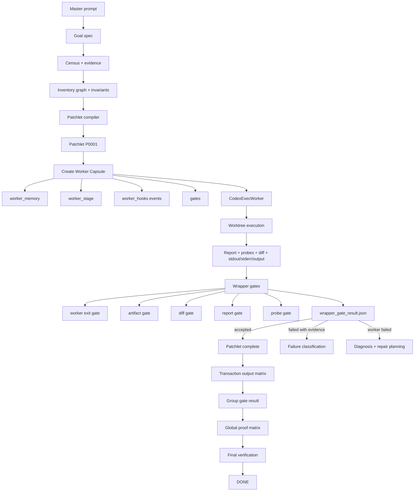

The important change is the new middle layer:

```text id="vkpe9p"
Patchlet → Worker Capsule → Codex worker → Wrapper gates → State transition
```

Right now the orchestrator has strong validators, but the Codex worker itself does not yet get a full run-local memory/stage surface. The capsule fills that gap.

---

# 4. Artifact tree after implementation

Each patchlet attempt should look like this:

```text id="vxttun"
.codex-orchestrator/runs/P0001_attempt1/
  command.json
  stdout.txt
  stderr.txt
  output.jsonl
  diff.patch
  diff_name_status.txt

  worker_memory/
    TASK_CONTRACT.md
    LIVE_MEMORY.md
    LIVE_MEMORY.json
    KNOWN_FACTS.json
    ALLOWED_PATHS.json
    PREVIOUS_FAILURES.md
    CURRENT_STAGE.md
    WRITE_THESE_FILES.md

  worker_stage/
    00_preflight.md
    01_investigation.md
    02_probe_plan.md
    03_implementation.md
    04_validation.md
    05_final_report.md

  worker_hooks/
    events.jsonl
    session_start_context.md
    prompt_submit_context.md
    pre_run_snapshot.json
    post_run_snapshot.json
    failure_snapshot.json

  gates/
    final_status.json
    required_artifacts_check.json
    memory_validation.json
    stage_validation.json
    report_validation.json
    probe_validation.json
    diff_validation.json
    wrapper_gate_result.json

  diagnostics/
    real_codex_failure_diagnosis.json
    real_codex_failure_diagnosis.md
```

This is intentionally inside the existing run directory, not in a global `.codex-state/`.

---

# 5. Phase-by-phase implementation plan

## Phase 0 — Preflight and current-path mapping

### Goal

Map the current implementation before changing anything.

### Inspect

```text id="6s7qae"
src/codex_orchestrator/stages/run_patchlet.py
src/codex_orchestrator/workers/codex_exec.py
src/codex_orchestrator/patchlet_run_context.py
src/codex_orchestrator/worktree.py
src/codex_orchestrator/run_records.py
src/codex_orchestrator/real_codex_smoke.py
src/codex_orchestrator/validators/report_validator.py
src/codex_orchestrator/validators/probe_artifact_validator.py
tests/integration/test_real_codex_smoke_contract.py
tests/integration/test_run_manifest_failures.py
tests/integration/test_auto_worktree.py
```

### Preflight commands

```bash id="e6gy2k"
export UV_CACHE_DIR=/tmp/uv-cache

uv run --no-sync python --version
uv run --no-sync pytest -q
codex --version || true
git status --short
```

### Acceptance

```text id="83hxt8"
Baseline suite is green.
Current real-Codex safe-failure behavior remains understood.
No code changed yet.
```

---

## Phase 1 — Worker Capsule schema and path builder

### Goal

Introduce the capsule data model without changing worker behavior yet.

### New module

```text id="ggizjd"
src/codex_orchestrator/worker_capsule.py
```

### New schemas

```text id="xya5i2"
src/codex_orchestrator/schemas/worker_capsule.schema.json
src/codex_orchestrator/schemas/worker_memory.schema.json
src/codex_orchestrator/schemas/worker_event.schema.json
src/codex_orchestrator/schemas/wrapper_gate_result.schema.json
```

### Core API

```python id="n5pu91"
@dataclass
class WorkerCapsule:
    patchlet_id: str
    attempt_id: str
    run_dir: Path
    worker_memory_dir: Path
    worker_stage_dir: Path
    worker_hooks_dir: Path
    gates_dir: Path
    diagnostics_dir: Path
```

```python id="3kkjms"
build_worker_capsule(run_context, patchlet) -> WorkerCapsule
```

### Path graph

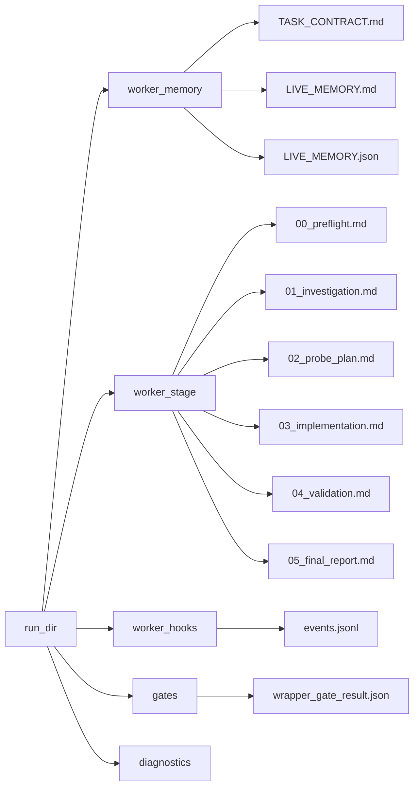

### Tests

Create:

```text id="9em48f"
tests/integration/test_worker_capsule_paths.py
```

Test names:

```python id="u8w3wa"
test_build_worker_capsule_paths_are_under_run_dir
test_worker_capsule_paths_are_under_target_artifact_root_not_worktree
test_worker_capsule_schema_validates_minimum_capsule_manifest
test_worker_capsule_direct_mode_uses_existing_run_dir
test_worker_capsule_worktree_mode_keeps_capsule_under_target_run_dir
```

### Acceptance

```text id="sb19jc"
No worker behavior changes.
No real Codex invocation.
Capsule paths are deterministic.
Capsule paths never point into orchestrator source repo.
Capsule paths are under target .codex-orchestrator/runs/<attempt>.
```

---

## Phase 2 — Capsule creation before worker execution

### Goal

Every patchlet attempt creates a capsule directory before Codex runs.

### Integration point

Add capsule creation inside:

```text id="3vj4go"
src/codex_orchestrator/stages/run_patchlet.py
```

before calling the worker.

### Execution graph

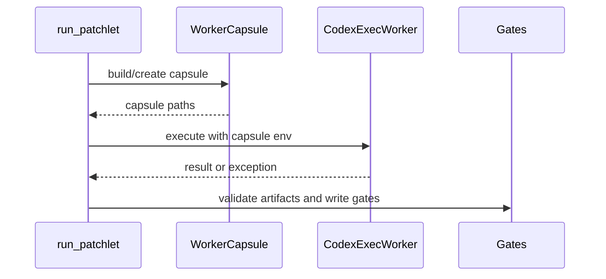

### New files created per run

At minimum:

```text id="5k2g7v"
worker_memory/
worker_stage/
worker_hooks/
gates/
diagnostics/
```

### Tests

Create or extend:

```text id="tp55f5"
tests/integration/test_worker_capsule_creation.py
```

Test names:

```python id="ef4p4f"
test_run_next_creates_worker_capsule_before_worker_execution
test_failed_worker_attempt_still_has_worker_capsule
test_worktree_run_creates_capsule_under_target_run_dir
test_capsule_creation_is_idempotent_for_existing_attempt
```

### Acceptance

```text id="n36cf3"
Capsule exists even when worker exits non-zero.
Capsule exists in direct and worktree mode.
Existing run manifest tests remain green.
No validator weakening.
```

---

## Phase 3 — Worker memory artifacts

### Goal

Create concrete run-local memory files for Codex.

### Files

```text id="kdkt5q"
worker_memory/TASK_CONTRACT.md
worker_memory/LIVE_MEMORY.md
worker_memory/LIVE_MEMORY.json
worker_memory/KNOWN_FACTS.json
worker_memory/ALLOWED_PATHS.json
worker_memory/PREVIOUS_FAILURES.md
worker_memory/CURRENT_STAGE.md
worker_memory/WRITE_THESE_FILES.md
```

### TASK_CONTRACT.md should include

```text id="z4yvr4"
patchlet id
attempt id
worker mode
target root
execution root
artifact root
allowed product/runtime file
forbidden edit paths
required report path
required probe root
required stage files
required final status marker
root-cause/probe contract reminder
no blind retry rule
```

### LIVE_MEMORY.json shape

```json id="g6e0zc"
{
  "schema_version": "1.0",
  "kind": "worker_memory",
  "patchlet_id": "P0001",
  "attempt_id": "P0001_attempt1",
  "allowed_product_runtime_file": "app.py",
  "goal_ids": ["G001"],
  "invariant_ids": ["I001"],
  "evidence_ids": ["E001"],
  "graph_node_ids": ["N001"],
  "required_report_path": ".codex-orchestrator/reports/P0001.json",
  "required_probe_root": ".artifacts/probes/P0001",
  "current_stage": "worker_initialized",
  "known_facts": [],
  "previous_failures": [],
  "open_questions": []
}
```

### Memory graph

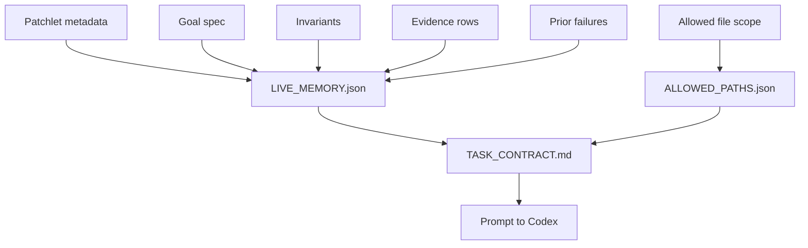

### Tests

Create:

```text id="csl7me"
tests/integration/test_worker_capsule_memory.py
```

Test names:

```python id="2t5x5d"
test_worker_capsule_writes_task_contract
test_task_contract_contains_report_probe_and_allowed_file_paths
test_worker_capsule_writes_machine_validated_live_memory_json
test_worker_capsule_writes_human_live_memory_markdown
test_worker_capsule_does_not_include_broad_unscoped_repo_memory
test_real_codex_smoke_prompt_points_to_task_contract
```

### Acceptance

```text id="nykt7d"
Real-Codex prompt says to read TASK_CONTRACT.md first.
Memory JSON validates.
Memory Markdown exists.
Memory is scoped to the patchlet attempt.
Memory cannot override report/probe/diff validators.
```

---

## Phase 4 — Worker stage artifacts

### Goal

Add required stage artifacts that Codex must fill or at least acknowledge.

### Stage files

```text id="yafk0c"
worker_stage/00_preflight.md
worker_stage/01_investigation.md
worker_stage/02_probe_plan.md
worker_stage/03_implementation.md
worker_stage/04_validation.md
worker_stage/05_final_report.md
```

### Stage path graph

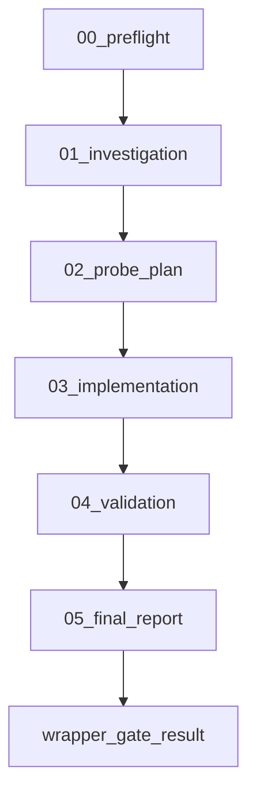

### Required stage contents

`00_preflight.md` must restate:

```text id="p4wcty"
allowed file
forbidden files
report path
probe path
current state
patchlet goal
required validators
```

`02_probe_plan.md` must cover:

```text id="2wr07x"
minimal reproduction
deterministic run count
controlled initial state
producer → transformer → consumer boundary
negative control
cleanup proof
```

`05_final_report.md` must include:

```text id="spgpft"
FINAL_STATUS: PASS
```

or a failure/blocking status.

### Tests

Create:

```text id="fgh6nq"
tests/integration/test_worker_capsule_stage_artifacts.py
```

Test names:

```python id="rwqzuu"
test_worker_stage_templates_are_created_before_worker_execution
test_worker_stage_preflight_template_mentions_allowed_file_and_report_path
test_worker_stage_probe_plan_template_mentions_root_cause_requirements
test_missing_preflight_stage_fails_wrapper_gate
test_missing_probe_plan_stage_blocks_complete_report_acceptance
test_missing_final_report_marker_fails_wrapper_gate
```

### Acceptance

```text id="v198v2"
Stage files are generated before worker execution.
Codex is instructed to fill them.
Wrapper gate checks them after execution.
Missing stage files do not silently pass.
```

---

## Phase 5 — Orchestrator-owned lifecycle events

### Goal

Formalize wrapper hooks as deterministic events, not native Codex compaction hooks.

### New event log

```text id="gfhtp2"
worker_hooks/events.jsonl
```

### Event graph

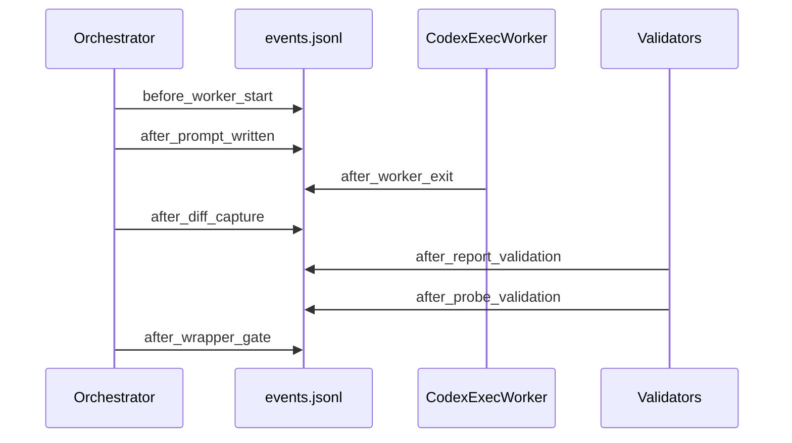

### Event shape

```json id="o5p27z"
{
  "schema_version": "1.0",
  "kind": "worker_event",
  "event": "after_worker_exit",
  "patchlet_id": "P0001",
  "attempt_id": "P0001_attempt1",
  "worker_mode": "real_codex",
  "execution_mode": "worktree",
  "exit_code": 1,
  "stdout_path": ".codex-orchestrator/runs/P0001_attempt1/stdout.txt",
  "stderr_path": ".codex-orchestrator/runs/P0001_attempt1/stderr.txt",
  "output_jsonl_path": ".codex-orchestrator/runs/P0001_attempt1/output.jsonl",
  "created_at": "..."
}
```

### Tests

Create:

```text id="9juh7i"
tests/integration/test_worker_capsule_events.py
```

Test names:

```python id="meekxc"
test_worker_events_log_before_and_after_worker_execution
test_worker_events_log_worker_exception_without_suppressing_exception
test_worker_events_log_validation_steps
test_worker_events_are_jsonl_objects
test_worker_events_are_under_target_run_dir
```

### Acceptance

```text id="k6yz0m"
Events are append-only.
Events are JSONL.
Events are written in direct and worktree modes.
Worker failure still records events.
Events never decide success; gates decide success.
```

---

## Phase 6 — Wrapper gate result

### Goal

Make the final accept/reject decision per attempt explicit and machine-readable.

### Gate result path

```text id="ki2br5"
.codex-orchestrator/runs/P0001_attempt1/gates/wrapper_gate_result.json
```

### Gate decision graph

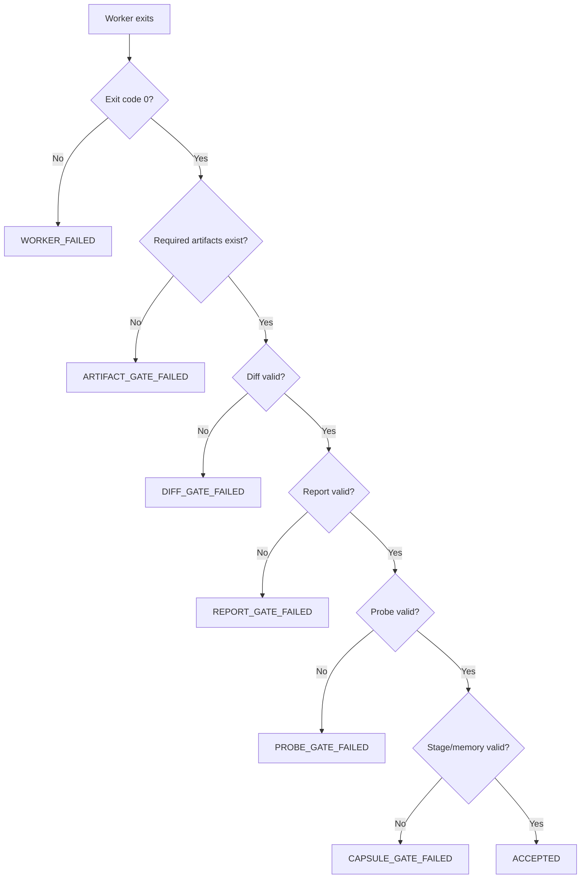

### Wrapper result shape

```json id="s4zvxr"
{
  "schema_version": "1.0",
  "kind": "wrapper_gate_result",
  "patchlet_id": "P0001",
  "attempt_id": "P0001_attempt1",
  "accepted": false,
  "worker_exit_gate": "pass",
  "artifact_gate": "fail",
  "memory_gate": "pass",
  "stage_gate": "fail",
  "diff_gate": "not_run",
  "report_gate": "fail",
  "probe_gate": "fail",
  "final_status_claim": null,
  "reasons": [
    "missing report",
    "missing worker_stage/05_final_report.md"
  ],
  "next_state": "FAILURE_CLASSIFICATION_REQUIRED",
  "blind_retry_allowed": false,
  "validator_weakening_allowed": false
}
```

### Tests

Create:

```text id="m9b32u"
tests/integration/test_wrapper_gate_result.py
```

Test names:

```python id="g52tt0"
test_wrapper_gate_result_written_for_successful_patchlet
test_wrapper_gate_result_written_for_worker_failed_patchlet
test_wrapper_gate_result_rejects_missing_stage_artifacts
test_wrapper_gate_result_rejects_missing_report
test_wrapper_gate_result_rejects_missing_probe_artifacts
test_wrapper_gate_result_never_allows_blind_retry
test_wrapper_gate_result_is_written_by_orchestrator_not_codex
```

### Acceptance

```text id="4lo99w"
Every attempt gets wrapper_gate_result.json.
Codex cannot write or overwrite gate result after validation.
Gate result is referenced from run_manifest.json.
Gate result controls state transition.
No text-only pass is accepted.
```

---

## Phase 7 — Prompt integration for real Codex

### Goal

Make real Codex explicitly use the capsule files.

### Prompt addition

The real-Codex subprompt should say:

```text id="s8t46y"
Before doing any task work, read:
.codex-orchestrator/runs/P0001_attempt1/worker_memory/TASK_CONTRACT.md
.codex-orchestrator/runs/P0001_attempt1/worker_memory/LIVE_MEMORY.md
.codex-orchestrator/runs/P0001_attempt1/worker_memory/WRITE_THESE_FILES.md

Then write:
.codex-orchestrator/runs/P0001_attempt1/worker_stage/00_preflight.md

Before final response, write:
.codex-orchestrator/runs/P0001_attempt1/worker_stage/05_final_report.md
```

### Prompt graph

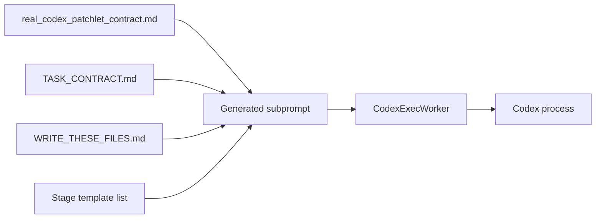

### Tests

Extend:

```text id="55hjsn"
tests/integration/test_real_codex_smoke_contract.py
```

Test names:

```python id="s2y2d6"
test_real_codex_prompt_mentions_task_contract_path
test_real_codex_prompt_mentions_worker_stage_preflight_path
test_real_codex_prompt_mentions_wrapper_gate_is_orchestrator_owned
test_contract_sensitive_fake_codex_reads_task_contract_and_reaches_done
test_contract_sensitive_fake_codex_fails_when_task_contract_missing
```

### Acceptance

```text id="pnsy6n"
Fake Codex only reaches DONE when capsule prompt paths are present.
Real-Codex smoke reports capsule paths.
Default suite still skips real Codex.
```

---

## Phase 8 — Failure diagnosis integration

### Goal

Extend the existing real-Codex diagnosis to include capsule state.

### Diagnosis should include

```text id="ebuz11"
worker_memory presence
worker_stage presence
events.jsonl presence
wrapper_gate_result.json
which stage files are missing
whether Codex read/wrote expected files if observable
whether final status claim exists
```

### Diagnosis graph

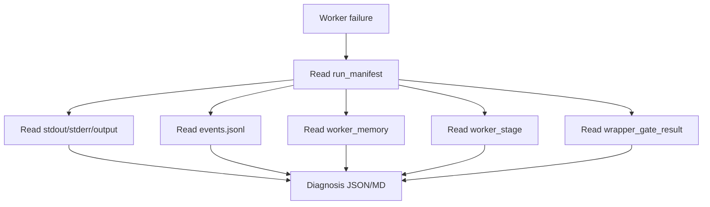

### Tests

Extend:

```text id="fs0hze"
tests/integration/test_real_codex_failure_diagnosis.py
```

Test names:

```python id="7obh3s"
test_diagnosis_reports_worker_memory_presence
test_diagnosis_reports_missing_stage_artifacts
test_diagnosis_links_wrapper_gate_result
test_diagnosis_reports_last_worker_event
test_diagnosis_recommends_capsule_prompt_fix_when_preflight_missing
```

### Acceptance

```text id="clksk6"
Diagnosis says whether Codex failed before reading/writing capsule files.
No guessing.
No validator weakening.
No product mutation.
```

---

## Phase 9 — Transaction group output matrix

### Goal

Make transaction verification produce a cross-check matrix before verdict.

### New artifact

```text id="gs0u7p"
.codex-orchestrator/transaction_groups/TG001/patchlet_output_matrix.json
.codex-orchestrator/transaction_groups/TG001/gates/group_gate_result.json
```

### Matrix graph

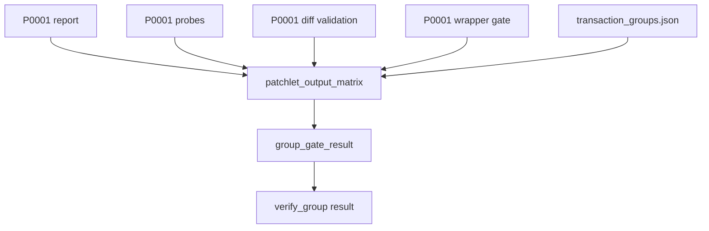

### Matrix checks

```text id="3e4rce"
Does report reference expected invariant?
Does probe artifact exist?
Does row ledger exist?
Did patchlet edit only allowed file?
Did wrapper gate accept it?
Do patchlet claims conflict with other patchlets?
Does transaction group expect this patchlet?
```

### Tests

Create:

```text id="heq00n"
tests/integration/test_transaction_patchlet_output_matrix.py
```

Test names:

```python id="pcl6l1"
test_verify_group_writes_patchlet_output_matrix
test_patchlet_output_matrix_links_reports_probes_diffs_and_wrapper_gates
test_patchlet_output_matrix_records_contradictions
test_group_gate_result_blocks_when_matrix_has_contradictions
test_group_gate_result_passes_when_matrix_all_valid
```

### Acceptance

```text id="y6pyg5"
verify_group no longer only checks patchlet status.
verify_group writes matrix before verdict.
Contradictions block group pass.
```

---

## Phase 10 — Global proof matrix

### Goal

Make global verification matrix-driven.

### New artifacts

```text id="5mqz5n"
.codex-orchestrator/global_verification/verification_matrix.json
.codex-orchestrator/global_verification/gates/global_gate_result.json
```

### Global graph

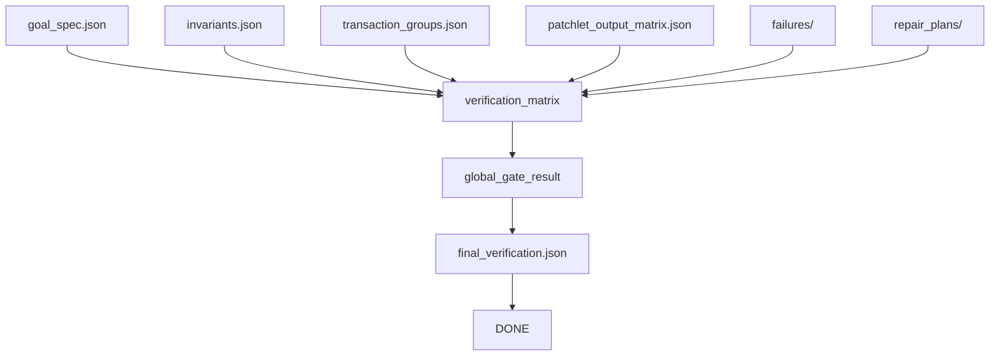

### Verification matrix shape

```json id="42v4wy"
{
  "schema_version": "1.0",
  "kind": "verification_matrix",
  "goals": [],
  "invariants": [],
  "transaction_groups": [],
  "patchlets": [],
  "failures": [],
  "unresolved": [],
  "verdict": "DONE_ALLOWED"
}
```

### Tests

Create:

```text id="4owthu"
tests/integration/test_global_verification_matrix.py
```

Test names:

```python id="cjdefm"
test_verify_global_writes_verification_matrix_before_final_verification
test_verification_matrix_links_goals_invariants_groups_patchlets_and_failures
test_global_gate_result_blocks_done_when_matrix_has_unresolved_failures
test_final_verification_is_conclusion_over_verification_matrix
test_verify_global_is_read_only_for_product_files
```

### Acceptance

```text id="kmwvgr"
DONE is allowed only through matrix-backed proof.
final_verification.json references verification_matrix.json.
Global verification remains deterministic and read-only.
```

---

## Phase 11 — Docs, CLI, and smoke

### Goal

Document and expose the new evidence layer.

### CLI additions

```bash id="gqf84l"
cxor inspect-capsule --repo <repo> --attempt P0001_attempt1
cxor validate-capsule --repo <repo> --attempt P0001_attempt1
cxor diagnose-real-codex --repo <repo> --attempt P0001_attempt1
cxor verify-group --repo <repo> TG001
cxor verify-global --repo <repo>
```

### Docs to update

```text id="h8cfia"
README.md
docs/cli.md
docs/worktrees.md
docs/autonomous_loop.md
docs/root_cause_patchlets.md
docs/transaction_groups.md
docs/real_codex_smoke.md
IMPLEMENTATION_STATUS.md
```

### Final smoke

```bash id="vj42lr"
uv run --no-sync pytest -q
uv run --no-sync cxor auto --repo "$tmprepo" --master "$tmprepo/master_prompt.md" --until DONE --worker-mode mock --use-worktree
uv run --no-sync pytest -q tests/smoke/test_real_codex_auto_worktree.py
uv run --no-sync pytest -q tests/smoke/test_real_codex_auto_worktree.py --run-real-codex -s
```

### Acceptance

```text id="yvejuf"
Default suite remains independent of real Codex.
Mock/fake success reaches DONE.
Real Codex failure remains safe and better diagnosed.
Docs explain capsule artifacts.
```

---

# 6. State transition impact

The capsule should not add many new workflow states at first. It should be an artifact layer inside `PATCHLET_EXECUTION_IN_PROGRESS`.

Recommended state behavior:

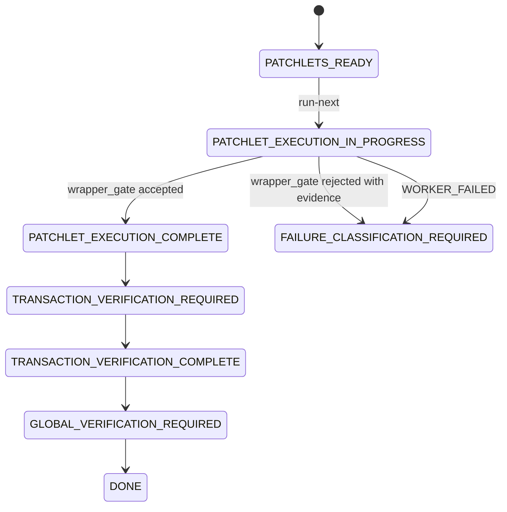

Do not introduce `CAPSULE_READY` as a workflow state unless needed. Prefer artifact validation inside the patchlet execution stage.

---

# 7. Acceptance ladder

The implementation should get stricter by phase.

```text id="1uzbfb"
Phase 1–2:
  Capsule exists.

Phase 3:
  Capsule contains memory.

Phase 4:
  Capsule contains stage artifacts.

Phase 5:
  Capsule contains lifecycle events.

Phase 6:
  Capsule contains wrapper gate result.

Phase 7:
  Real Codex prompt uses capsule.

Phase 8:
  Diagnosis uses capsule.

Phase 9:
  Transaction verifier uses patchlet wrapper gates.

Phase 10:
  Global verifier uses matrix proof.

Phase 11:
  CLI/docs/smoke prove operator usability.
```

---

# 8. Main risk areas

## Risk 1 — Overloading real Codex

Adding too many required files may overwhelm Codex. Mitigation: start with the minimum capsule:

```text id="igztoi"
TASK_CONTRACT.md
LIVE_MEMORY.md
00_preflight.md
wrapper_gate_result.json
events.jsonl
```

Then expand.

## Risk 2 — Letting Codex write gate artifacts

Do not let Codex write `gates/*.json`. It can write claims, memory, and stage notes. The orchestrator writes gate results.

## Risk 3 — Turning memory into proof

Memory is not proof. The gate must say:

```text id="tcx31q"
memory is context
report/probe/diff/schema validation is proof
```

## Risk 4 — Breaking mock/fake flows

All capsule behavior must be tested with mock and fake Codex first.

## Risk 5 — Native Codex hook confusion

Do not depend on native lifecycle hooks. Use orchestrator-owned events. Native hooks can come later as optional telemetry.

---

# 9. Recommended first Codex implementation increment

The first TDD increment should be limited and concrete:

```text id="9tn7uu"
Implement per-attempt Worker Capsule creation and memory files.
```

Do **not** start with transaction/global matrices.

First prompt should ask Codex to implement:

```text id="2ggm1q"
worker_capsule.py
capsule path builder
worker_memory/TASK_CONTRACT.md
worker_memory/LIVE_MEMORY.md
worker_memory/LIVE_MEMORY.json
worker_stage/00_preflight.md template
events.jsonl with before_worker_start
tests for direct and worktree modes
real-Codex smoke result reports capsule paths
```

Then, in the next increment, add wrapper gates.

---

# 10. Summary

The implementation plan is:

```text id="lwwd90"
1. Add Worker Capsule paths and schemas.
2. Create capsule before every CodexExecWorker run.
3. Write scoped memory files.
4. Write stage templates.
5. Write orchestrator-owned lifecycle events.
6. Write wrapper gate results.
7. Feed capsule paths into real-Codex prompts.
8. Extend diagnosis to inspect capsule artifacts.
9. Add transaction patchlet-output matrix.
10. Add global proof matrix.
11. Add CLI/docs/smoke coverage.
```

This preserves the approved architecture while integrating it safely into the current orchestrator. It also directly addresses the current real-Codex issue: Codex needs a smaller, concrete, run-local working surface, and the orchestrator needs a first-class gate result that explains exactly why Codex’s work was accepted or rejected.

---

# 2. Expanded Implementation Context

The approved plan already defines the right direction: each Codex worker attempt should have its own memory, stage files, hook/event files, and wrapper-side gate files.

This expansion turns that approved direction into a concrete rollout plan.

The current `codex-orchestrator` has reached a mature implementation stage. It already proves the following major pieces:

```text
- autonomous loop
- patchlet generation
- durable reports
- durable probe artifacts
- root-cause/proof validators
- diff guard
- repair planning and repair patchlets
- terminal DONE no-op behavior
- real Codex adapter hardening
- fake Codex success/failure contracts
- worktree isolation
- auto --use-worktree
- transaction-group verifier
- stronger global verifier
- advanced repair classifications
- rediscovery and rebuild
- real-Codex smoke opt-in gating
- run_manifest WORKER_FAILED evidence
- fake-success parity through worker_mode=real_codex
```

The remaining real-Codex weakness is not general orchestrator wiring. The proven gap is narrower:

```text
Installed real Codex still exits non-zero before it produces a validator-complete report and durable probe artifact set.
```

The Worker Capsule is meant to help with that by giving real Codex a smaller and more concrete working surface:

```text
Read these exact task files.
Write these exact stage files.
Write this exact report.
Write these exact probe files.
Only edit this exact product file.
The orchestrator will validate everything.
```

---

# 3. Expanded Architecture Principles

## 3.1 Codex memory is context, not proof

Worker memory can guide Codex, but it can never override validators.

```text
If LIVE_MEMORY.md says "complete"
but report validation fails,
the result is failure.

If 05_final_report.md says "FINAL_STATUS: PASS"
but probe artifacts are missing,
the result is failure.

If Codex claims no product changes were made
but diff validation finds unauthorized files,
the result is failure.
```

## 3.2 The orchestrator writes acceptance

Codex may write:

```text
- investigation notes
- probe plan notes
- implementation notes
- validation notes
- final status claims
- product/runtime edits inside allowed path
- report JSON
- probe artifacts
```

The orchestrator writes:

```text
- wrapper_gate_result.json
- memory_validation.json
- stage_validation.json
- report_validation.json
- probe_validation.json
- diff_validation.json
- group_gate_result.json
- global_gate_result.json
- final_verification.json
```

## 3.3 The capsule is per attempt, not global

A global memory file is risky because it becomes stale, noisy, and hard to validate.

The correct scope is:

```text
Patchlet attempt:
  .codex-orchestrator/runs/P0001_attempt1/worker_memory/

Transaction group:
  .codex-orchestrator/transaction_groups/TG001/

Global verification:
  .codex-orchestrator/global_verification/
```

## 3.4 Native Codex hooks are optional telemetry

The plan must not depend on native Codex compaction hooks.

The reliable hook layer is orchestrator-owned:

```text
before_worker_start
after_prompt_written
after_worker_exit
after_diff_capture
after_report_validation
after_probe_validation
after_stage_validation
after_memory_validation
after_wrapper_gate
after_failure
```

These are written to `events.jsonl`.

# 4. Expanded Target Artifact Model

## 4.1 Per-attempt capsule tree

```text
.codex-orchestrator/runs/P0001_attempt1/
  command.json
  stdout.txt
  stderr.txt
  output.jsonl
  diff.patch
  diff_name_status.txt

  capsule_manifest.json

  worker_memory/
    TASK_CONTRACT.md
    LIVE_MEMORY.md
    LIVE_MEMORY.json
    KNOWN_FACTS.json
    ALLOWED_PATHS.json
    PREVIOUS_FAILURES.md
    CURRENT_STAGE.md
    WRITE_THESE_FILES.md

  worker_stage/
    00_preflight.md
    01_investigation.md
    02_probe_plan.md
    03_implementation.md
    04_validation.md
    05_final_report.md

  worker_hooks/
    events.jsonl
    session_start_context.md
    prompt_submit_context.md
    pre_run_snapshot.json
    post_run_snapshot.json
    failure_snapshot.json

  gates/
    final_status.json
    required_artifacts_check.json
    memory_validation.json
    stage_validation.json
    report_validation.json
    probe_validation.json
    diff_validation.json
    wrapper_gate_result.json

  diagnostics/
    real_codex_failure_diagnosis.json
    real_codex_failure_diagnosis.md
```

## 4.2 Transaction group tree

```text
.codex-orchestrator/transaction_groups/TG001/
  group_memory.md
  patchlet_output_matrix.json

  group_stage/
    00_inputs.md
    01_patchlet_report_matrix.md
    02_probe_crosscheck.md
    03_diff_scope_check.md
    04_group_verdict.md

  gates/
    group_gate_result.json
```

## 4.3 Global verification tree

```text
.codex-orchestrator/global_verification/
  global_memory.md
  verification_matrix.json

  global_stage/
    00_inputs.md
    01_goal_matrix.md
    02_invariant_matrix.md
    03_transaction_matrix.md
    04_failure_matrix.md
    05_final_verdict.md

  gates/
    global_gate_result.json
```

---

# 5. Expanded Graphs

## 5.1 Worker Capsule lifecycle graph

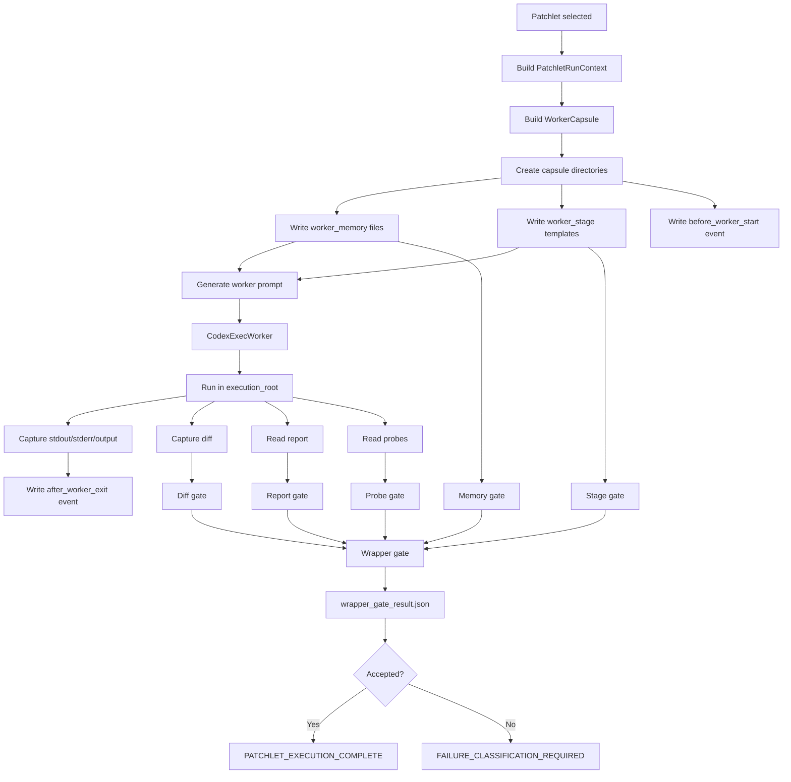

## 5.2 Wrapper gate decision graph

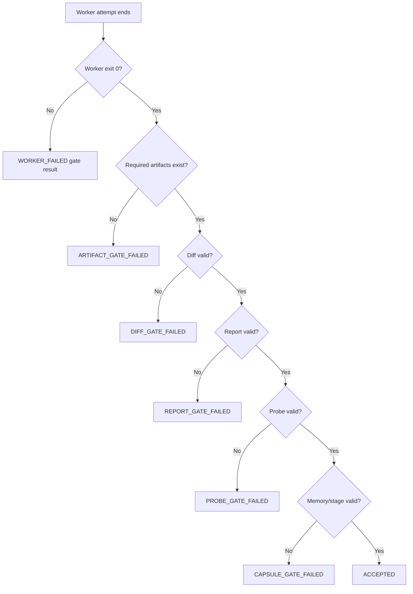

## 5.3 Transaction group cross-check graph

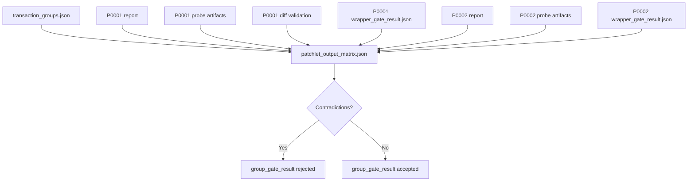

## 5.4 Global proof matrix graph

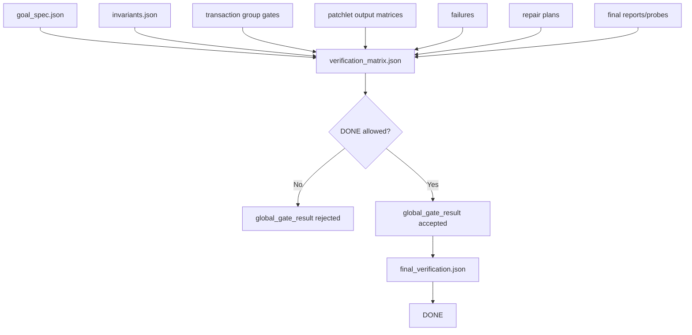

---

# 6. Detailed Implementation Phases

## Phase 0 — Preflight and Current-Path Mapping

### Goal

Map the current implementation before modifying it.

### Required commands

```bash
export UV_CACHE_DIR=/tmp/uv-cache

pwd
git status --short
git rev-parse --show-toplevel
git rev-parse --verify HEAD || true

uv run --no-sync python --version
uv run --no-sync pytest -q

codex --version || true
which codex || true
```

### Inspect

```text
src/codex_orchestrator/stages/run_patchlet.py
src/codex_orchestrator/workers/codex_exec.py
src/codex_orchestrator/patchlet_run_context.py
src/codex_orchestrator/worktree.py
src/codex_orchestrator/run_records.py
src/codex_orchestrator/real_codex_smoke.py
src/codex_orchestrator/validators/report_validator.py
src/codex_orchestrator/validators/probe_artifact_validator.py
src/codex_orchestrator/stages/verify_group.py
src/codex_orchestrator/stages/verify_global.py
src/codex_orchestrator/stages/auto.py
src/codex_orchestrator/cli.py
```

### Output to record

```text
- Python version
- uv version
- Codex CLI version
- current test count
- current git status
- current run manifest shape
- current real-Codex safe-failure output
- current worktree artifact-root behavior
- current prompt/subprompt generation path
```

## Phase 1 — Worker Capsule Schema and Path Builder

### Goal

Introduce the Worker Capsule path model without changing worker behavior.

### Add module

```text
src/codex_orchestrator/worker_capsule.py
```

### Add schemas

```text
src/codex_orchestrator/schemas/worker_capsule.schema.json
src/codex_orchestrator/schemas/worker_memory.schema.json
src/codex_orchestrator/schemas/worker_event.schema.json
src/codex_orchestrator/schemas/wrapper_gate_result.schema.json
```

### Proposed API

```python
@dataclass(frozen=True)
class WorkerCapsule:
    patchlet_id: str
    attempt_id: str
    run_id: str
    run_dir: Path
    capsule_manifest_path: Path
    worker_memory_dir: Path
    worker_stage_dir: Path
    worker_hooks_dir: Path
    gates_dir: Path
    diagnostics_dir: Path
    task_contract_path: Path
    live_memory_md_path: Path
    live_memory_json_path: Path
    events_jsonl_path: Path
    wrapper_gate_result_path: Path
```

```python
def build_worker_capsule(run_context, patchlet, attempt_id: str, run_id: str) -> WorkerCapsule:
    ...
```

### Red tests

Create:

```text
tests/integration/test_worker_capsule_paths.py
```

Test names:

```python
test_build_worker_capsule_paths_are_under_run_dir
test_worker_capsule_paths_are_under_target_artifact_root_not_worktree
test_worker_capsule_schema_validates_minimum_capsule_manifest
test_worker_capsule_direct_mode_uses_existing_run_dir
test_worker_capsule_worktree_mode_keeps_capsule_under_target_run_dir
test_worker_capsule_never_points_to_orchestrator_source_repo
```

### Acceptance

```text
No worker execution behavior changes.
No Codex invocation.
Capsule paths are deterministic.
Capsule paths remain under target artifact root.
```

---

## Phase 2 — Capsule Creation Before Worker Execution

### Goal

Create the capsule directory before every patchlet worker run.

### Integration

Inside:

```text
src/codex_orchestrator/stages/run_patchlet.py
```

add capsule creation before worker execution.

### Required behavior

```text
1. Build PatchletRunContext.
2. Determine run_dir / attempt_id.
3. Build WorkerCapsule.
4. Create capsule directories.
5. Write capsule manifest.
6. Write before_worker_start event.
7. Call worker.
```

### Red tests

Create:

```text
tests/integration/test_worker_capsule_creation.py
```

Test names:

```python
test_run_next_creates_worker_capsule_before_worker_execution
test_failed_worker_attempt_still_has_worker_capsule
test_worktree_run_creates_capsule_under_target_run_dir
test_capsule_creation_is_idempotent_for_existing_attempt
test_run_manifest_references_capsule_manifest_path
```

### Acceptance

```text
Capsule exists for success and failure.
Capsule exists in direct and worktree modes.
Capsule path is included in run_manifest.json.
```

---

## Phase 3 — Worker Memory Artifacts

### Goal

Write the first real run-local memory files.

### Required files

```text
worker_memory/TASK_CONTRACT.md
worker_memory/LIVE_MEMORY.md
worker_memory/LIVE_MEMORY.json
worker_memory/KNOWN_FACTS.json
worker_memory/ALLOWED_PATHS.json
worker_memory/PREVIOUS_FAILURES.md
worker_memory/CURRENT_STAGE.md
worker_memory/WRITE_THESE_FILES.md
```

### TASK_CONTRACT.md must include

```text
patchlet id
attempt id
worker mode
target root
execution root
artifact root
allowed product/runtime file
forbidden paths
required report path
required probe root
required stage files
root-cause/probe-only reminder
durable probe reminder
no blind retry
memory is context not proof
orchestrator decides success
```

### LIVE_MEMORY.json must include

```json
{
  "schema_version": "1.0",
  "kind": "worker_memory",
  "patchlet_id": "P0001",
  "attempt_id": "P0001_attempt1",
  "worker_mode": "real_codex",
  "execution_mode": "worktree",
  "allowed_product_runtime_file": "app.py",
  "goal_ids": ["G001"],
  "invariant_ids": ["I001"],
  "evidence_ids": ["E001"],
  "graph_node_ids": ["N001"],
  "source_failure_ids": [],
  "repair_plan_id": null,
  "required_report_path": ".codex-orchestrator/reports/P0001.json",
  "required_probe_root": ".artifacts/probes/P0001",
  "current_stage": "worker_initialized",
  "memory_is_context_not_proof": true
}
```

### Red tests

Create:

```text
tests/integration/test_worker_capsule_memory.py
```

Test names:

```python
test_worker_capsule_writes_task_contract
test_task_contract_contains_report_probe_and_allowed_file_paths
test_task_contract_says_orchestrator_decides_success
test_worker_capsule_writes_machine_validated_live_memory_json
test_worker_capsule_writes_human_live_memory_markdown
test_worker_capsule_writes_allowed_paths_json
test_worker_capsule_writes_write_these_files_markdown
test_worker_capsule_does_not_include_broad_unscoped_repo_memory
test_real_codex_smoke_prompt_points_to_task_contract
```

### Acceptance

```text
Worker memory exists before worker execution.
Memory JSON validates.
Prompt references TASK_CONTRACT.md.
Memory cannot override validators.
```

---

## Phase 4 — Worker Stage Artifacts

### Goal

Create stage templates that Codex must fill.

### Required files

```text
worker_stage/00_preflight.md
worker_stage/01_investigation.md
worker_stage/02_probe_plan.md
worker_stage/03_implementation.md
worker_stage/04_validation.md
worker_stage/05_final_report.md
```

### Key rule

Stage artifacts are claims and evidence, not proof.

They become proof only when wrapper gates validate them together with report/probe/diff validation.

### Red tests

Create:

```text
tests/integration/test_worker_capsule_stage_artifacts.py
```

Test names:

```python
test_worker_stage_templates_are_created_before_worker_execution
test_worker_stage_preflight_template_mentions_allowed_file_and_report_path
test_worker_stage_probe_plan_template_mentions_root_cause_requirements
test_worker_stage_final_report_template_contains_final_status_marker
test_missing_preflight_stage_fails_wrapper_gate
test_missing_probe_plan_stage_blocks_complete_report_acceptance
test_missing_final_report_marker_fails_wrapper_gate
```

### Acceptance

```text
Stage templates exist before worker run.
Wrapper gate can reject missing stage files.
```

---

## Phase 5 — Orchestrator-Owned Lifecycle Events

### Goal

Add `events.jsonl` as a deterministic lifecycle event log.

### Event file

```text
worker_hooks/events.jsonl
```

### Required events

```text
before_worker_start
after_prompt_written
after_worker_exit
after_diff_capture
after_report_validation
after_probe_validation
after_stage_validation
after_memory_validation
after_wrapper_gate
after_failure
```

### Red tests

Create:

```text
tests/integration/test_worker_capsule_events.py
```

Test names:

```python
test_worker_events_log_before_and_after_worker_execution
test_worker_events_log_worker_exception_without_suppressing_exception
test_worker_events_log_validation_steps
test_worker_events_are_jsonl_objects
test_worker_events_are_under_target_run_dir
test_worker_events_do_not_decide_success
```

### Acceptance

```text
events.jsonl is present for every run.
Events are append-only.
Events are deterministic.
Events do not decide success.
```

## Phase 6 — Wrapper Gate Result

### Goal

Write an explicit gate result for every attempt.

### Gate path

```text
gates/wrapper_gate_result.json
```

### Gate result must include

```text
worker_exit_gate
artifact_gate
memory_gate
stage_gate
diff_gate
report_gate
probe_gate
final_status_claim
accepted
reasons
next_state
blind_retry_allowed false
validator_weakening_allowed false
written_by orchestrator
```

### Red tests

Create:

```text
tests/integration/test_wrapper_gate_result.py
```

Test names:

```python
test_wrapper_gate_result_written_for_successful_patchlet
test_wrapper_gate_result_written_for_worker_failed_patchlet
test_wrapper_gate_result_rejects_missing_stage_artifacts
test_wrapper_gate_result_rejects_missing_report
test_wrapper_gate_result_rejects_missing_probe_artifacts
test_wrapper_gate_result_never_allows_blind_retry
test_wrapper_gate_result_is_written_by_orchestrator_not_codex
test_run_manifest_references_wrapper_gate_result
```

### Acceptance

```text
Every attempt gets wrapper_gate_result.json.
Run manifest references wrapper_gate_result.json.
State transition follows gate result.
```

---

## Phase 7 — Real-Codex Prompt Integration

### Goal

Tell real Codex to use the capsule files.

### Prompt should say

```text
Before doing any task work, read:
- TASK_CONTRACT.md
- LIVE_MEMORY.md
- WRITE_THESE_FILES.md

Then write:
- worker_stage/00_preflight.md

Before final response, write:
- worker_stage/05_final_report.md
```

### Red tests

Extend:

```text
tests/integration/test_real_codex_smoke_contract.py
```

Test names:

```python
test_real_codex_prompt_mentions_task_contract_path
test_real_codex_prompt_mentions_worker_stage_preflight_path
test_real_codex_prompt_mentions_wrapper_gate_is_orchestrator_owned
test_real_codex_smoke_result_reports_worker_capsule_paths
test_contract_sensitive_fake_codex_reads_task_contract_and_reaches_done
test_contract_sensitive_fake_codex_fails_when_task_contract_missing
```

### Acceptance

```text
Fake Codex reaches DONE only when task contract path is present.
Real-Codex smoke result reports capsule paths.
Default suite still skips real Codex.
```

---

## Phase 8 — Failure Diagnosis Integration

### Goal

Extend diagnosis with capsule evidence.

### Diagnosis must report

```text
worker_memory exists or missing
TASK_CONTRACT exists or missing
LIVE_MEMORY exists or missing
stage files exist or missing
events.jsonl exists or missing
wrapper_gate_result exists or missing
last event
gate failure reasons
likely failure boundary if supported
```

### Red tests

Extend:

```text
tests/integration/test_real_codex_failure_diagnosis.py
```

Test names:

```python
test_diagnosis_reports_worker_memory_presence
test_diagnosis_reports_missing_stage_artifacts
test_diagnosis_links_wrapper_gate_result
test_diagnosis_reports_last_worker_event
test_diagnosis_recommends_capsule_prompt_fix_when_preflight_missing
test_diagnosis_never_guesses_unsupported_cause
```

### Acceptance

```text
Diagnosis is evidence-based.
Diagnosis does not guess.
Diagnosis does not weaken validators.
```

---

## Phase 9 — Transaction Group Output Matrix

### Goal

Make transaction verification cross-check patchlet outputs explicitly.

### New files

```text
.codex-orchestrator/transaction_groups/TG001/patchlet_output_matrix.json
.codex-orchestrator/transaction_groups/TG001/gates/group_gate_result.json
```

### Matrix checks

```text
wrapper gate accepted
report valid
probe valid
allowed diff valid
goal ids match
invariant ids match
evidence ids match
no contradictions
transaction group expected patchlet
```

### Red tests

Create:

```text
tests/integration/test_transaction_patchlet_output_matrix.py
```

Test names:

```python
test_verify_group_writes_patchlet_output_matrix
test_patchlet_output_matrix_links_reports_probes_diffs_and_wrapper_gates
test_patchlet_output_matrix_records_contradictions
test_group_gate_result_blocks_when_matrix_has_contradictions
test_group_gate_result_passes_when_matrix_all_valid
test_verify_group_rejects_patchlet_without_accepted_wrapper_gate
```

### Acceptance

```text
Group verification is matrix-backed.
Contradictions block group pass.
Wrapper gate acceptance is required.
```

---

## Phase 10 — Global Proof Matrix

### Goal

Make DONE matrix-backed.

### New files

```text
.codex-orchestrator/global_verification/verification_matrix.json
.codex-orchestrator/global_verification/gates/global_gate_result.json
```

### Matrix must link

```text
goals
invariants
transaction groups
patchlets
wrapper gates
failures
repair cycles
unresolved blockers
```

### Red tests

Create:

```text
tests/integration/test_global_verification_matrix.py
```

Test names:

```python
test_verify_global_writes_verification_matrix_before_final_verification
test_verification_matrix_links_goals_invariants_groups_patchlets_and_failures
test_global_gate_result_blocks_done_when_matrix_has_unresolved_failures
test_final_verification_is_conclusion_over_verification_matrix
test_verify_global_is_read_only_for_product_files
test_global_verification_requires_group_gate_results
```

### Acceptance

```text
DONE is allowed only through matrix-backed proof.
final_verification.json references verification_matrix.json.
Global verification remains deterministic and read-only.
```

---

## Phase 11 — Docs, CLI, and Smoke

### Goal

Expose capsule inspection and validation to operators.

### CLI commands

```bash
cxor inspect-capsule --repo <repo> --attempt P0001_attempt1
cxor validate-capsule --repo <repo> --attempt P0001_attempt1
cxor diagnose-real-codex --repo <repo> --attempt P0001_attempt1
```

### Docs must explain

```text
Worker Capsule purpose
memory is context, not proof
stage artifacts are claims, not proof
gate results are orchestrator proof
transaction matrix
global matrix
how to inspect failed real-Codex runs
```

### Tests

Create:

```text
tests/integration/test_cli_worker_capsule.py
tests/unit/test_docs_worker_capsule_contract.py
```

### Acceptance

```text
Operator can inspect capsules.
Operator can validate capsules.
Docs explain the model.
Default suite still skips real Codex.
```

---

# 7. Stop Conditions

Stop immediately if any of these happen:

```text
baseline test suite fails
Python 3.10 compatibility regresses
default suite invokes real Codex
validators are weakened
Codex is allowed to write gate files
memory is treated as proof
capsule artifacts are written to worktree instead of target root
existing mock/fake success path breaks
auto --use-worktree regresses
run_manifest WORKER_FAILED evidence regresses
transaction/global verification regresses
DONE can be reached without global proof
```

---

# 8. Implementation Sequencing Recommendation

Do not implement all phases in one step.

Recommended batch sequence:

```text
Batch 1:
  Phase 1 — Worker Capsule schema/path builder
  Phase 2 — Capsule creation before worker execution
  Phase 3 minimum — worker memory files
  Phase 5 minimum — events.jsonl with before_worker_start

Batch 2:
  Phase 4 — worker stage artifacts
  Phase 6 — wrapper gate result

Batch 3:
  Phase 7 — real-Codex prompt integration
  Phase 8 — diagnosis integration

Batch 4:
  Phase 9 — transaction output matrix
  Phase 10 — global proof matrix

Batch 5:
  Phase 11 — CLI/docs/smoke
```

The reason for this sequencing is risk control.

Batch 1 gives real Codex a concrete surface without destabilizing acceptance.

Batch 2 makes acceptance explicit.

Batch 3 uses the capsule to improve real-Codex diagnosis.

Batch 4 strengthens group/global proof.

Batch 5 exposes operator tooling.

---

# 9. First Implementation Prompt

The first implementation prompt to Codex should be:

```text
Implement Codex Worker Capsule Batch 1.

Scope:
- Phase 1 Worker Capsule schema/path builder.
- Phase 2 capsule creation before worker execution.
- Phase 3 minimum worker memory files.
- Phase 5 minimum events.jsonl with before_worker_start.

Do not implement wrapper_gate_result yet except create the gates/ directory.
Do not implement transaction matrix.
Do not implement global matrix.
Do not add new workflow states.

Required files:
- src/codex_orchestrator/worker_capsule.py
- src/codex_orchestrator/schemas/worker_capsule.schema.json
- src/codex_orchestrator/schemas/worker_memory.schema.json
- src/codex_orchestrator/schemas/worker_event.schema.json
- tests/integration/test_worker_capsule_paths.py
- tests/integration/test_worker_capsule_creation.py
- tests/integration/test_worker_capsule_memory.py
- tests/integration/test_worker_capsule_events.py

Required artifacts per attempt:
- capsule_manifest.json
- worker_memory/TASK_CONTRACT.md
- worker_memory/LIVE_MEMORY.md
- worker_memory/LIVE_MEMORY.json
- worker_memory/ALLOWED_PATHS.json
- worker_memory/WRITE_THESE_FILES.md
- worker_stage/00_preflight.md
- worker_hooks/events.jsonl
- gates/
- diagnostics/

Rules:
- Do not weaken validators.
- Do not make default tests invoke real Codex.
- Do not change default mock/direct behavior except adding capsule artifacts.
- In worktree mode, capsule artifacts must be under target artifact root, not worktree.
- Capsule path must be referenced in run_manifest.json.
- Real-Codex smoke result should report capsule paths.

TDD:
- Add tests for capsule paths.
- Add tests for capsule creation before worker execution.
- Add tests for memory files.
- Add tests for worktree artifact-root behavior.
- Add tests that failed worker attempts still have capsule artifacts.
- Run full suite.

Final report:
- Baseline
- Red tests
- Changed files
- Focused green tests
- Full suite result
- Artifact tree created in a temp smoke repo
- Remaining next increment: wrapper gate result
```

---

# 10. Completion Definition

The Codex Worker Capsule implementation is complete only when all of the following are true:

```text
1. Every patchlet attempt has a capsule.
2. Capsule paths are target-root safe in direct and worktree modes.
3. Capsule includes scoped memory.
4. Capsule includes stage artifacts.
5. Capsule includes orchestrator-owned events.
6. Capsule includes wrapper gate result.
7. Real-Codex prompts point to capsule memory/stage files.
8. Failure diagnosis reads capsule artifacts.
9. Transaction verification reads wrapper gates and writes output matrix.
10. Global verification reads transaction matrices and writes proof matrix.
11. CLI can inspect and validate capsules.
12. Docs explain memory/stage/gates/matrices.
13. Default suite skips real Codex.
14. Mock/fake Codex still reaches DONE.
15. Real Codex safe failure remains contained and better diagnosed.
16. No validator is weakened.
```

---

# 11. Final Principle

The final architecture should make this enforceable:

```text
Codex can work.
Codex can write notes.
Codex can write reports.
Codex can write probes.
Codex can claim success.

But only the orchestrator can accept success.
```

The Codex Worker Capsule is the filesystem contract that makes this enforceable.

It is the missing worker-continuity and worker-audit layer between:

```text
Patchlet intent
```

and:

```text
Orchestrator acceptance
```
