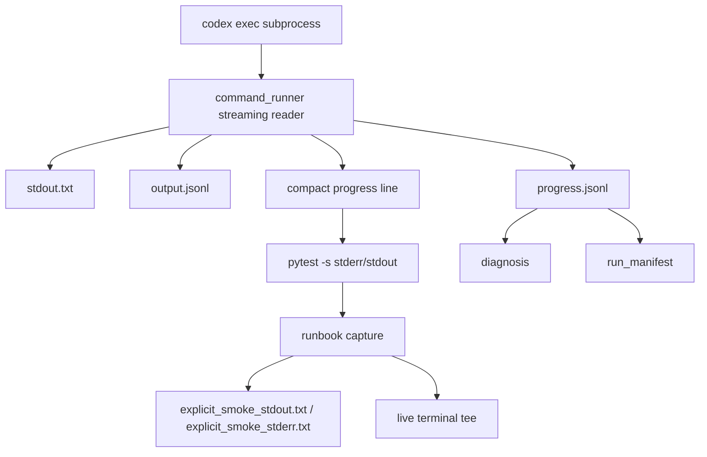
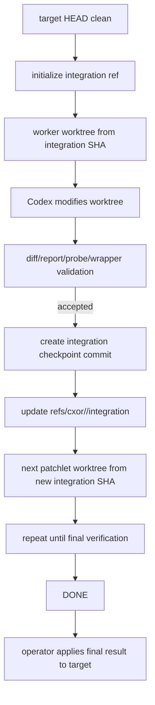

# Codex Orchestrator — Live Progress Plane and Accepted-Change Integration Plane

Status: approved architecture update

Purpose: preserve the approved reflections, corrections, and implementation direction for two newly confirmed architecture issues in `codex-orchestrator`:

1. real Codex subprocess progress exists as durable `progress.jsonl`, but it is not visible live in the operator terminal during long explicit real-Codex runs;
2. after an accepted real Codex patchlet modifies a product/runtime file, the auto/worktree loop can fail the next worktree precondition because the target repository is left dirty with an orchestrator-accepted change.

This document intentionally does not compress the approved ideas. It preserves the approved reflections and expands them into a detailed implementation architecture, artifact contract, state model, failure model, TDD plan, test list, CLI plan, and rollout sequence.

---

# 0. Executive summary

The current orchestrator has reached a stronger real-Codex operating point than before. The older `worker_stage/` path ambiguity has been addressed: real Codex no longer creates top-level `worker_stage/` in the observed runs after the path-disambiguation fix. The 120-second explicit real-Codex smoke timed out cleanly with `orchestrator_subprocess_timeout`, and the 600-second explicit run progressed farther but exposed a different issue: accepted product/runtime changes can leave the target repository dirty, causing the next worktree step to fail its clean-target precondition.

This means the next architecture should not treat these as isolated bugs. They are two separate orchestration planes that need first-class handling:

```text
Layer 1 — Live subprocess progress plane
Layer 2 — Accepted-change integration plane
```

The live progress plane improves operator visibility while preserving all existing durable evidence. It should be implemented at the Codex subprocess level, where Codex JSONL is already parsed and progress events are already written. The live progress output must be short, throttled, and silenced by environment variable when needed.

The accepted-change integration plane fixes the workflow-state problem. Accepted product/runtime changes should not be left as dirty target working-tree files between patchlets. Instead, accepted changes should advance an orchestrator-owned integration ref/checkpoint. Future patchlet worktrees should be based on the latest integration SHA, not the original target HEAD. The target working tree remains clean throughout auto execution until an explicit finalization step applies the result as a patch, branch, or working-tree change.

The key principle:

```text
Target repo cleanliness should protect against external/user dirtiness,
not be broken by orchestrator-accepted changes.
```

---

# 1. Background and current evidence

The relevant observed state is:

```text
- The old worker_stage/ path ambiguity was fixed.
- Real Codex did not write top-level worker_stage/ in the later 120-second and 600-second explicit runs.
- The 120-second explicit run safe-failed with orchestrator_subprocess_timeout.
- The 600-second explicit run safe-failed after Codex modified app.py and the next worktree step found the target repo dirty.
- Progress existed, but it was durable-file progress in progress.jsonl, not short live terminal progress.
```

The prior wrong-path failure looked like this:

```text
Wrong:
  target/worker_stage/

Correct:
  target/.codex-orchestrator/runs/P0001_attempt1/worker_stage/
```

That issue was addressed through path disambiguation using `CXOR_WORKER_STAGE_DIR`, `CXOR_PREFLIGHT_PATH`, and `CXOR_FINAL_REPORT_PATH`. After that, the observed failure changed.

The newer issue looked like this:

```text
Worktree execution requires a clean target repo; dirty paths: app.py
```

This newer failure is not the same as Codex writing capsule artifacts to the wrong location. It is a workflow integration issue: accepted product/runtime changes are reaching the target working tree before the loop has completed, and that makes the next worktree precondition fail.

This is a genuine architecture gap because the current clean-target precondition cannot distinguish:

```text
dirty because a user made external changes
vs
dirty because cxor accepted a patchlet result
```

The orchestrator should still protect strongly against external dirtiness. But accepted patchlet changes should live in a controlled integration plane, not in a dirty target working tree.

---

# 2. Approved two-layer correction

The approved correction has two layers:

```text
Layer 1 — Live subprocess progress plane
Layer 2 — Accepted-change integration plane
```

Layer 1 is an operator visibility correction. It answers:

```text
Is Codex alive right now?
What small kind of progress is happening?
Can I silence live output when I need a quiet run?
```

Layer 2 is a workflow correctness correction. It answers:

```text
Where do accepted patchlet changes live before finalization?
How does the next patchlet see previous accepted changes without dirtying the target repo?
How does the orchestrator keep the clean-target precondition meaningful?
```

These two layers should be implemented separately, but they support the same goal: making long real-Codex orchestration runs observable, safe, replayable, and deterministic.

---

# 3. Layer 1 — Live Codex subprocess progress plane

## 3.1 Current problem

Progress currently exists as a durable artifact:

```text
.codex-orchestrator/runs/<attempt>/progress.jsonl
```

This is good and must remain. It allows diagnosis to prove Codex was alive and to inspect the sequence of progress signals after a run finishes.

But the operator does not see this progress live during an explicit real-Codex smoke run because the runbook captures subprocess stdout/stderr into files:

```text
explicit_smoke_stdout.txt
explicit_smoke_stderr.txt
```

The current stack behaves like this:

```text
cxor real-codex-smoke-runbook
  -> captures pytest stdout/stderr to operator-run files
    -> pytest runs real-Codex smoke
      -> orchestrator runs Codex
        -> Codex progress is written to progress.jsonl
```

The durable progress exists, but the operator sees nothing until the runbook finishes and prints final JSON. For a run that can take 120 to 600 seconds, this feels like a hang even when Codex is working.

## 3.2 Required behavior

The Codex subprocess runner should emit short live progress lines to terminal stderr while continuing to write all durable artifacts.

The runner must still write:

```text
progress.jsonl
stdout.txt
stderr.txt
output.jsonl
command.json
```

In addition, it should emit compact lines like:

```text
[cxor:P0002 +004s] codex: thread.started
[cxor:P0002 +011s] codex: turn.started
[cxor:P0002 +036s] codex: command.completed
[cxor:P0002 +090s] codex: alive
[cxor:P0002 +459s] codex: exited 0
```

These lines must be intentionally small:

```text
No full JSON.
No prompt text.
No report body.
No file contents.
No unbounded command output.
No repetitive spam.
Only liveness and coarse event labels.
```

## 3.3 Where live progress belongs

Live progress must be implemented at the **Codex subprocess level**, not only in the outer runbook.

The right ownership is:

```text
command_runner / CodexExecWorker:
  reads stdout incrementally
  writes stdout.txt
  writes output.jsonl
  writes progress.jsonl
  emits compact live progress lines when enabled
```

The runbook should not attempt to infer Codex progress by parsing all smoke output itself. It should only tee the already-compact `[cxor:...]` lines live while still capturing raw smoke stdout/stderr into files.

## 3.4 Environment controls

Default for explicit real-Codex operator runs should be live progress enabled.

Add:

```bash
CXOR_LIVE_CODEX_PROGRESS=1
```

Disable with:

```bash
CXOR_LIVE_CODEX_PROGRESS=0
```

Add a throttle:

```bash
CXOR_LIVE_CODEX_PROGRESS_INTERVAL_SECONDS=15
```

Recommended defaults:

```text
15 seconds for explicit operator runbook executions
30 seconds for ordinary explicit real-Codex smoke if no operator-run wrapper is used
0 / disabled for default deterministic tests unless the fake subprocess test intentionally opts in
```

The default full test suite must not become noisy.

## 3.5 Progress event mapping

Codex JSONL events should be mapped to compact signals.

Examples:

```json
{"type":"thread.started"}
```

Live output:

```text
[cxor:P0001 +001s] codex: thread.started
```

Progress JSONL:

```json
{
  "schema_version": "1.0",
  "kind": "codex_progress",
  "patchlet_id": "P0001",
  "attempt_id": "P0001_attempt1",
  "elapsed_seconds": 1.0,
  "signal": "thread.started",
  "source": "stdout_jsonl"
}
```

Command-completed event:

```json
{
  "type":"item.completed",
  "item": {
    "type":"command_execution",
    "status":"completed",
    "exit_code":0
  }
}
```

Live output:

```text
[cxor:P0001 +026s] codex: command.completed
```

If there is silence but the subprocess is still alive, emit a heartbeat line at the throttle interval:

```text
[cxor:P0001 +090s] codex: alive
```

Progress JSONL heartbeat:

```json
{
  "schema_version": "1.0",
  "kind": "codex_progress",
  "patchlet_id": "P0001",
  "attempt_id": "P0001_attempt1",
  "elapsed_seconds": 90.0,
  "signal": "heartbeat",
  "source": "runner",
  "summary": "subprocess still running; no new output"
}
```

## 3.6 Progress architecture graph



## 3.7 Runbook tee behavior

The operator runbook currently captures stdout/stderr into:

```text
explicit_smoke_stdout.txt
explicit_smoke_stderr.txt
```

It should preserve this behavior, but it should tee compact progress lines live.

Recommended behavior:

```text
1. Capture all stdout/stderr into files.
2. While capturing, detect lines beginning with [cxor:.
3. Print those compact progress lines to the operator terminal immediately.
4. Do not print full pytest output live unless a verbose flag is enabled.
5. Continue printing final JSON result at the end.
```

Optional flags:

```bash
cxor real-codex-smoke-runbook --run-real-codex --live-progress
cxor real-codex-smoke-runbook --run-real-codex --no-live-progress
```

Environment equivalent:

```bash
CXOR_LIVE_CODEX_PROGRESS=1
CXOR_LIVE_CODEX_PROGRESS=0
```

## 3.8 Acceptance criteria for live progress

```text
progress.jsonl still exists.
stdout.txt still exists.
stderr.txt still exists.
output.jsonl still exists.
command.json still exists.
operator sees compact progress live for explicit runs.
progress lines are throttled.
progress can be disabled with CXOR_LIVE_CODEX_PROGRESS=0.
default suite does not become noisy.
default suite still does not run real Codex.
runbook still captures full stdout/stderr.
runbook only tees compact progress lines by default.
```

---

# 4. Layer 2 — Accepted-change integration plane

## 4.1 Current problem

The worktree loop currently behaves like this:

```text
1. Target repo starts clean.
2. Orchestrator creates worktree for patchlet P0001.
3. Codex modifies the allowed product/runtime file.
4. Orchestrator validates the diff, report, probes, wrapper gate, and worktree constraints.
5. Orchestrator merges or applies the accepted change back to target.
6. Target repo now has dirty app.py.
7. Auto loop starts the next patchlet.
8. Worktree precondition checks target cleanliness.
9. It fails because app.py is dirty.
```

This is a conceptual problem. The clean-target precondition should prevent external user changes from contaminating the run. It should not be broken by changes that the orchestrator itself has already accepted.

The clean-target logic currently sees:

```text
app.py is dirty
```

But it does not know whether that dirtiness means:

```text
external/user mutation
```

or:

```text
orchestrator-accepted patchlet change
```

This means the accepted-change lifecycle is not explicit enough.

## 4.2 Best architecture: hidden integration ref

The cleanest architecture is to avoid applying accepted product/runtime changes directly to the target working tree between patchlets.

Instead, the orchestrator should maintain an integration ref:

```text
target working tree:
  remains clean during auto loop

integration ref:
  carries accepted product/runtime changes

worker worktrees:
  are created from latest integration ref, not from target HEAD
```

In Git terms, the orchestrator maintains something like:

```text
refs/cxor/runs/<run_id>/integration
```

The target working tree remains on the user’s branch/HEAD and stays clean.

Each accepted patchlet creates an integration checkpoint commit. The integration ref advances. The next patchlet worktree is created from the integration SHA, so it sees previous accepted changes without dirtying the target working tree.

## 4.3 Integration graph



## 4.4 What changes

Current behavior:

```text
accepted patchlet diff -> apply to target working tree -> target dirty
```

New behavior:

```text
accepted patchlet diff -> apply to integration worktree/ref -> integration SHA advances
```

The target product/runtime files remain clean until an explicit finalization command.

This matters because the target working tree is the operator’s working tree. The orchestrator should not silently dirty it after every accepted patchlet. It should preserve a clean target and make final application explicit.

## 4.5 Integration artifact tree

Add:

```text
.codex-orchestrator/integration/
  integration_state.json
  accepted_changes.jsonl
  checkpoints/
    P0001.json
    P0002.json
  final_diff.patch
  final_diff_name_status.txt
  apply_results/
    patch_result.json
    branch_result.json
    working_tree_result.json
```

`integration_state.json` is the current integration pointer.

`accepted_changes.jsonl` is the append-only ledger of accepted patchlet changes.

`checkpoints/` contains one checkpoint per accepted patchlet.

`final_diff.patch` is the final diff from original target HEAD to integration SHA.

`apply_results/` records explicit operator finalization actions.

## 4.6 integration_state.json

Minimum shape:

```json
{
  "schema_version": "1.0",
  "kind": "integration_state",
  "target_head_sha": "abc123",
  "integration_ref": "refs/cxor/runs/R0001/integration",
  "integration_sha": "def456",
  "apply_mode": "finalize_only",
  "target_product_dirty_allowed": false,
  "accepted_patchlets": ["P0001", "P0002"],
  "last_checkpoint_path": ".codex-orchestrator/integration/checkpoints/P0002.json",
  "final_diff_path": ".codex-orchestrator/integration/final_diff.patch"
}
```

Important fields:

```text
schema_version:
  supports future migration.

kind:
  makes the artifact self-describing.

target_head_sha:
  the original target HEAD when the run started.

integration_ref:
  hidden Git ref owned by cxor.

integration_sha:
  current integration commit.

apply_mode:
  default should be finalize_only.

target_product_dirty_allowed:
  should be false during auto loop.

accepted_patchlets:
  ordered list of accepted patchlet ids.

last_checkpoint_path:
  last durable checkpoint artifact.

final_diff_path:
  path to final diff from target_head_sha to integration_sha.
```

## 4.7 accepted_changes.jsonl

Append one record per accepted patchlet:

```json
{
  "schema_version": "1.0",
  "kind": "accepted_change",
  "patchlet_id": "P0001",
  "attempt_id": "P0001_attempt1",
  "base_sha": "abc123",
  "new_integration_sha": "def456",
  "allowed_product_runtime_files": ["app.py"],
  "diff_path": ".codex-orchestrator/runs/P0001_attempt1/diff.patch",
  "report_path": ".codex-orchestrator/reports/P0001.json",
  "wrapper_gate_result": ".codex-orchestrator/runs/P0001_attempt1/gates/wrapper_gate_result.json"
}
```

Recommended expanded shape:

```json
{
  "schema_version": "1.0",
  "kind": "accepted_change",
  "run_id": "R0001",
  "patchlet_id": "P0001",
  "attempt_id": "P0001_attempt1",
  "transaction_group_id": "TG001",
  "base_sha": "abc123",
  "previous_integration_sha": "abc123",
  "new_integration_sha": "def456",
  "integration_ref": "refs/cxor/runs/R0001/integration",
  "allowed_product_runtime_files": ["app.py"],
  "changed_product_runtime_files": ["app.py"],
  "changed_artifact_paths": [
    ".codex-orchestrator/reports/P0001.json",
    ".artifacts/probes/P0001/run_001/row_ledger.jsonl"
  ],
  "diff_path": ".codex-orchestrator/runs/P0001_attempt1/diff.patch",
  "diff_name_status_path": ".codex-orchestrator/runs/P0001_attempt1/diff_name_status.txt",
  "report_path": ".codex-orchestrator/reports/P0001.json",
  "probe_root": ".artifacts/probes/P0001",
  "wrapper_gate_result": ".codex-orchestrator/runs/P0001_attempt1/gates/wrapper_gate_result.json",
  "accepted_at": "2026-07-02T00:00:00Z"
}
```

## 4.8 checkpoint artifact

Each accepted patchlet should also get:

```text
.codex-orchestrator/integration/checkpoints/P0001.json
```

Shape:

```json
{
  "schema_version": "1.0",
  "kind": "integration_checkpoint",
  "run_id": "R0001",
  "patchlet_id": "P0001",
  "attempt_id": "P0001_attempt1",
  "previous_integration_sha": "abc123",
  "new_integration_sha": "def456",
  "integration_ref": "refs/cxor/runs/R0001/integration",
  "source_worktree_path": "/tmp/cxor-p0001-...",
  "target_root": "/path/to/target",
  "target_head_sha": "abc123",
  "diff_path": ".codex-orchestrator/runs/P0001_attempt1/diff.patch",
  "wrapper_gate_result": ".codex-orchestrator/runs/P0001_attempt1/gates/wrapper_gate_result.json",
  "report_path": ".codex-orchestrator/reports/P0001.json",
  "probe_root": ".artifacts/probes/P0001",
  "target_working_tree_clean_after_checkpoint": true,
  "created_at": "2026-07-02T00:00:00Z"
}
```

## 4.9 Why this is better

The integration ref solves several problems at once:

```text
1. Target repo stays clean between patchlets.
2. Next worktree includes previous accepted changes.
3. Worktree precondition remains strict.
4. External user dirtiness is still detected.
5. Accepted changes are durable and replayable.
6. Final application to target is explicit.
7. Operators can inspect integration state before applying results.
8. The auto loop is no longer blocked by its own accepted changes.
9. Final verification can reference the exact integration SHA.
10. Multi-patchlet workflows become deterministic across attempts and resumes.
```

## 4.10 Finalization options

At the end, the orchestrator should not silently surprise the user by dirtying their working tree. Add explicit finalization modes:

```bash
cxor apply-results --repo . --mode patch
cxor apply-results --repo . --mode branch
cxor apply-results --repo . --mode working-tree
```

Recommended default:

```text
--mode patch
```

or:

```text
--mode branch
```

`--mode patch`:

```text
writes final_diff.patch
writes apply result metadata
does not mutate product/runtime files
safest default
```

`--mode branch`:

```text
creates a result branch at integration_sha
keeps current working tree clean
operator can inspect the branch
```

`--mode working-tree`:

```text
requires clean target working tree
applies final diff to current working tree
explicitly dirties user repo only because operator asked for it
```

## 4.11 State transition correction

Current implicit behavior:

```text
PATCHLET_ACCEPTED -> target dirty -> next worktree blocked
```

New behavior:

```text
PATCHLET_ACCEPTED -> integration ref advanced -> target remains clean -> next worktree allowed
```

## 4.12 Minimal bridge and why it is not enough

A temporary bridge could be an accepted dirty ledger:

```json
{
  "schema_version": "1.0",
  "kind": "target_dirty_ledger",
  "dirty_paths": [
    {
      "path": "app.py",
      "owner": "cxor",
      "patchlet_id": "P0001",
      "accepted": true,
      "diff_path": ".codex-orchestrator/runs/P0001_attempt1/diff.patch"
    }
  ]
}
```

That would let cleanliness checks distinguish:

```text
external dirty path -> fail
cxor-owned accepted dirty path -> not external
```

But this bridge does **not** solve the core worktree base problem. The next worktree still needs to be based on a state that includes accepted changes. If the next worktree is created from target HEAD while accepted changes are only dirty in the target working tree, the system remains fragile.

Therefore, the dirty ledger can be useful for diagnosis, but the real architecture is:

```text
integration ref / integration checkpoint
```

---

# 5. New failure categories

## 5.1 Existing improved categories

Recent work already added more precise categories such as:

```text
orchestrator_subprocess_timeout
worker_capsule_path_violation
```

The next issue needs a new category.

## 5.2 target_dirty_after_integration_apply

Preferred category:

```text
target_dirty_after_integration_apply
```

This means:

```text
The previous patchlet appears to have produced an accepted product/runtime change,
but the target working tree retained the allowed file as dirty before the next worktree step.
This indicates missing integration-state management, not a Codex path failure.
```

Alternative category:

```text
accepted_change_left_target_dirty
```

The better one is:

```text
target_dirty_after_integration_apply
```

because it points to the architectural lifecycle failure rather than blaming the patchlet.

## 5.3 Diagnosis output

Diagnosis should say:

```text
The target working tree is dirty with app.py after a prior accepted patchlet.
This appears to be an orchestrator integration lifecycle issue.
Accepted product/runtime changes should advance the integration ref and should not dirty the target working tree between patchlets.
Recommended next action: implement integration_state.json, accepted_changes.jsonl, and worktree creation from integration_sha.
Do not weaken clean-target preconditions.
```

## 5.4 When to classify it

Classify `target_dirty_after_integration_apply` when all of these are true:

```text
1. Worktree precondition fails because a product/runtime file is dirty in the target repo.
2. The dirty path is an allowed product/runtime file from a prior accepted patchlet, or it appears in accepted_changes.jsonl / run_manifest accepted records.
3. The failure happens before creating the next worktree.
4. It is not a top-level capsule wrong-path failure like worker_stage/.
5. It is not an external untracked file unrelated to the orchestrator accepted change.
```

If the system cannot prove the dirty file came from an accepted patchlet, it should remain a generic clean-target precondition failure. Do not overclassify.

---

# 6. Recommended implementation order

The recommended order is:

```text
Phase 1 — Live subprocess progress
Phase 2 — Classify target dirty after accepted merge
Phase 3 — Add integration state artifacts
Phase 4 — Change worktree base to integration SHA
Phase 5 — Stop applying accepted product changes to target between patchlets
Phase 6 — Add final apply-results command
Phase 7 — Docs and runbook updates
Phase 8 — Explicit real-Codex smoke rerun
```

The progress plane should come first because it improves debugging for all future explicit real-Codex runs.

The integration ref should be phased in carefully. First record the state and classify the current failure. Then change worktree base behavior. Then stop dirtying the target. Then add finalization.

---

# 7. Phase 1 — Live subprocess progress

## 7.1 Goal

Add compact terminal progress output at the Codex subprocess level, while preserving durable progress artifacts.

## 7.2 Required behavior

```text
1. command_runner / CodexExecWorker parses streaming Codex JSONL.
2. progress.jsonl is still written.
3. stdout.txt, stderr.txt, output.jsonl, command.json are still written.
4. Compact live lines are emitted to stderr when enabled.
5. Live lines are throttled.
6. Live lines can be disabled with CXOR_LIVE_CODEX_PROGRESS=0.
7. Operator runbook tees only compact live lines.
8. Default tests remain quiet.
```

## 7.3 Suggested functions

```python
@dataclass(frozen=True)
class LiveProgressPolicy:
    enabled: bool
    interval_seconds: int
    sink: Literal["stderr", "none"]


def resolve_live_progress_policy(env: Mapping[str, str], *, explicit_operator_run: bool) -> LiveProgressPolicy:
    ...
```

```python
def maybe_emit_live_progress(
    *,
    policy: LiveProgressPolicy,
    patchlet_id: str,
    attempt_id: str,
    elapsed_seconds: float,
    signal: str,
    now: float,
    last_emit_at: float | None,
    stream: TextIO,
) -> float | None:
    ...
```

Python 3.10 compatibility note: avoid `|` type syntax if the codebase is not already using it with `from __future__ import annotations`, or keep annotations compatible with the existing style.

## 7.4 Tests

```python
test_codex_worker_emits_compact_live_progress_to_stderr
test_live_progress_can_be_disabled_with_env
test_live_progress_is_throttled
test_live_progress_does_not_replace_progress_jsonl
test_runbook_tees_compact_progress_lines_live
test_runbook_still_captures_full_stdout_stderr
test_default_suite_progress_policy_is_quiet
```

## 7.5 Acceptance

```text
Focused tests pass.
Full suite passes.
No real Codex is invoked by default.
Runbook dry-run does not invoke real Codex.
progress.jsonl shape remains compatible.
```

---

# 8. Phase 2 — Classify target dirty after accepted merge

## 8.1 Goal

Before changing integration behavior, classify the exact current failure better.

Add:

```text
target_dirty_after_integration_apply
```

## 8.2 Required evidence

The classifier should use evidence from:

```text
run_manifest.json
wrapper_gate_result.json
accepted_changes.jsonl when available
worktree precondition error message
dirty path list
patchlet allowed files
```

## 8.3 Tests

```python
test_diagnosis_classifies_dirty_allowed_product_file_after_accepted_patchlet
test_run_manifest_records_target_dirty_after_integration_apply
test_smoke_safe_failure_reports_target_dirty_after_integration_apply
test_diagnosis_does_not_classify_external_unknown_dirty_file_as_integration_apply
test_diagnosis_does_not_confuse_worker_capsule_path_violation_with_target_dirty_after_integration_apply
```

## 8.4 Acceptance

```text
The real failure mode no longer appears as network_or_api_error.
The diagnosis says missing integration-state management.
It does not weaken clean-target precondition.
It does not allow external dirtiness.
```

---

# 9. Phase 3 — Add integration state artifacts

## 9.1 Goal

Introduce durable integration artifacts before changing merge behavior.

Add:

```text
.codex-orchestrator/integration/integration_state.json
.codex-orchestrator/integration/accepted_changes.jsonl
.codex-orchestrator/integration/checkpoints/
```

At first, this phase can record current state only. It does not have to change worktree base behavior yet.

## 9.2 Initialization

At workflow start:

```text
1. Confirm target repo is clean.
2. Record target_head_sha.
3. Create integration_ref = refs/cxor/runs/<run_id>/integration.
4. Set integration_sha = target_head_sha.
5. Write integration_state.json.
```

## 9.3 Accepted patchlet recording

When a patchlet is accepted:

```text
1. Record patchlet id and attempt id.
2. Record diff path.
3. Record wrapper gate result path.
4. Record report path.
5. Record probe root.
6. Record current integration sha.
7. Append accepted_changes.jsonl.
8. Write checkpoint artifact.
```

## 9.4 Tests

```python
test_integration_state_initialized_from_target_head
test_integration_state_uses_hidden_cxor_ref
test_accepted_patchlet_records_accepted_change
test_integration_state_records_current_integration_sha
test_integration_state_references_wrapper_gate_result
test_integration_checkpoint_is_written_per_accepted_patchlet
```

---

# 10. Phase 4 — Change worktree base to integration SHA

## 10.1 Goal

Worker worktrees should be created from `integration_state.integration_sha`, not always target HEAD.

## 10.2 Required behavior

```text
First patchlet:
  integration_sha == target_head_sha
  worktree is created from target_head_sha

Accepted P0001:
  integration_sha advances

Second patchlet:
  worktree is created from updated integration_sha
  worktree includes P0001 accepted changes
  target working tree remains clean
```

## 10.3 Tests

```python
test_second_patchlet_worktree_includes_first_patchlet_accepted_change
test_target_product_file_remains_clean_between_patchlets
test_external_dirty_target_file_still_blocks_worktree_execution
test_artifact_dirs_do_not_block_worktree_execution
test_worktree_manifest_records_integration_base_sha
```

## 10.4 Acceptance

```text
Next patchlet sees previous accepted changes.
Target product files remain clean.
External dirty target file still blocks.
Run manifest records integration base sha.
```

---

# 11. Phase 5 — Stop applying accepted product changes to target between patchlets

## 11.1 Goal

Accepted product/runtime changes should advance integration ref and should not dirty target product files between patchlets.

## 11.2 Required behavior

```text
Accepted patchlet diff:
  validated in worker worktree
  committed/checkpointed into integration ref
  recorded in accepted_changes.jsonl
  not applied to target working tree
```

## 11.3 Tests

```python
test_accepted_patchlet_advances_integration_ref
test_accepted_patchlet_does_not_dirty_target_product_file
test_next_patchlet_uses_integrated_product_state
test_final_verification_uses_integration_sha
test_auto_worktree_multiple_patchlets_reaches_group_verification_without_target_dirty_failure
```

## 11.4 Acceptance

```text
The current app.py dirty-target failure is structurally impossible after accepted patchlets.
Target repo remains clean until explicit finalization.
Integration state carries accepted changes.
```

---

# 12. Phase 6 — Add final apply-results command

## 12.1 Goal

Final application should be explicit and operator-controlled.

Add:

```bash
cxor apply-results --repo . --mode patch
cxor apply-results --repo . --mode branch
cxor apply-results --repo . --mode working-tree
```

## 12.2 Mode: patch

```text
Writes final_diff.patch.
Does not mutate product/runtime files.
Recommended safest default.
```

Test:

```python
test_apply_results_patch_writes_final_diff_without_mutating_product_files
```

## 12.3 Mode: branch

```text
Creates a result branch from integration_sha.
Keeps current working tree clean.
```

Test:

```python
test_apply_results_branch_creates_result_branch
```

## 12.4 Mode: working-tree

```text
Requires clean target working tree.
Applies final diff to target working tree.
Mutates product/runtime files only because operator explicitly asked.
```

Tests:

```python
test_apply_results_working_tree_requires_clean_target
test_apply_results_working_tree_applies_final_diff
```

## 12.5 Result artifact

Each apply operation writes:

```text
.codex-orchestrator/integration/apply_results/<mode>_result.json
```

Shape:

```json
{
  "schema_version": "1.0",
  "kind": "apply_results_result",
  "mode": "patch",
  "target_head_sha": "abc123",
  "integration_sha": "def456",
  "final_diff_path": ".codex-orchestrator/integration/final_diff.patch",
  "mutated_working_tree": false,
  "created_branch": null,
  "created_at": "2026-07-02T00:00:00Z"
}
```

---

# 13. Phase 7 — Docs and runbook updates

Docs to update:

```text
README.md
docs/cli.md
docs/worktrees.md
docs/autonomous_loop.md
docs/real_codex_smoke.md
docs/runbooks/real_codex_smoke_runbook.md
IMPLEMENTATION_STATUS.md
```

Docs must explain:

```text
Live progress is short terminal liveness only.
progress.jsonl remains the durable truth.
CXOR_LIVE_CODEX_PROGRESS=0 disables live terminal progress.
Accepted changes advance integration ref.
Target repo remains clean between patchlets.
Next worktree starts from integration SHA.
apply-results is the explicit finalization step.
Safe failure is evidence capture, not DONE.
Do not weaken clean-target preconditions.
```

Docs tests:

```python
test_docs_explain_live_codex_progress
test_docs_explain_live_progress_can_be_disabled
test_docs_explain_integration_ref
test_docs_explain_target_remains_clean_between_patchlets
test_docs_explain_apply_results_modes
test_docs_explain_safe_failure_not_done
```

---

# 14. Phase 8 — Explicit real-Codex smoke rerun

After implementation, run default skip first:

```bash
uv run --no-sync pytest -q tests/smoke/test_real_codex_auto_worktree.py
```

Then operator-run explicit smoke:

```bash
CODEX_PATCHLET_TIMEOUT_SECONDS=120 uv run --no-sync cxor real-codex-smoke-runbook --run-real-codex
```

Then full timeout if needed:

```bash
CODEX_PATCHLET_TIMEOUT_SECONDS=600 uv run --no-sync cxor real-codex-smoke-runbook --run-real-codex
```

Expected improvements:

```text
Operator sees compact live progress lines.
No top-level worker_stage/ path violation.
No target dirty app.py failure after accepted patchlet.
If the run still safe-fails, diagnosis is precise and evidence-rich.
```

---

# 15. Full TDD acceptance ladder

```text
Phase 1:
  live progress is visible and silenced by env.

Phase 2:
  current dirty target failure is diagnosed precisely.

Phase 3:
  integration artifacts are written.

Phase 4:
  worktrees use integration SHA.

Phase 5:
  accepted changes no longer dirty target between patchlets.

Phase 6:
  finalization is explicit through apply-results.

Phase 7:
  docs explain the new architecture.

Phase 8:
  explicit real-Codex run validates or safe-fails with clear evidence.
```

---

# 16. Stop conditions

Stop implementation if any of these occur:

```text
Default suite invokes real Codex.
Live progress prints full JSON or prompt content.
Live progress spams unthrottled output.
CXOR_LIVE_CODEX_PROGRESS=0 does not silence terminal progress.
progress.jsonl stops being written.
stdout/stderr/output artifacts are lost.
Clean-target precondition is weakened for external dirty files.
Accepted changes are treated as external dirtiness after integration ref exists.
Next patchlet does not see prior accepted changes.
Target product/runtime files are dirtied between patchlets.
apply-results working-tree mode mutates a dirty target without failing.
DONE is allowed without final verification over integration SHA.
```

---

# 17. File and module candidates

Likely runtime files:

```text
src/codex_orchestrator/command_runner.py
src/codex_orchestrator/workers/codex_exec.py
src/codex_orchestrator/real_codex_operator_runbook.py
src/codex_orchestrator/stages/run_patchlet.py
src/codex_orchestrator/worktree.py
src/codex_orchestrator/run_records.py
src/codex_orchestrator/diagnostics.py
src/codex_orchestrator/cli.py
```

Likely new runtime files:

```text
src/codex_orchestrator/live_progress.py
src/codex_orchestrator/integration_state.py
src/codex_orchestrator/apply_results.py
```

Likely tests:

```text
tests/integration/test_codex_worker_progress.py
tests/integration/test_real_codex_operator_runbook.py
tests/integration/test_integration_state.py
tests/integration/test_worktree_integration_ref.py
tests/integration/test_apply_results.py
tests/integration/test_real_codex_failure_diagnosis.py
tests/unit/test_docs_integration_plane.py
```

---

# 18. Final architecture summary

The final architecture should be:

```text
Real Codex subprocess:
  streams compact live progress
  writes durable progress.jsonl
  can be silenced with env

Worker patchlet:
  runs in isolated worktree from integration SHA

Accepted patchlet:
  advances integration ref
  records accepted change
  does not dirty target product files

Next patchlet:
  starts from integration ref containing previous accepted changes

Final result:
  applied explicitly by operator
```

This gives the orchestrator both:

```text
1. live confidence that Codex is working
2. clean deterministic multi-patchlet worktree progression
```

The system should continue to treat Codex as a worker that must leave durable evidence. The orchestrator still owns truth through reports, probes, diff guards, wrapper gates, run manifests, integration checkpoints, and final verification.

---

# 19. Approved source reflections preserved

The following section preserves the approved source text used to create this expanded document. It is included intentionally so that the original reflections are not lost, compressed, or replaced by the expanded architecture.

Yes. The two corrections should be treated as **architecture corrections**, not one-off patches.

The latest evidence says the old `worker_stage/` path ambiguity was fixed: real Codex no longer wrote top-level `worker_stage/`; the 120-second run timed out cleanly, and the 600-second run failed for a different reason: after a real Codex patchlet modified `app.py`, the next worktree step hit the “target repo must be clean” precondition because `app.py` was dirty in the target repo. The same report also confirms progress existed only as durable `progress.jsonl`, not live terminal output. 

# Better architecture

Use two separate correction layers:

```text id="7qsp9q"
Layer 1 — Live subprocess progress plane
Layer 2 — Accepted-change integration plane
```

The first layer improves operator visibility.

The second layer fixes the deeper workflow-state problem: accepted product changes must not leave the target repo in a dirty state that blocks the next patchlet.

---

# 1. Live Codex subprocess progress plane

## Current problem

Progress exists, but it is only durable-file progress:

```text id="4dgtli"
.codex-orchestrator/runs/<attempt>/progress.jsonl
```

The operator does not see it live because the runbook captures subprocess stdout/stderr into:

```text id="rizafk"
explicit_smoke_stdout.txt
explicit_smoke_stderr.txt
```

So the operator sees nothing until the command finishes.

## Better behavior

Codex subprocess progress should be emitted at the **Codex subprocess runner level**, not merely by the outer runbook.

The runner should still write:

```text id="ri7dga"
progress.jsonl
stdout.txt
stderr.txt
output.jsonl
command.json
```

But it should also emit short live progress lines to terminal stderr.

Example:

```text id="ipcvve"
[cxor:P0002 +004s] codex: thread.started
[cxor:P0002 +011s] codex: turn.started
[cxor:P0002 +036s] codex: command.completed
[cxor:P0002 +090s] codex: alive
[cxor:P0002 +459s] codex: exited 0
```

No full JSON. No large logs. No prompt text. No report bodies. Just liveness.

## Env control

Default for real Codex should be live progress **enabled**.

Add:

```bash id="ysqtlm"
CXOR_LIVE_CODEX_PROGRESS=1
```

Disable with:

```bash id="upfnn8"
CXOR_LIVE_CODEX_PROGRESS=0
```

Optional throttle:

```bash id="m96caz"
CXOR_LIVE_CODEX_PROGRESS_INTERVAL_SECONDS=15
```

Default interval:

```text id="a4ka6d"
15 seconds for explicit operator runs
30 seconds for ordinary real-Codex smoke if not otherwise set
```

## Important detail

Because the runbook captures the pytest subprocess, the runbook must also **tee only these short progress lines live** while still writing the full stdout/stderr files.

So the design is:

```text id="5wvf5s"
CodexExecWorker / command_runner
  parses Codex JSONL
  writes progress.jsonl
  emits compact progress lines to stderr

real-codex-smoke-runbook
  captures stdout/stderr to files
  tees only compact [cxor:...] progress lines live
  writes final JSON summary at the end
```

## Progress architecture graph


## Acceptance criteria

```text id="926fzl"
progress.jsonl still exists
stdout/stderr capture still exists
operator sees compact progress live
progress lines are throttled
progress can be silenced with CXOR_LIVE_CODEX_PROGRESS=0
default suite does not become noisy
no real Codex is run in default tests
```

---

# 2. Accepted-change integration plane

## Current problem

The worktree loop currently behaves like this:

```text id="hpgv6o"
1. Target repo starts clean.
2. Orchestrator creates worktree for patchlet P0001.
3. Codex modifies allowed file.
4. Orchestrator validates and merges/applies change back to target.
5. Target repo now has dirty app.py.
6. Auto loop starts next patchlet.
7. Worktree precondition checks target cleanliness.
8. It fails because app.py is dirty.
```

This is not an external-user dirty change. It is an **orchestrator-accepted product change**. But the current cleanliness gate cannot distinguish:

```text id="jsav0f"
dirty because user changed the repo externally
vs
dirty because cxor accepted a patchlet result
```

So the architecture needs a formal accepted-change lifecycle.

## Best architecture: hidden integration ref

The cleanest fix is: do not apply accepted product/runtime changes directly to the target working tree between patchlets.

Instead, maintain an orchestrator-owned integration ref.

```text id="xw75du"
target working tree:
  remains clean during auto loop

integration ref:
  carries accepted product/runtime changes

worker worktrees:
  are created from latest integration ref, not from target HEAD
```

## Integration graph


## What changes

Instead of this:

```text id="yrb892"
accepted patchlet diff -> apply to target working tree -> target dirty
```

Use this:

```text id="gpg8gy"
accepted patchlet diff -> apply to integration worktree/ref -> integration SHA advances
```

The target product files remain clean until finalization.

## New durable artifacts

Add:

```text id="rqcorh"
.codex-orchestrator/integration/
  integration_state.json
  accepted_changes.jsonl
  checkpoints/
    P0001.json
    P0002.json
  final_diff.patch
```

## integration_state.json

```json id="4q57oq"
{
  "schema_version": "1.0",
  "kind": "integration_state",
  "target_head_sha": "abc123",
  "integration_ref": "refs/cxor/runs/R0001/integration",
  "integration_sha": "def456",
  "apply_mode": "finalize_only",
  "target_product_dirty_allowed": false,
  "accepted_patchlets": ["P0001", "P0002"]
}
```

## accepted_changes.jsonl

```json id="v9bbtk"
{
  "schema_version": "1.0",
  "kind": "accepted_change",
  "patchlet_id": "P0001",
  "attempt_id": "P0001_attempt1",
  "base_sha": "abc123",
  "new_integration_sha": "def456",
  "allowed_product_runtime_files": ["app.py"],
  "diff_path": ".codex-orchestrator/runs/P0001_attempt1/diff.patch",
  "report_path": ".codex-orchestrator/reports/P0001.json",
  "wrapper_gate_result": ".codex-orchestrator/runs/P0001_attempt1/gates/wrapper_gate_result.json"
}
```

## Why this is better

It solves several problems at once:

```text id="z4dk61"
1. Target repo stays clean between patchlets.
2. Next worktree includes previous accepted changes.
3. Worktree precondition remains strict.
4. External user dirtiness is still detected.
5. Accepted changes are durable and replayable.
6. Final application to target is an explicit operator step.
```

## Finalization options

At the end, do not silently surprise the user. Provide explicit modes:

```bash id="j6tbjk"
cxor apply-results --repo . --mode working-tree
cxor apply-results --repo . --mode branch
cxor apply-results --repo . --mode patch
```

Recommended default:

```text id="fq9ofb"
--mode patch
```

or:

```text id="12vy3f"
--mode branch
```

Safer than silently dirtying the user’s target working tree.

## State transition correction

Current implicit behavior:

```text id="28xdr1"
PATCHLET_ACCEPTED -> target dirty -> next worktree blocked
```

New behavior:

```text id="wwxocm"
PATCHLET_ACCEPTED -> integration ref advanced -> target remains clean -> next worktree allowed
```

---

# 3. Minimal bridging fix if full integration ref is too large

If implementing the integration ref is too big for the next increment, do a smaller bridge:

```text id="jgkn0p"
Accepted Dirty Ledger
```

After an accepted patchlet dirties `app.py`, record it as orchestrator-owned:

```json id="n01ly6"
{
  "schema_version": "1.0",
  "kind": "target_dirty_ledger",
  "dirty_paths": [
    {
      "path": "app.py",
      "owner": "cxor",
      "patchlet_id": "P0001",
      "accepted": true,
      "diff_path": ".codex-orchestrator/runs/P0001_attempt1/diff.patch"
    }
  ]
}
```

Then clean-precondition logic can distinguish:

```text id="tw8sh5"
external dirty path -> fail
cxor-owned accepted dirty path -> not external
```

But this is only a bridge. It does **not** solve the next worktree base problem unless the next worktree is also created from a base that includes those accepted changes.

So the real solution remains:

```text id="1ec0hh"
integration ref / integration checkpoint
```

---

# Recommended implementation order

## Phase 1 — Live subprocess progress

Implement first because it improves debugging for all future explicit runs.

```text id="tvvj7a"
1. Add compact terminal progress sink in command_runner/CodexExecWorker.
2. Throttle output.
3. Keep progress.jsonl unchanged.
4. Add env disable switch.
5. Make runbook tee compact progress lines live.
6. Prove with fake Codex.
```

Tests:

```python id="uhbkm9"
test_codex_worker_emits_compact_live_progress_to_stderr
test_live_progress_can_be_disabled_with_env
test_live_progress_is_throttled
test_live_progress_does_not_replace_progress_jsonl
test_runbook_tees_compact_progress_lines_live
test_runbook_still_captures_full_stdout_stderr
```

## Phase 2 — Classify target dirty after accepted merge

Before changing architecture, classify the exact current failure better.

Add diagnosis category:

```text id="39tpgb"
accepted_change_left_target_dirty
```

or better:

```text id="z4yacr"
target_dirty_after_integration_apply
```

Diagnosis should say:

```text id="xrsxll"
The previous patchlet appears to have produced an accepted product change, but the target working tree retained app.py as dirty before the next worktree step.
This indicates missing integration-state management, not Codex path failure.
```

Tests:

```python id="3t2db2"
test_diagnosis_classifies_dirty_allowed_product_file_after_accepted_patchlet
test_run_manifest_records_target_dirty_after_integration_apply
test_smoke_safe_failure_reports_target_dirty_after_integration_apply
```

## Phase 3 — Add integration state artifacts

Add:

```text id="qgbaig"
.codex-orchestrator/integration/integration_state.json
.codex-orchestrator/integration/accepted_changes.jsonl
```

At first, just record the state. Do not yet change merge behavior.

Tests:

```python id="hgmoi6"
test_integration_state_initialized_from_target_head
test_accepted_patchlet_records_accepted_change
test_integration_state_records_current_integration_sha
test_integration_state_references_wrapper_gate_result
```

## Phase 4 — Change worktree base to integration SHA

This is the real fix.

```text id="13wmos"
worker worktree base = integration_state.integration_sha
not always target HEAD
```

Tests:

```python id="nc6y6c"
test_second_patchlet_worktree_includes_first_patchlet_accepted_change
test_target_product_file_remains_clean_between_patchlets
test_external_dirty_target_file_still_blocks_worktree_execution
test_artifact_dirs_do_not_block_worktree_execution
```

## Phase 5 — Stop applying accepted product changes to target between patchlets

Accepted changes should advance the integration ref, not dirty the target working tree.

Tests:

```python id="ehxau6"
test_accepted_patchlet_advances_integration_ref
test_accepted_patchlet_does_not_dirty_target_product_file
test_next_patchlet_uses_integrated_product_state
test_final_verification_uses_integration_sha
```

## Phase 6 — Add final apply-results command

Add explicit operator finalization:

```bash id="4fv7qi"
cxor apply-results --repo . --mode patch
cxor apply-results --repo . --mode branch
cxor apply-results --repo . --mode working-tree
```

Tests:

```python id="pji3c7"
test_apply_results_patch_writes_final_diff_without_mutating_product_files
test_apply_results_branch_creates_result_branch
test_apply_results_working_tree_requires_clean_target
test_apply_results_working_tree_applies_final_diff
```

---

# Final architecture summary

The better architecture is:

```text id="p5h2k7"
Real Codex subprocess:
  streams compact live progress
  writes durable progress.jsonl
  can be silenced with env

Worker patchlet:
  runs in isolated worktree from integration SHA

Accepted patchlet:
  advances integration ref
  records accepted change
  does not dirty target product files

Next patchlet:
  starts from integration ref containing previous accepted changes

Final result:
  applied explicitly by operator
```

That gives you both:

```text id="o4m9vv"
1. live confidence that Codex is working
2. clean deterministic multi-patchlet worktree progression
```

The key rule is:

```text id="vdvv3e"
Target repo cleanliness should protect against external/user dirtiness, not be broken by orchestrator-accepted changes.
```

So accepted product/runtime changes need their own integration plane instead of being left as dirty target working-tree state.


---

# 20. Implementation-ready prompt skeleton for the next Builder run

Use this as the skeleton for the next Codex Builder prompt when implementation begins.

```text
Step 0 — Read this entire prompt before editing anything.

You are the Builder Layer for the local codex-orchestrator repository.

Implement the approved architecture update: Live Codex subprocess progress plane and accepted-change integration plane.

Do not weaken validators.
Do not run real Codex in the default suite.
Do not remove durable progress.jsonl.
Do not lose stdout/stderr/output artifacts.
Do not weaken clean-target preconditions for external dirty files.
Do not dirty target product/runtime files between accepted patchlets.

Phases:
1. Add compact live progress at command_runner/CodexExecWorker level.
2. Add env controls CXOR_LIVE_CODEX_PROGRESS and CXOR_LIVE_CODEX_PROGRESS_INTERVAL_SECONDS.
3. Make operator runbook tee compact progress lines live while capturing full output.
4. Add target_dirty_after_integration_apply diagnosis.
5. Add integration_state.json, accepted_changes.jsonl, checkpoints.
6. Create worktrees from integration_state.integration_sha.
7. Advance integration ref on accepted patchlets instead of dirtying target working tree.
8. Add cxor apply-results --mode patch|branch|working-tree.
9. Update docs and runbook.
10. Verify default smoke skip and optionally run explicit real-Codex smoke.

Required final report:
- baseline
- phase results
- tests added
- live progress behavior
- integration ref behavior
- target cleanliness behavior
- apply-results behavior
- docs updates
- default smoke skip
- explicit real-Codex smoke if run
- final verification output
- git status
- remaining gaps
```

---

# 21. Closing principle

Accepted product/runtime changes need their own integration plane. They should not live as dirty files in the operator’s target working tree during auto execution.

Live progress needs its own subprocess-level visibility plane. It should not depend on reading terminal scrollback or waiting for the runbook to finish.

Together, these two changes turn explicit real-Codex runs from opaque, long-running black boxes into observable, evidence-preserving, integration-safe workflows.
