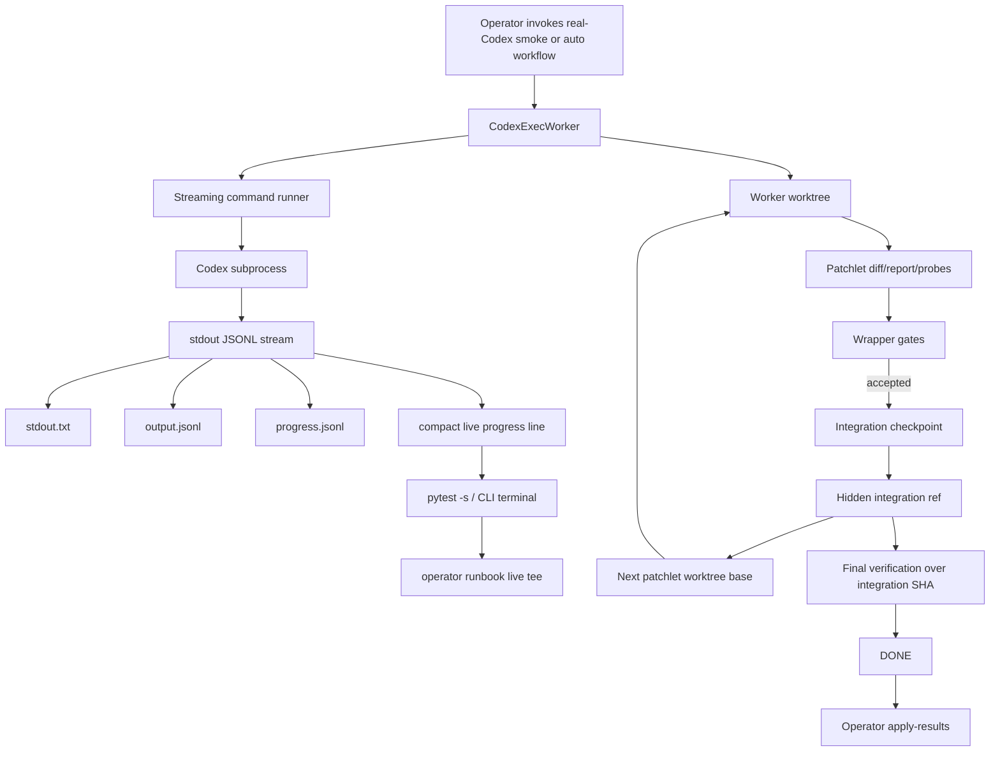
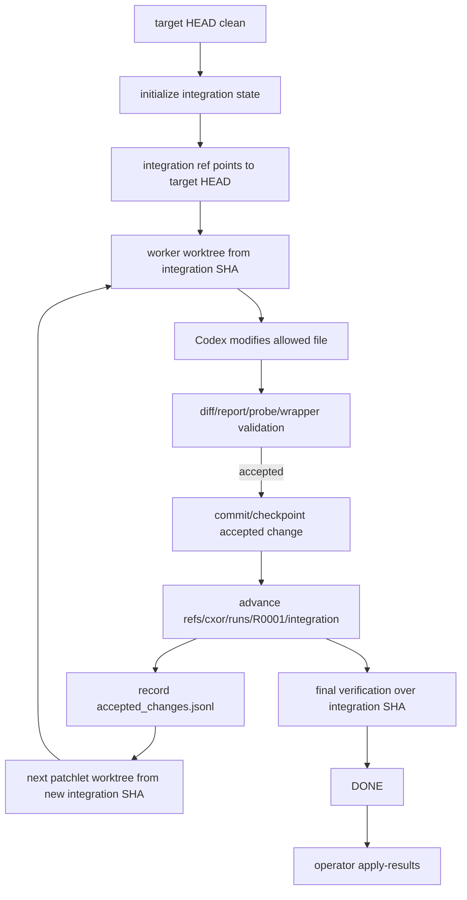

# Codex Live Progress and Accepted-Change Integration — Approved Implementation Plan

> Status: Approved implementation-plan consolidation.  
> Scope: Codex subprocess live progress, operator-run visibility, target-dirty diagnosis, accepted-change integration state, hidden integration ref, worktree base correction, final verification over integration SHA, and explicit `apply-results` finalization.  
> Purpose: Preserve all approved reflections and expand them into a detailed implementation plan that can be handed to the builder without compressing or losing context.

---

# 0. Document intent

This file consolidates the approved architecture and implementation plan for two related but distinct corrections in `codex-orchestrator`:

```text
Layer 1 — Live subprocess progress plane
Layer 2 — Accepted-change integration plane
```

These are architecture corrections, not tactical bug patches.

The live subprocess progress plane improves operator visibility during long real-Codex runs. The accepted-change integration plane fixes the deeper workflow-state issue where orchestrator-accepted product/runtime changes can leave the target working tree dirty and then block the next worktree step.

The current approved principle is:

```text
Target repo cleanliness should protect against external/user dirtiness,
not be broken by orchestrator-accepted changes.
```

This means clean-target preconditions must remain strict, but accepted changes must be carried by an orchestrator-owned integration state instead of being left as dirty working-tree edits.

---

# 1. Current evidence and why this implementation is needed

The recent real-Codex work established several important facts:

```text
1. Real Codex can launch through the orchestrator.
2. Real Codex can read Worker Capsule artifacts.
3. The earlier worker_stage/ path ambiguity was fixed.
4. The 120-second explicit run timed out cleanly and was classified as orchestrator_subprocess_timeout.
5. The 600-second explicit run did not time out.
6. The 600-second explicit run failed for a different reason: target repo dirty with app.py before a subsequent worktree step.
7. progress.jsonl existed and proved liveness, but the operator did not see short live terminal progress during the outer runbook command.
```

The new confirmed issue is not that Codex is frozen. It is that the system needs better visibility and a better accepted-change lifecycle.

The two corrections are therefore:

```text
Correction A:
  Show compact live Codex subprocess progress at the subprocess level.
  Keep it short.
  Keep durable progress.jsonl.
  Allow disabling live terminal progress with an environment variable.

Correction B:
  Stop applying accepted product/runtime changes directly to the target working tree between patchlets.
  Use a durable integration ref / integration SHA.
  Create future patchlet worktrees from integration SHA.
  Keep the target working tree clean until explicit finalization.
```

---

# 2. Non-negotiable design constraints

## 2.1 Default suite constraints

The default test suite must remain deterministic:

```text
- No real Codex invocation in ordinary pytest.
- No network/account/model dependency in ordinary pytest.
- No token usage in ordinary pytest.
- No unbounded subprocess waits.
- No terminal spam in ordinary pytest.
```

## 2.2 Safety constraints

Do not weaken any of the following:

```text
- diff validation
- report validation
- schema validation
- state validation
- target repo resolution
- one allowed product/runtime file per patchlet
- artifact directory allowlist
- clean-target preconditions for external/user dirtiness
- worktree isolation
- run_manifest WORKER_FAILED evidence
- Worker Capsule artifacts
- wrapper_gate_result.json
- no blind retry
- terminal DONE no-op behavior
- final verification gating
```

## 2.3 Testing constraints

Do not test runtime behavior by searching runtime source code under:

```text
src/codex_orchestrator/
```

Behavior-facing tests should inspect generated artifacts and command results, not source implementation text.

Allowed artifact inspections include:

```text
- generated progress.jsonl
- generated command.json
- generated run_manifest.json
- generated wrapper_gate_result.json
- generated integration_state.json
- generated accepted_changes.jsonl
- generated final_verification.json
- generated operator-run result.json
- generated diagnosis JSON/MD
- generated docs/runbook text
- generated subprompt/capsule artifacts
```

---

# 3. High-level target architecture



---

# 4. Plane 1 — Live Codex subprocess progress

## 4.1 Problem statement

The system already writes durable progress to:

```text
.codex-orchestrator/runs/<attempt>/progress.jsonl
```

That is good for post-run diagnosis, but during a long real-Codex run the operator sees little or no live feedback because the operator runbook captures stdout/stderr into files:

```text
.operator-runs/real-codex-smoke/<timestamp>/explicit_smoke_stdout.txt
.operator-runs/real-codex-smoke/<timestamp>/explicit_smoke_stderr.txt
```

The result is a poor operator experience:

```text
The subprocess may be alive and working,
but the outer terminal appears quiet until the whole run completes.
```

## 4.2 Correct design

Live progress must originate at the Codex subprocess streaming reader, not only at the outer runbook.

The subprocess reader is the component that sees the Codex JSONL stream as it arrives. Therefore it is the right layer to emit compact liveness lines.

The runner must still write all existing artifacts:

```text
stdout.txt
stderr.txt
output.jsonl
progress.jsonl
command.json
```

It should additionally write compact live lines to terminal stderr when enabled.

## 4.3 Compact line format

Use a stable, low-noise format:

```text
[cxor:P0001_attempt1 +004s] codex: thread.started
[cxor:P0001_attempt1 +011s] codex: turn.started
[cxor:P0001_attempt1 +036s] codex: command.completed
[cxor:P0001_attempt1 +090s] codex: alive
[cxor:P0001_attempt1 +459s] codex: exited 0
```

The prefix should be stable:

```text
[cxor:<attempt_id> +<elapsed>s] codex: <short_signal>
```

This lets the runbook tee only these lines without printing full subprocess output.

## 4.4 What live progress must not print

Live progress must not print:

```text
- full Codex JSON
- full command output
- prompt text
- report JSON
- probe artifact contents
- source file contents
- stack traces unless the process exits/fails and stderr summary is requested
- repeated unbounded heartbeat spam
```

Live progress is liveness, not proof.

## 4.5 Environment policy

Add a policy layer:

```text
CXOR_LIVE_CODEX_PROGRESS=1
  enable compact live terminal progress

CXOR_LIVE_CODEX_PROGRESS=0
  disable compact live terminal progress

CXOR_LIVE_CODEX_PROGRESS_INTERVAL_SECONDS=15
  throttle live progress output
```

Recommended defaults:

```text
Operator runbook explicit run:
  live progress enabled
  interval 15 seconds unless overridden

Default pytest suite:
  live progress disabled / quiet

Fake-Codex tests:
  live progress enabled only when test explicitly opts in
```

## 4.6 Policy model

Suggested module:

```text
src/codex_orchestrator/live_progress.py
```

Suggested data class:

```python
@dataclass(frozen=True)
class LiveProgressPolicy:
    enabled: bool
    interval_seconds: int
    sink: str  # "stderr" or "none"
```

Suggested resolver:

```python
def resolve_live_progress_policy(env: Mapping[str, str], *, operator_mode: bool = False) -> LiveProgressPolicy:
    ...
```

Suggested validation rules:

```text
- CXOR_LIVE_CODEX_PROGRESS must be 0 or 1 if provided.
- CXOR_LIVE_CODEX_PROGRESS_INTERVAL_SECONDS must be a positive integer if provided.
- Invalid values should raise the same structured policy/precondition error family used for timeout env validation.
```

## 4.7 Streaming event extraction

Codex JSONL events should map into compact signals.

Example mapping:

```text
thread.started                         -> thread.started
turn.started                           -> turn.started
item.started command_execution         -> command.started
item.completed command_execution       -> command.completed
item.completed agent_message           -> message.completed
turn.completed                         -> turn.completed
runner heartbeat                       -> alive
process exit_code 0                    -> exited 0
process exit_code nonzero              -> exited <code>
process timeout                        -> timed out after <N>s
```

The progress line should not include raw command bodies. For command events, use only the abstract signal unless a short sanitized summary already exists.

## 4.8 Durable progress remains source of truth

`progress.jsonl` remains the durable artifact.

Live terminal progress is a convenience signal.

Diagnosis and run manifest should continue to link to `progress.jsonl`, not rely on terminal output.

## 4.9 Runbook tee behavior

The operator runbook should capture full output to files and tee only compact progress lines.

The runbook should watch the subprocess stream and:

```text
1. Write full stdout/stderr to explicit_smoke_stdout.txt and explicit_smoke_stderr.txt.
2. If a line starts with [cxor:, print it live to the terminal.
3. Do not print all pytest output.
4. Print final normalized JSON result at the end.
```

CLI flags:

```bash
cxor real-codex-smoke-runbook --run-real-codex --live-progress
cxor real-codex-smoke-runbook --run-real-codex --no-live-progress
```

Environment still works:

```bash
CXOR_LIVE_CODEX_PROGRESS=1
CXOR_LIVE_CODEX_PROGRESS=0
```

## 4.10 Live progress tests

Behavior tests:

```python
test_live_progress_policy_defaults_quiet_for_default_suite
test_live_progress_policy_enabled_by_env
test_live_progress_policy_disabled_by_env
test_live_progress_policy_validates_positive_interval
test_codex_worker_emits_compact_live_progress_to_stderr
test_live_progress_can_be_disabled_with_env
test_live_progress_is_throttled
test_live_progress_does_not_replace_progress_jsonl
test_runbook_tees_compact_progress_lines_live
test_runbook_does_not_tee_full_pytest_output_by_default
test_runbook_still_captures_full_stdout_stderr
test_runbook_no_live_progress_silences_terminal_progress
test_runbook_dry_run_does_not_invoke_real_codex
```

## 4.11 Live progress acceptance criteria

```text
progress.jsonl still exists.
stdout.txt/stderr.txt/output.jsonl still exist.
Live progress is compact.
Live progress is throttled.
Live progress can be disabled.
Default suite remains quiet.
No real Codex is invoked by default.
Runbook still produces complete evidence bundles.
```

---

# 5. Plane 2 — Accepted-change integration plane

## 5.1 Problem statement

Current problematic flow:

```text
1. Target repo starts clean.
2. Orchestrator creates worktree for patchlet P0001.
3. Codex modifies allowed file.
4. Orchestrator validates and merges/applies change back to target.
5. Target repo now has dirty app.py.
6. Auto loop starts next patchlet.
7. Worktree precondition checks target cleanliness.
8. It fails because app.py is dirty.
```

This is not external user dirtiness. It is an orchestrator-accepted product/runtime change.

But the current clean-target gate cannot distinguish:

```text
dirty because user changed repo externally
vs
dirty because cxor accepted a patchlet result
```

Even if a dirty ledger distinguishes ownership, it does not fully solve the problem because future worktrees still need to include accepted changes as their base.

Therefore the system needs a formal integration state, not just a dirty ledger.

## 5.2 Correct architecture

Accepted product/runtime changes should advance an orchestrator-owned integration ref.

They should not dirty the target working tree between patchlets.

```text
target working tree:
  remains clean during the auto loop

integration ref:
  carries accepted product/runtime changes

worker worktrees:
  are created from latest integration SHA, not target HEAD
```

## 5.3 Integration graph



## 5.4 New artifact tree

Add durable integration artifacts:

```text
.codex-orchestrator/integration/
  integration_state.json
  accepted_changes.jsonl
  checkpoints/
    P0001.json
    P0002.json
  final_diff.patch
  apply_results/
    patch_result.json
    branch_result.json
    working_tree_result.json
```

## 5.5 integration_state.json schema

```json
{
  "schema_version": "1.0",
  "kind": "integration_state",
  "run_id": "R0001",
  "target_head_sha": "abc123",
  "integration_ref": "refs/cxor/runs/R0001/integration",
  "integration_sha": "abc123",
  "apply_mode": "finalize_only",
  "target_product_dirty_allowed": false,
  "accepted_patchlets": [],
  "last_checkpoint_path": null,
  "final_diff_path": ".codex-orchestrator/integration/final_diff.patch",
  "created_at": "...",
  "updated_at": "..."
}
```

Important fields:

```text
target_head_sha:
  the commit at the start of the workflow

integration_ref:
  hidden orchestrator-owned ref used to carry accepted changes

integration_sha:
  current integrated state SHA

apply_mode:
  finalize_only, meaning target working tree should not be dirtied during auto loop

target_product_dirty_allowed:
  false; accepted changes should not be left in target working tree

accepted_patchlets:
  ordered patchlet IDs that advanced integration
```

## 5.6 accepted_changes.jsonl schema

```json
{
  "schema_version": "1.0",
  "kind": "accepted_change",
  "run_id": "R0001",
  "patchlet_id": "P0001",
  "attempt_id": "P0001_attempt1",
  "previous_integration_sha": "abc123",
  "new_integration_sha": "def456",
  "integration_ref": "refs/cxor/runs/R0001/integration",
  "allowed_product_runtime_files": ["app.py"],
  "changed_product_runtime_files": ["app.py"],
  "diff_path": ".codex-orchestrator/runs/P0001_attempt1/diff.patch",
  "report_path": ".codex-orchestrator/reports/P0001.json",
  "probe_root": ".artifacts/probes/P0001",
  "wrapper_gate_result": ".codex-orchestrator/runs/P0001_attempt1/gates/wrapper_gate_result.json",
  "accepted_at": "..."
}
```

## 5.7 checkpoint JSON schema

Each accepted patchlet should get a checkpoint:

```text
.codex-orchestrator/integration/checkpoints/P0001.json
```

Suggested shape:

```json
{
  "schema_version": "1.0",
  "kind": "integration_checkpoint",
  "run_id": "R0001",
  "patchlet_id": "P0001",
  "attempt_id": "P0001_attempt1",
  "previous_integration_sha": "abc123",
  "new_integration_sha": "def456",
  "integration_ref": "refs/cxor/runs/R0001/integration",
  "changed_product_runtime_files": ["app.py"],
  "diff_path": ".codex-orchestrator/runs/P0001_attempt1/diff.patch",
  "wrapper_gate_result": ".codex-orchestrator/runs/P0001_attempt1/gates/wrapper_gate_result.json",
  "target_working_tree_clean_after_checkpoint": true,
  "created_at": "..."
}
```

## 5.8 Why a dirty ledger alone is insufficient

A dirty ledger could record:

```json
{
  "path": "app.py",
  "owner": "cxor",
  "patchlet_id": "P0001",
  "accepted": true
}
```

That may help diagnosis, but it does not solve the worktree-base problem.

The next patchlet must start from the state that includes P0001. If the next worktree starts from target HEAD while P0001 exists only as dirty working-tree state, the system either fails clean-target checks or produces a worktree that does not include previous accepted changes.

Therefore:

```text
Target dirty ledger may be useful as a bridge or diagnostic artifact.
It is not the main architecture.
The main architecture is an integration ref / integration checkpoint.
```

---

# 6. Detailed implementation phases

## Phase 0 — Preflight and baseline

### Goal

Confirm current behavior before changing anything.

### Commands

```bash
export UV_CACHE_DIR=/tmp/uv-cache

pwd
git status --short
git rev-parse --show-toplevel
git rev-parse --verify HEAD || true

uv run --no-sync python --version
uv run --no-sync pytest -q

codex --version || true
```

### Inspect likely files

```text
src/codex_orchestrator/command_runner.py
src/codex_orchestrator/workers/codex_exec.py
src/codex_orchestrator/real_codex_operator_runbook.py
src/codex_orchestrator/stages/run_patchlet.py
src/codex_orchestrator/worktree.py
src/codex_orchestrator/run_records.py
src/codex_orchestrator/diagnostics.py
src/codex_orchestrator/cli.py
tests/integration/test_codex_worker_progress.py
tests/integration/test_real_codex_operator_runbook.py
tests/integration/test_real_codex_failure_diagnosis.py
tests/integration/test_wrapper_gate_result.py
tests/smoke/test_real_codex_auto_worktree.py
```

### Required preflight note

Write a local implementation note with:

```text
Preflight Findings
Current live progress behavior
Current progress.jsonl behavior
Current runbook capture behavior
Current target dirty failure behavior
Current worktree base behavior
Current accepted patchlet merge/apply behavior
Current final verification behavior
Integration-ref implementation risks
Stop conditions
```

### Acceptance

```text
Baseline suite green.
Default real-Codex smoke still skipped.
No real Codex run in default tests.
Current operator-run behavior understood.
```

---

## Phase 1 — Live subprocess progress policy

### Goal

Implement compact live terminal progress at the Codex subprocess level.

### Dependencies

No integration-ref dependency. This can be implemented first.

### Implementation steps

```text
1. Add live progress policy resolver.
2. Validate CXOR_LIVE_CODEX_PROGRESS.
3. Validate CXOR_LIVE_CODEX_PROGRESS_INTERVAL_SECONDS.
4. Add compact progress formatter.
5. Integrate formatter into command_runner streaming path.
6. Ensure stdout.txt/stderr.txt/output.jsonl remain unchanged.
7. Ensure progress.jsonl remains unchanged.
8. Ensure live progress can be disabled.
9. Ensure default suite remains quiet.
```

### Suggested files

```text
src/codex_orchestrator/live_progress.py
src/codex_orchestrator/command_runner.py
src/codex_orchestrator/workers/codex_exec.py
tests/unit/test_live_progress_policy.py
tests/integration/test_codex_worker_progress.py
```

### Red tests

```python
test_live_progress_policy_defaults_quiet_for_default_suite
test_live_progress_policy_enabled_by_env
test_live_progress_policy_disabled_by_env
test_live_progress_policy_validates_positive_interval
test_codex_worker_emits_compact_live_progress_to_stderr
test_live_progress_can_be_disabled_with_env
test_live_progress_is_throttled
test_live_progress_does_not_replace_progress_jsonl
test_live_progress_does_not_print_full_json
test_live_progress_does_not_print_prompt_or_file_contents
```

### Acceptance

```text
progress.jsonl still exists.
stdout.txt/stderr.txt/output.jsonl still exist.
Live progress is compact.
Live progress is throttled.
Live progress can be disabled.
Default suite remains quiet.
No real Codex is invoked by default.
```

---

## Phase 2 — Runbook live progress tee

### Goal

Make the operator runbook tee only compact progress lines live while preserving full captured stdout/stderr.

### Implementation steps

```text
1. Update real_codex_operator_runbook to stream child process output instead of waiting silently.
2. Continue writing explicit_smoke_stdout.txt and explicit_smoke_stderr.txt.
3. Detect lines beginning with [cxor:.
4. Print those lines live to the operator terminal.
5. Do not print all pytest output by default.
6. Add CLI flags --live-progress and --no-live-progress.
7. Preserve environment override CXOR_LIVE_CODEX_PROGRESS.
8. Preserve dry-run behavior.
```

### Suggested files

```text
src/codex_orchestrator/real_codex_operator_runbook.py
src/codex_orchestrator/cli.py
tests/integration/test_real_codex_operator_runbook.py
```

### Red tests

```python
test_runbook_tees_compact_progress_lines_live
test_runbook_does_not_tee_full_pytest_output_by_default
test_runbook_still_captures_full_stdout_stderr
test_runbook_no_live_progress_silences_terminal_progress
test_runbook_live_progress_flag_sets_env_for_inner_smoke
test_runbook_dry_run_does_not_invoke_real_codex
```

### Acceptance

```text
Operator sees short liveness lines in real explicit runs.
Evidence bundle remains complete.
Dry-run does not invoke real Codex.
Default smoke skip remains unchanged.
```

---

## Phase 3 — Diagnose dirty target after accepted patchlet

### Goal

Classify the observed `app.py` dirty-target failure precisely before changing integration behavior.

### New category

```text
target_dirty_after_integration_apply
```

### Meaning

```text
The previous patchlet appears to have produced an accepted product/runtime change,
but the target working tree retained that change as dirty before the next worktree step.
This indicates missing integration-state management, not Codex path failure.
```

### Implementation steps

```text
1. Identify where clean-target precondition failures are captured.
2. Ensure dirty paths are recorded in run manifest and diagnosis input.
3. If dirty path is allowed product/runtime file and prior accepted patchlet evidence exists, classify target_dirty_after_integration_apply.
4. Do not classify unknown external dirty files this way.
5. Do not confuse worker_capsule_path_violation with product/runtime dirty files.
6. Add operator guidance in diagnosis summary.
```

### Suggested files

```text
src/codex_orchestrator/diagnostics.py
src/codex_orchestrator/stages/run_patchlet.py
src/codex_orchestrator/run_records.py
tests/integration/test_real_codex_failure_diagnosis.py
tests/integration/test_real_codex_smoke_contract.py
```

### Red tests

```python
test_diagnosis_classifies_dirty_allowed_product_file_after_accepted_patchlet
test_run_manifest_records_target_dirty_after_integration_apply
test_smoke_safe_failure_reports_target_dirty_after_integration_apply
test_diagnosis_does_not_classify_external_unknown_dirty_file_as_integration_apply
test_diagnosis_does_not_confuse_worker_capsule_path_violation_with_target_dirty_after_integration_apply
```

### Acceptance

```text
Observed app.py dirty-target failure is no longer mislabeled network_or_api_error.
External dirty files still fail as external/precondition issues.
No clean-target guard is weakened.
```

---

## Phase 4 — Integration state artifacts, recording only

### Goal

Introduce durable integration artifacts before changing behavior.

### New module

```text
src/codex_orchestrator/integration_state.py
```

### Implementation steps

```text
1. Create integration artifact directory under .codex-orchestrator/integration/.
2. Initialize integration_state.json at workflow start.
3. Set target_head_sha from git rev-parse HEAD.
4. Set integration_ref to refs/cxor/runs/<run_id>/integration.
5. Set integration_sha to target_head_sha.
6. Initialize accepted_changes.jsonl.
7. Write checkpoints directory.
8. On accepted patchlet, record accepted_changes.jsonl entry.
9. On accepted patchlet, write checkpoint JSON.
10. Do not change worktree base or apply behavior yet.
```

### Artifacts

```text
.codex-orchestrator/integration/integration_state.json
.codex-orchestrator/integration/accepted_changes.jsonl
.codex-orchestrator/integration/checkpoints/P0001.json
```

### Red tests

```python
test_integration_state_initialized_from_target_head
test_integration_state_uses_hidden_cxor_ref
test_accepted_patchlet_records_accepted_change
test_integration_state_records_current_integration_sha
test_integration_state_references_wrapper_gate_result
test_integration_checkpoint_is_written_per_accepted_patchlet
```

### Acceptance

```text
Artifacts exist and are valid.
No behavior change yet.
Full suite remains green.
```

---

## Phase 5 — Worktree base from integration SHA

### Goal

Future patchlet worktrees should be created from `integration_state.integration_sha`, not always target HEAD.

### Implementation steps

```text
1. Update worktree manager to accept base_sha.
2. Load integration_state before creating patchlet worktree.
3. Use integration_state.integration_sha as base SHA.
4. Record base_source=integration_state in run manifest.
5. Record integration_ref in run manifest worktree metadata.
6. Ensure external dirty target files still block.
7. Ensure artifact directories do not block.
8. Ensure next patchlet sees prior accepted changes once integration SHA advances.
```

### Run manifest addition

```json
{
  "worktree": {
    "base_sha": "integration_sha_here",
    "base_source": "integration_state",
    "integration_ref": "refs/cxor/runs/R0001/integration"
  }
}
```

### Red tests

```python
test_second_patchlet_worktree_includes_first_patchlet_accepted_change
test_target_product_file_remains_clean_between_patchlets
test_external_dirty_target_file_still_blocks_worktree_execution
test_artifact_dirs_do_not_block_worktree_execution
test_worktree_manifest_records_integration_base_sha
```

### Acceptance

```text
Next patchlet sees accepted changes.
Target product files are not dirty between patchlets.
External dirty files still block.
Worktree manifest records integration base.
```

---

## Phase 6 — Accepted patchlet advances integration ref

### Goal

Stop applying accepted product/runtime changes to the target working tree between patchlets.

### Required behavior

```text
Accepted patchlet diff:
  validated in worker worktree
  committed/checkpointed into integration ref
  recorded in accepted_changes.jsonl
  not applied to target working tree
```

### Implementation steps

```text
1. After wrapper gate accepts a patchlet, keep the validated worker worktree until integration checkpoint is created.
2. Commit accepted product/runtime change in that worktree or equivalent integration workspace.
3. Update refs/cxor/runs/<run_id>/integration to the checkpoint commit.
4. Update integration_state.integration_sha.
5. Append accepted_changes.jsonl.
6. Write checkpoint JSON.
7. Generate or update final_diff.patch from target_head_sha to integration_sha.
8. Confirm target working tree is clean after accepted change.
9. Remove worker worktree per cleanup policy.
```

### Red tests

```python
test_accepted_patchlet_advances_integration_ref
test_accepted_patchlet_does_not_dirty_target_product_file
test_next_patchlet_uses_integrated_product_state
test_final_verification_uses_integration_sha
test_auto_worktree_multiple_patchlets_reaches_group_verification_without_target_dirty_failure
```

### Acceptance

```text
Current app.py dirty-target failure becomes structurally impossible after accepted patchlets.
Integration ref carries accepted changes.
Target is clean until explicit finalization.
```

---

## Phase 7 — Final verification over integration SHA

### Goal

Final verification should verify the integrated result, not target HEAD or dirty working-tree state.

### final_verification.json additions

```json
{
  "integration_ref": "refs/cxor/runs/R0001/integration",
  "integration_sha": "def456",
  "target_head_sha": "abc123",
  "final_diff_path": ".codex-orchestrator/integration/final_diff.patch",
  "target_working_tree_clean": true
}
```

### Implementation steps

```text
1. Load integration_state during global/final verification.
2. Verify integration_sha exists.
3. Verify final diff exists or generate it.
4. Verify target working tree is clean.
5. Verify final_verification.json references integration_state.
6. Allow DONE only when integration state is consistent.
7. Preserve existing report/probe/group/global checks.
```

### Red tests

```python
test_final_verification_references_integration_state
test_done_requires_integration_state_consistency
test_done_requires_target_working_tree_clean_before_finalization
test_final_diff_from_target_head_to_integration_sha_exists
test_final_verification_preserves_existing_goal_and_invariant_checks
```

### Acceptance

```text
DONE is based on integration SHA.
Target repo is still clean at DONE unless operator applied results.
Final diff exists.
Existing global proof remains intact.
```

---

## Phase 8 — apply-results finalization command

### Goal

Applying accepted results to the operator's repo must be explicit.

### New CLI

```bash
cxor apply-results --repo . --mode patch
cxor apply-results --repo . --mode branch
cxor apply-results --repo . --mode working-tree
```

### Mode: patch

Safest default.

```text
Writes or refreshes .codex-orchestrator/integration/final_diff.patch.
Does not mutate product/runtime files.
```

### Mode: branch

```text
Creates a branch at integration_sha.
Does not mutate current working tree.
```

Example branch:

```text
cxor/results/R0001
```

### Mode: working-tree

```text
Requires clean target working tree.
Applies final diff to current working tree.
Mutates product/runtime files only because operator explicitly requested it.
```

### apply result artifact

```text
.codex-orchestrator/integration/apply_results/<mode>_result.json
```

Shape:

```json
{
  "schema_version": "1.0",
  "kind": "apply_results_result",
  "mode": "patch",
  "target_head_sha": "abc123",
  "integration_sha": "def456",
  "final_diff_path": ".codex-orchestrator/integration/final_diff.patch",
  "mutated_working_tree": false,
  "created_branch": null,
  "created_at": "..."
}
```

### Red tests

```python
test_apply_results_patch_writes_final_diff_without_mutating_product_files
test_apply_results_branch_creates_result_branch
test_apply_results_working_tree_requires_clean_target
test_apply_results_working_tree_applies_final_diff
test_apply_results_records_apply_result_json
test_apply_results_refuses_unknown_mode
```

### Acceptance

```text
No silent product mutation at DONE.
Operator explicitly chooses how to consume result.
working-tree mode requires clean target.
patch and branch modes do not dirty current working tree.
```

---

## Phase 9 — Docs, runbook, and explicit real-Codex smoke

### Docs to update

```text
README.md
docs/cli.md
docs/worktrees.md
docs/autonomous_loop.md
docs/real_codex_smoke.md
docs/runbooks/real_codex_smoke_runbook.md
IMPLEMENTATION_STATUS.md
```

### Docs must explain

```text
Live progress is short liveness only.
progress.jsonl remains durable truth.
CXOR_LIVE_CODEX_PROGRESS=0 disables terminal progress.
Accepted changes advance integration ref.
Target repo remains clean between patchlets.
Next worktree starts from integration SHA.
apply-results is the explicit finalization step.
Safe failure is evidence capture, not DONE.
Do not weaken clean-target preconditions.
```

### Docs tests

```python
test_docs_explain_live_codex_progress
test_docs_explain_live_progress_can_be_disabled
test_docs_explain_integration_ref
test_docs_explain_target_remains_clean_between_patchlets
test_docs_explain_apply_results_modes
test_docs_explain_safe_failure_not_done
```

### Explicit real-Codex verification commands

First default skip:

```bash
uv run --no-sync pytest -q tests/smoke/test_real_codex_auto_worktree.py
```

Then operator-run with shorter timeout:

```bash
CODEX_PATCHLET_TIMEOUT_SECONDS=120 uv run --no-sync cxor real-codex-smoke-runbook --run-real-codex
```

Then full timeout:

```bash
CODEX_PATCHLET_TIMEOUT_SECONDS=600 uv run --no-sync cxor real-codex-smoke-runbook --run-real-codex
```

Expected improvements:

```text
operator sees compact live progress lines
no top-level worker_stage path violation
no target dirty app.py failure after accepted patchlet
if still safe-fails, diagnosis is precise
```

---

# 7. Diagnosis categories and meanings

## Existing important categories

```text
orchestrator_subprocess_timeout
  The orchestrator terminated Codex after configured timeout.

worker_capsule_path_violation
  Codex wrote capsule artifacts outside the run-local capsule directory.

network_or_api_error
  Evidence indicates Codex API/network/model access failure.

unknown_codex_nonzero_exit
  Worker failed but evidence does not support a narrower category.
```

## New category

```text
target_dirty_after_integration_apply
```

Meaning:

```text
A prior accepted product/runtime change appears to have remained as target working-tree dirtiness before the next worktree step.
This is a missing integration-plane lifecycle issue.
```

Do not use this category for:

```text
- unknown external dirty file
- top-level worker_stage/ or worker_memory/ directories
- real Codex timeout
- network/API failures
- ordinary report/probe validation failure
```

Use it only when the evidence supports accepted product/runtime dirty state.

---

# 8. Run manifest changes

The run manifest should include live progress and integration metadata.

## Patchlet run entry additions

```json
{
  "progress_path": ".codex-orchestrator/runs/P0001_attempt1/progress.jsonl",
  "live_progress": {
    "enabled": true,
    "interval_seconds": 15,
    "sink": "stderr"
  },
  "integration": {
    "integration_ref": "refs/cxor/runs/R0001/integration",
    "integration_sha_before": "abc123",
    "integration_sha_after": "def456",
    "checkpoint_path": ".codex-orchestrator/integration/checkpoints/P0001.json"
  },
  "worktree": {
    "base_source": "integration_state",
    "base_sha": "abc123"
  }
}
```

## Failure entry additions for target dirty issue

```json
{
  "worker_failure": {
    "failure_category": "target_dirty_after_integration_apply",
    "dirty_paths": ["app.py"],
    "blind_retry_allowed": false,
    "retryable": false
  }
}
```

---

# 9. CLI contracts

## real-codex-smoke-runbook

Existing command:

```bash
cxor real-codex-smoke-runbook --dry-run
cxor real-codex-smoke-runbook --run-real-codex
```

Add live progress flags:

```bash
cxor real-codex-smoke-runbook --run-real-codex --live-progress
cxor real-codex-smoke-runbook --run-real-codex --no-live-progress
```

Behavior:

```text
--live-progress:
  set or preserve CXOR_LIVE_CODEX_PROGRESS=1 for inner smoke
  tee compact [cxor:...] lines live

--no-live-progress:
  set CXOR_LIVE_CODEX_PROGRESS=0
  do not tee compact progress lines

Neither mode changes evidence capture.
```

## apply-results

New command:

```bash
cxor apply-results --repo . --mode patch
cxor apply-results --repo . --mode branch
cxor apply-results --repo . --mode working-tree
```

Behavior summary:

```text
patch:
  write final_diff.patch only
  no product/runtime mutation

branch:
  create result branch at integration_sha
  no current working-tree mutation

working-tree:
  require clean target
  apply final diff to working tree
  record mutated_working_tree=true
```

---

# 10. Real-Codex smoke interpretation after this plan

After implementation, explicit real-Codex smoke results should be interpreted as follows:

## DONE

```text
Real Codex completed the smoke and all orchestrator validators accepted the integrated result.
Target remains clean until apply-results unless working-tree finalization was explicitly requested.
```

## safe_failure with orchestrator_subprocess_timeout

```text
Codex was alive but exceeded configured timeout.
Use progress.jsonl and live progress lines to inspect how far it got.
Increase timeout or simplify prompt/task if appropriate.
```

## safe_failure with worker_capsule_path_violation

```text
Codex wrote capsule artifacts outside run-local capsule paths.
Do not weaken validators.
Fix prompt/path instructions.
```

## safe_failure with target_dirty_after_integration_apply

```text
Accepted product/runtime change remained dirty in target before next worktree step.
This means integration-plane lifecycle is not correctly installed or has a bug.
```

## safe_failure with network_or_api_error

```text
Codex process or model/API access failed.
This is environment/account/network/model availability, not necessarily orchestrator logic.
```

---

# 11. Risk register

## Risk 1 — Live progress terminal spam

Mitigation:

```text
- throttle progress
- print only compact lines
- never print raw JSON or file contents
- allow CXOR_LIVE_CODEX_PROGRESS=0
```

## Risk 2 — Streaming capture regression

Mitigation:

```text
- tests assert stdout.txt/stderr.txt/output.jsonl still exist
- tests assert progress.jsonl still exists
- tests assert timeout still works
```

## Risk 3 — Integration ref mutates user repo unexpectedly

Mitigation:

```text
- use hidden refs
- do not dirty target working tree
- require explicit apply-results
- test patch/branch modes are non-mutating
```

## Risk 4 — Clean-target guard weakened accidentally

Mitigation:

```text
- tests for external dirty files still block
- target dirty after accepted patchlet solved by integration plane, not by relaxing guard
```

## Risk 5 — Next patchlet misses prior accepted changes

Mitigation:

```text
- worktree base must be integration_state.integration_sha
- tests assert second patchlet worktree includes first patchlet accepted change
```

## Risk 6 — DONE based on wrong state

Mitigation:

```text
- final_verification references integration_state
- final diff from target_head_sha to integration_sha must exist
- target working tree must be clean before finalization
```

---

# 12. Stop conditions

Stop if any of the following happens:

```text
Default suite invokes real Codex.
Live progress prints full JSON/prompt/file contents.
Live progress is not throttled.
CXOR_LIVE_CODEX_PROGRESS=0 does not silence output.
progress.jsonl is lost or changed incompatibly.
stdout/stderr/output artifacts are lost.
Clean-target precondition is weakened for external dirty files.
Target product/runtime files remain dirty between patchlets after integration ref is implemented.
Next patchlet does not see prior accepted changes.
DONE is allowed without final verification over integration SHA.
apply-results working-tree mode mutates a dirty target.
```

---

# 13. Recommended first Codex handoff prompt

Use a large single prompt, but enforce phase gates. The builder should implement as much as safely possible in one run, but must keep the phase order and full-suite gates.

```text
Implement the approved Live Progress and Accepted-Change Integration plan.

Phase order:
1. Live subprocess progress policy.
2. Runbook live progress tee.
3. Diagnosis target_dirty_after_integration_apply.
4. Integration state artifacts, recording only.
5. Worktree base from integration SHA.
6. Accepted patchlet advances integration ref and does not dirty target.
7. Final verification over integration SHA.
8. apply-results command.
9. Docs and real-Codex operator smoke.

Do not invoke real Codex in the default suite.
Do not weaken validators.
Do not relax clean-target guard for external dirty files.
Use behavior-facing tests.
Run full suite after each phase.
Stop on regression.
```

---

# 14. Final implementation summary

The approved plan is:

```text
1. Add compact live progress at Codex subprocess level.
2. Tee compact progress through the operator runbook.
3. Diagnose target_dirty_after_integration_apply precisely.
4. Add integration_state.json and accepted_changes.jsonl.
5. Base worktrees on integration SHA.
6. Advance integration ref instead of dirtying target.
7. Verify DONE against integration SHA.
8. Add explicit apply-results finalization.
9. Update docs and run real-Codex operator smoke.
```

This architecture gives the system:

```text
operator visibility during long real-Codex runs
clean deterministic multi-patchlet worktree progression
explicit finalization instead of silent working-tree mutation
```

without weakening the safety model.

---

# Appendix A — Approved source reflections preserved verbatim

The following section preserves the approved reflections and implementation plan that this document expands. It is intentionally kept verbatim so that no approved detail is lost.

---

I reviewed the approved architecture file. The core direction is right: treat this as two architecture planes, not two tactical fixes — **Live subprocess progress plane** and **Accepted-change integration plane**. The file’s key principle is that target repo cleanliness should protect against external/user dirtiness, not be broken by orchestrator-accepted changes. 

Below is the implementation plan I would use.

---

# Implementation plan — Live progress + accepted-change integration

## Overall strategy

Do **not** implement the integration-ref system in one risky jump. Use a staged rollout:

```text id="am1qkx"
Phase 0 — Preflight and baseline
Phase 1 — Live subprocess progress policy
Phase 2 — Runbook live progress tee
Phase 3 — Precise diagnosis for target dirty after accepted patchlet
Phase 4 — Integration state artifacts, read-only recording first
Phase 5 — Worktree base from integration SHA
Phase 6 — Accepted patchlet advances integration ref, target stays clean
Phase 7 — Final verification over integration SHA
Phase 8 — apply-results finalization command
Phase 9 — Docs, runbook, and explicit real-Codex smoke
```

The reason for this order:

```text id="kc2mzb"
1. Live progress improves all future debugging immediately.
2. Diagnosis classification makes the current failure understandable before changing behavior.
3. Integration artifacts can be introduced safely before altering worktree semantics.
4. Only after artifacts are durable should worktree base and merge behavior change.
5. Finalization should be explicit after integration ref behavior is stable.
```

---

# Phase 0 — Preflight and baseline

## Goal

Confirm current behavior before changing anything.

## Commands

```bash id="v62y2p"
export UV_CACHE_DIR=/tmp/uv-cache

pwd
git status --short
git rev-parse --show-toplevel
git rev-parse --verify HEAD || true

uv run --no-sync python --version
uv run --no-sync pytest -q

codex --version || true
```

## Inspect likely files

```text id="d6yi31"
src/codex_orchestrator/command_runner.py
src/codex_orchestrator/workers/codex_exec.py
src/codex_orchestrator/real_codex_operator_runbook.py
src/codex_orchestrator/stages/run_patchlet.py
src/codex_orchestrator/worktree.py
src/codex_orchestrator/run_records.py
src/codex_orchestrator/diagnostics.py
src/codex_orchestrator/cli.py
tests/integration/test_codex_worker_progress.py
tests/integration/test_real_codex_operator_runbook.py
tests/integration/test_real_codex_failure_diagnosis.py
tests/integration/test_wrapper_gate_result.py
tests/smoke/test_real_codex_auto_worktree.py
```

## Acceptance

```text id="ve4otm"
Baseline suite green.
Default real-Codex smoke still skipped.
No real Codex run in default tests.
Current operator-run behavior understood.
```

---

# Phase 1 — Live subprocess progress policy

## Goal

Implement compact live terminal progress at the Codex subprocess level.

Progress already exists as durable `progress.jsonl`; now the runner should also emit short live lines.

## New or updated module

Preferred new module:

```text id="9gicjj"
src/codex_orchestrator/live_progress.py
```

## Policy

```text id="ngx7eg"
CXOR_LIVE_CODEX_PROGRESS=1  -> enabled
CXOR_LIVE_CODEX_PROGRESS=0  -> disabled
CXOR_LIVE_CODEX_PROGRESS_INTERVAL_SECONDS=15 -> throttle interval
```

Recommended default:

```text id="fl7doh"
operator runbook explicit run: enabled
ordinary default suite: disabled/quiet
ordinary fake tests: opt-in only
```

## Suggested data model

```python id="fxoh56"
@dataclass(frozen=True)
class LiveProgressPolicy:
    enabled: bool
    interval_seconds: int
    sink: str  # "stderr" or "none"
```

## Compact line format

```text id="nwqkho"
[cxor:P0001_attempt1 +004s] codex: thread.started
[cxor:P0001_attempt1 +011s] codex: turn.started
[cxor:P0001_attempt1 +036s] codex: command.completed
[cxor:P0001_attempt1 +090s] codex: alive
[cxor:P0001_attempt1 +459s] codex: exited 0
```

## Do not print

```text id="xxyu05"
full JSON
prompt text
report text
file contents
command output bodies
unbounded repeated lines
```

## Tests

```python id="b27357"
test_live_progress_policy_defaults_quiet_for_default_suite
test_live_progress_policy_enabled_by_env
test_live_progress_policy_disabled_by_env
test_live_progress_policy_validates_positive_interval
test_codex_worker_emits_compact_live_progress_to_stderr
test_live_progress_can_be_disabled_with_env
test_live_progress_is_throttled
test_live_progress_does_not_replace_progress_jsonl
```

## Acceptance

```text id="v52zbn"
progress.jsonl still exists.
stdout.txt/stderr.txt/output.jsonl still exist.
Live progress is compact.
Live progress can be disabled.
Default suite remains quiet.
No real Codex is invoked by default.
```

---

# Phase 2 — Runbook live progress tee

## Goal

The operator runbook currently captures output into files. It should additionally tee only compact progress lines live.

## Current capture files

```text id="gy2tvr"
explicit_smoke_stdout.txt
explicit_smoke_stderr.txt
```

## New behavior

The runbook should:

```text id="rx4l2w"
1. Continue capturing full stdout/stderr to files.
2. Watch captured lines while the subprocess runs.
3. If a line starts with [cxor:, print it immediately to the operator terminal.
4. Do not print full pytest output by default.
5. Print final result JSON after completion.
```

## CLI flags

Add or support:

```bash id="tbnjr2"
cxor real-codex-smoke-runbook --run-real-codex --live-progress
cxor real-codex-smoke-runbook --run-real-codex --no-live-progress
```

Environment should still work:

```bash id="n5bz04"
CXOR_LIVE_CODEX_PROGRESS=1
CXOR_LIVE_CODEX_PROGRESS=0
```

## Tests

```python id="s2skxw"
test_runbook_tees_compact_progress_lines_live
test_runbook_does_not_tee_full_pytest_output_by_default
test_runbook_still_captures_full_stdout_stderr
test_runbook_no_live_progress_silences_terminal_progress
test_runbook_dry_run_does_not_invoke_real_codex
```

## Acceptance

```text id="u2b08e"
Operator sees short liveness lines in real explicit runs.
Evidence bundle remains complete.
Dry-run does not invoke real Codex.
Default smoke skip remains unchanged.
```

---

# Phase 3 — Diagnose dirty target after accepted patchlet

## Goal

Before changing integration behavior, classify the new observed failure precisely.

Current failure:

```text id="z5ysf6"
Worktree execution requires a clean target repo; dirty paths: app.py
```

After the observed 600-second run, this was not a capsule path violation. It was a product/runtime file dirty after an accepted patchlet.

## New diagnosis category

Use:

```text id="ubazah"
target_dirty_after_integration_apply
```

## Meaning

```text id="06kkgo"
A prior patchlet appears to have produced an accepted product/runtime change,
but the target working tree retained that change as dirty before the next worktree step.
This indicates missing integration-state management, not Codex path failure.
```

## Classification should require evidence

Do not overclassify. Use this category only when evidence supports it:

```text id="zmtvkc"
1. Worktree precondition failed because target product/runtime file is dirty.
2. Dirty path matches an allowed file or accepted patchlet record.
3. It is not a top-level capsule directory like worker_stage/.
4. It is not an unknown external dirty file.
```

## Tests

```python id="bbgum2"
test_diagnosis_classifies_dirty_allowed_product_file_after_accepted_patchlet
test_run_manifest_records_target_dirty_after_integration_apply
test_smoke_safe_failure_reports_target_dirty_after_integration_apply
test_diagnosis_does_not_classify_external_unknown_dirty_file_as_integration_apply
test_diagnosis_does_not_confuse_worker_capsule_path_violation_with_target_dirty_after_integration_apply
```

## Acceptance

```text id="8x3u2e"
Observed app.py dirty-target failure is no longer mislabeled network_or_api_error.
External dirty files still fail as external/precondition issues.
No clean-target guard is weakened.
```

---

# Phase 4 — Integration state artifacts, recording only

## Goal

Introduce durable integration artifacts before changing behavior.

## New module

```text id="vfh4u7"
src/codex_orchestrator/integration_state.py
```

## New artifact tree

```text id="p7o49e"
.codex-orchestrator/integration/
  integration_state.json
  accepted_changes.jsonl
  checkpoints/
```

## Initialize at workflow start

```text id="jmag4h"
1. Confirm target repo is clean.
2. Record target_head_sha.
3. Create integration_ref = refs/cxor/runs/<run_id>/integration.
4. Set integration_sha = target_head_sha.
5. Write integration_state.json.
```

## integration_state.json

```json id="acfmrs"
{
  "schema_version": "1.0",
  "kind": "integration_state",
  "target_head_sha": "abc123",
  "integration_ref": "refs/cxor/runs/R0001/integration",
  "integration_sha": "abc123",
  "apply_mode": "finalize_only",
  "target_product_dirty_allowed": false,
  "accepted_patchlets": [],
  "last_checkpoint_path": null,
  "final_diff_path": ".codex-orchestrator/integration/final_diff.patch"
}
```

## accepted_changes.jsonl entry

```json id="b3tuv8"
{
  "schema_version": "1.0",
  "kind": "accepted_change",
  "run_id": "R0001",
  "patchlet_id": "P0001",
  "attempt_id": "P0001_attempt1",
  "previous_integration_sha": "abc123",
  "new_integration_sha": "def456",
  "integration_ref": "refs/cxor/runs/R0001/integration",
  "allowed_product_runtime_files": ["app.py"],
  "changed_product_runtime_files": ["app.py"],
  "diff_path": ".codex-orchestrator/runs/P0001_attempt1/diff.patch",
  "report_path": ".codex-orchestrator/reports/P0001.json",
  "probe_root": ".artifacts/probes/P0001",
  "wrapper_gate_result": ".codex-orchestrator/runs/P0001_attempt1/gates/wrapper_gate_result.json",
  "accepted_at": "..."
}
```

## Tests

```python id="u19fwx"
test_integration_state_initialized_from_target_head
test_integration_state_uses_hidden_cxor_ref
test_accepted_patchlet_records_accepted_change
test_integration_state_records_current_integration_sha
test_integration_state_references_wrapper_gate_result
test_integration_checkpoint_is_written_per_accepted_patchlet
```

## Acceptance

```text id="qlx06d"
Artifacts exist and are valid.
No behavior change yet.
Full suite remains green.
```

---

# Phase 5 — Worktree base from integration SHA

## Goal

Future patchlet worktrees should be created from `integration_state.integration_sha`, not always target HEAD.

## Current bad behavior

```text id="exajlq"
P0001 accepted -> app.py dirty in target -> P0002 blocked
```

## Desired behavior

```text id="yxwh3w"
P0001 accepted -> integration_sha advances
P0002 worktree created from integration_sha
target working tree remains clean
P0002 sees P0001's accepted change
```

## Modify worktree creation

The worktree manager should accept a base SHA:

```python id="ddfwj7"
create_patchlet_worktree(base_sha=integration_state.integration_sha)
```

## Run manifest should record

```json id="eubdof"
{
  "worktree": {
    "base_sha": "integration_sha_here",
    "base_source": "integration_state",
    "integration_ref": "refs/cxor/runs/R0001/integration"
  }
}
```

## Tests

```python id="d6gnyb"
test_second_patchlet_worktree_includes_first_patchlet_accepted_change
test_target_product_file_remains_clean_between_patchlets
test_external_dirty_target_file_still_blocks_worktree_execution
test_artifact_dirs_do_not_block_worktree_execution
test_worktree_manifest_records_integration_base_sha
```

## Acceptance

```text id="rqoa2u"
Next patchlet sees accepted changes.
Target product files are not dirty between patchlets.
External dirty files still block.
Worktree manifest records integration base.
```

---

# Phase 6 — Accepted patchlet advances integration ref

## Goal

Stop applying accepted product/runtime changes to the target working tree between patchlets.

## Required behavior

```text id="6oggrs"
Accepted patchlet diff:
  validated in worker worktree
  committed/checkpointed into integration ref
  recorded in accepted_changes.jsonl
  not applied to target working tree
```

## How to checkpoint

After a patchlet is accepted:

```text id="u61cos"
1. Keep the validated worker worktree.
2. Commit accepted product/runtime change into an integration checkpoint.
3. Update refs/cxor/runs/<run_id>/integration.
4. Record checkpoint JSON.
5. Confirm target working tree remains clean.
6. Remove worker worktree per cleanup policy.
```

## Tests

```python id="o6ldww"
test_accepted_patchlet_advances_integration_ref
test_accepted_patchlet_does_not_dirty_target_product_file
test_next_patchlet_uses_integrated_product_state
test_final_verification_uses_integration_sha
test_auto_worktree_multiple_patchlets_reaches_group_verification_without_target_dirty_failure
```

## Acceptance

```text id="fk4rfo"
Current app.py dirty-target failure becomes structurally impossible after accepted patchlets.
Integration ref carries accepted changes.
Target is clean until explicit finalization.
```

---

# Phase 7 — Final verification over integration SHA

## Goal

Final verification should verify the integrated result, not only target HEAD or dirty working tree state.

## final_verification.json should include

```json id="bpwzbf"
{
  "integration_ref": "refs/cxor/runs/R0001/integration",
  "integration_sha": "def456",
  "target_head_sha": "abc123",
  "final_diff_path": ".codex-orchestrator/integration/final_diff.patch",
  "target_working_tree_clean": true
}
```

## Tests

```python id="euig80"
test_final_verification_references_integration_state
test_done_requires_integration_state_consistency
test_done_requires_target_working_tree_clean_before_finalization
test_final_diff_from_target_head_to_integration_sha_exists
```

## Acceptance

```text id="1fn9zh"
DONE is based on integration SHA.
Target repo is still clean at DONE unless operator applied results.
Final diff exists.
```

---

# Phase 8 — `apply-results` finalization command

## Goal

Applying accepted results to the operator’s repo must be explicit.

## New CLI

```bash id="7x5uhz"
cxor apply-results --repo . --mode patch
cxor apply-results --repo . --mode branch
cxor apply-results --repo . --mode working-tree
```

## Mode: patch

Safest default.

```text id="ex0f55"
Writes/refreshes .codex-orchestrator/integration/final_diff.patch.
Does not mutate product/runtime files.
```

## Mode: branch

```text id="tsc7ao"
Creates a branch at integration_sha.
Does not mutate current working tree.
```

Example branch:

```text id="fk2i4a"
cxor/results/R0001
```

## Mode: working-tree

```text id="miz70o"
Requires clean target working tree.
Applies final diff to current working tree.
Mutates product/runtime files only because operator explicitly requested it.
```

## apply result artifact

```text id="462qzk"
.codex-orchestrator/integration/apply_results/<mode>_result.json
```

Shape:

```json id="xds4x2"
{
  "schema_version": "1.0",
  "kind": "apply_results_result",
  "mode": "patch",
  "target_head_sha": "abc123",
  "integration_sha": "def456",
  "final_diff_path": ".codex-orchestrator/integration/final_diff.patch",
  "mutated_working_tree": false,
  "created_branch": null,
  "created_at": "..."
}
```

## Tests

```python id="p438pp"
test_apply_results_patch_writes_final_diff_without_mutating_product_files
test_apply_results_branch_creates_result_branch
test_apply_results_working_tree_requires_clean_target
test_apply_results_working_tree_applies_final_diff
test_apply_results_records_apply_result_json
```

## Acceptance

```text id="13fcer"
No silent product mutation at DONE.
Operator explicitly chooses how to consume result.
```

---

# Phase 9 — Docs and real-Codex rerun

## Docs to update

```text id="g15nfn"
README.md
docs/cli.md
docs/worktrees.md
docs/autonomous_loop.md
docs/real_codex_smoke.md
docs/runbooks/real_codex_smoke_runbook.md
IMPLEMENTATION_STATUS.md
```

## Docs must explain

```text id="8dl3ae"
Live progress is short liveness only.
progress.jsonl remains durable truth.
CXOR_LIVE_CODEX_PROGRESS=0 disables terminal progress.
Accepted changes advance integration ref.
Target repo remains clean between patchlets.
Next worktree starts from integration SHA.
apply-results is the explicit finalization step.
Safe failure is evidence capture, not DONE.
Do not weaken clean-target preconditions.
```

## Docs tests

```python id="rf7rpq"
test_docs_explain_live_codex_progress
test_docs_explain_live_progress_can_be_disabled
test_docs_explain_integration_ref
test_docs_explain_target_remains_clean_between_patchlets
test_docs_explain_apply_results_modes
test_docs_explain_safe_failure_not_done
```

## Explicit real-Codex commands

First default skip:

```bash id="g9s6fh"
uv run --no-sync pytest -q tests/smoke/test_real_codex_auto_worktree.py
```

Then operator-run with shorter timeout:

```bash id="szjgm1"
CODEX_PATCHLET_TIMEOUT_SECONDS=120 \
uv run --no-sync cxor real-codex-smoke-runbook --run-real-codex
```

Then full timeout:

```bash id="r8rbpp"
CODEX_PATCHLET_TIMEOUT_SECONDS=600 \
uv run --no-sync cxor real-codex-smoke-runbook --run-real-codex
```

Expected improvements:

```text id="wt6uof"
operator sees compact live progress lines
no top-level worker_stage path violation
no target dirty app.py failure after accepted patchlet
if still safe-fails, diagnosis is precise
```

---

# Critical design decisions

## Decision 1 — Live progress belongs at subprocess level

Do not implement progress only in the runbook. The runbook is outer packaging. The source of truth for Codex progress is the streaming Codex subprocess reader.

## Decision 2 — Target dirty ledger is not enough

A dirty ledger may help diagnostics, but it does not solve the next-worktree base problem. The next worktree must be based on the accepted integrated state.

## Decision 3 — Integration ref should not surprise the operator

The operator’s working tree should not be silently dirtied. Final application should be explicit through `apply-results`.

## Decision 4 — Clean-target precondition remains strict

Do not weaken this guard for external files. Instead, stop accepted changes from dirtying the target.

---

# Stop conditions

```text id="41dpp7"
Default suite invokes real Codex.
Live progress prints full JSON/prompt/file contents.
Live progress is not throttled.
CXOR_LIVE_CODEX_PROGRESS=0 does not silence output.
progress.jsonl is lost or changed incompatibly.
stdout/stderr/output artifacts are lost.
Clean-target precondition is weakened for external dirty files.
Target product/runtime files remain dirty between patchlets after integration ref is implemented.
Next patchlet does not see prior accepted changes.
DONE is allowed without final verification over integration SHA.
apply-results working-tree mode mutates a dirty target.
```

---

# Summary

The implementation plan is:

```text id="78nk3l"
1. Add compact live progress at Codex subprocess level.
2. Tee compact progress through the operator runbook.
3. Diagnose target_dirty_after_integration_apply precisely.
4. Add integration_state.json and accepted_changes.jsonl.
5. Base worktrees on integration SHA.
6. Advance integration ref instead of dirtying target.
7. Verify DONE against integration SHA.
8. Add explicit apply-results finalization.
9. Update docs and run real-Codex operator smoke.
```

This is the correct architecture because it gives the system both:

```text id="3g1fgz"
operator visibility during long real-Codex runs
clean deterministic multi-patchlet progression
```

without weakening the safety model.

