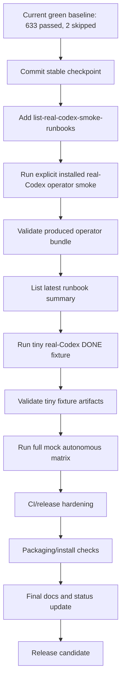
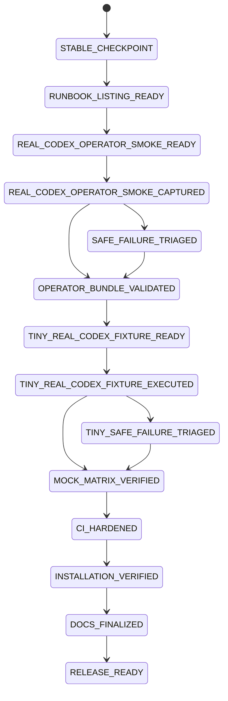
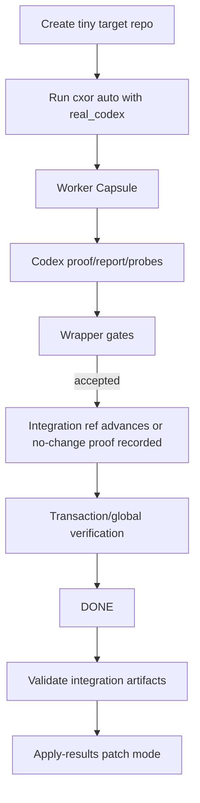
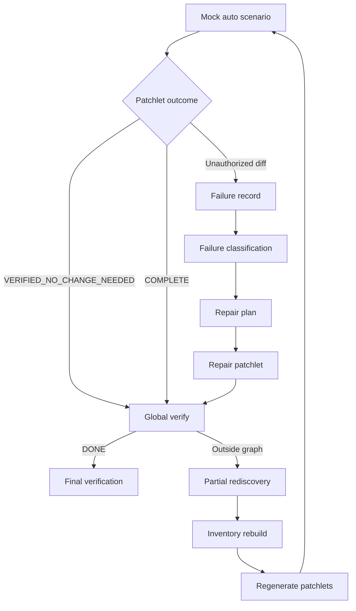
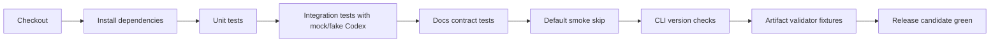
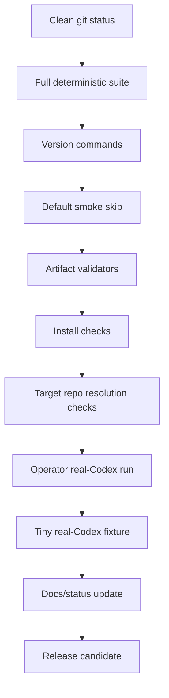

# Codex Orchestrator Final Validation and Release-Hardening Implementation Plan

Status: Approved final validation and release-hardening plan  
Scope: Finish the **Codex Orchestrator Implementation Plan — Autonomous Root-Cause Probe-Gated Loop** after the core architecture, Worker Capsule, live progress, integration-ref flow, integration artifact schemas, operator-run bundle schemas, and validation CLIs have been implemented.  
Purpose: Convert the project from “architecture implemented and deterministic tests green” into “release-ready, operator-validated, installation-validated, documented, and ready for repeated use against real target repositories.”

---

# 0. Current state snapshot

The project is now in final validation and release-hardening territory.

The latest confirmed baseline is:

```text
633 passed, 2 skipped
```

The most recent completed increment added schema validation for operator-run real-Codex smoke bundles.

The project already has:

```text
Core autonomous loop architecture
Standalone installable cxor CLI
Target repository resolution
Worker Capsule artifacts
CodexExecWorker real/fake/mocked execution path
Opt-in real-Codex smoke
Operator-controlled real-Codex smoke runbook
Runbook bundle schema validation
Live compact Codex subprocess progress
Integration ref accepted-change flow
Integration artifact schema validation
apply-results finalization command
validate-integration-artifacts CLI
validate-real-codex-smoke-runbook CLI
Default smoke skip behavior
No real Codex invocation in the default suite
```

The remaining work is no longer a missing architecture problem.

The remaining work is:

```text
1. Final deterministic operator tooling.
2. Live installed real-Codex proof.
3. Tiny real-Codex DONE-path proof.
4. Complete mock autonomous scenario matrix.
5. CI and release hardening.
6. Installability verification.
7. Final documentation/status consolidation.
```

---

# 1. Final goal

The implementation should be considered finished when the following are true:

```text
1. Full deterministic suite is green.
2. Mock autonomous matrix reaches DONE across success, repair, rediscovery, resume, and integration-ref scenarios.
3. Explicit installed real-Codex operator smoke has been run after the latest integration-ref/schema changes.
4. The produced operator-run bundle validates with `cxor validate-real-codex-smoke-runbook`.
5. A tiny real-Codex fixture either reaches DONE or safe-fails with precise diagnosis and complete evidence.
6. Integration artifacts validate with `cxor validate-integration-artifacts`.
7. Target repo remains clean between accepted patchlets.
8. `cxor apply-results` works in patch, branch, and working-tree modes.
9. Default CI never invokes real Codex.
10. Installable CLI works from outside the orchestrator repo.
11. `--repo` and current Git-root discovery work.
12. Final docs and `IMPLEMENTATION_STATUS.md` describe the real workflow and current known limits.
```

---

# 2. Final validation and release-hardening dependency graph



---

# 3. Release-readiness state machine



---

# 4. Non-goals

Do **not** turn real Codex into a default test dependency.

Do **not** weaken safety gates to make real Codex reach DONE.

Do **not** treat safe failure as DONE.

Do **not** silently apply final integration results to the operator working tree.

Do **not** allow target repo dirtiness from accepted patchlets to bypass integration-ref flow.

Do **not** make CI consume OpenAI/Codex account resources by default.

Do **not** rely on terminal scrollback as evidence.

Do **not** leave final release validation as informal manual notes.

---

# 5. Phase 0 — Commit current stable checkpoint

## Goal

Create a clean rollback point before final validation and live-environment work.

## Commands

```bash
git status --short

uv run --no-sync pytest -q
uv run --no-sync python -m codex_orchestrator --version
uv run --no-sync cxor --version
uv run --no-sync codex-orchestrator --version

git add .
git commit -m "Add operator-run smoke bundle schema validation"
```

## Acceptance criteria

```text
- Working tree is clean after commit.
- Full deterministic suite is green before commit.
- Commit contains all schema-validation changes.
- Commit does not include accidental operator-run output unless intentionally tracked.
- `.operator-runs/` remains ignored or untracked according to project policy.
```

## Stop conditions

```text
- Full suite is not green.
- Git status contains accidental large operator-run artifacts.
- Version commands fail.
- The repo contains untracked files that should be intentionally reviewed before commit.
```

---

# 6. Phase 1 — Add `cxor list-real-codex-smoke-runbooks`

## 6.1 Goal

Add a read-only command that summarizes all local operator-run real-Codex smoke bundles.

Current validation command:

```bash
cxor validate-real-codex-smoke-runbook --run-dir <bundle>
```

New listing command:

```bash
cxor list-real-codex-smoke-runbooks
```

This command should let the operator see all captured real-Codex smoke runs without manually opening each timestamped directory.

## 6.2 Recommended CLI

```bash
cxor list-real-codex-smoke-runbooks
```

Optional flags:

```bash
cxor list-real-codex-smoke-runbooks --root .operator-runs/real-codex-smoke
cxor list-real-codex-smoke-runbooks --json
cxor list-real-codex-smoke-runbooks --only-invalid
cxor list-real-codex-smoke-runbooks --latest
```

Optional future flags:

```bash
cxor list-real-codex-smoke-runbooks --outcome safe_failure
cxor list-real-codex-smoke-runbooks --diagnosis orchestrator_subprocess_timeout
cxor list-real-codex-smoke-runbooks --model gpt-5.4-mini
```

## 6.3 Input paths

Default root:

```text
.operator-runs/real-codex-smoke/
```

Example run directory:

```text
.operator-runs/real-codex-smoke/2026-07-02T21-46-56-real-codex-smoke/
```

Expected bundle files:

```text
README.md
environment.txt
git_status.txt
codex_version.txt
selected_policy.json
default_skip_stdout.txt
default_skip_stderr.txt
explicit_smoke_stdout.txt
explicit_smoke_stderr.txt
result.json
diagnosis_paths.json
validation_result.json
diagnosis.json                 # optional copied artifact
diagnosis.md                   # optional copied artifact
```

## 6.4 Fields to summarize

The command should show:

```text
timestamp
run directory
outcome
validation status
selected model
selected reasoning
timeout seconds
timed_out
diagnosis category
operator result path
validation result path
```

Additional useful fields:

```text
live progress enabled
explicit smoke run flag
default skip status
duration if present
safe-failure category
final state if present
```

## 6.5 JSON output shape

When `--json` is provided:

```json
{
  "schema_version": "1.0",
  "kind": "real_codex_smoke_runbook_list",
  "root": ".operator-runs/real-codex-smoke",
  "count": 2,
  "runs": [
    {
      "timestamp": "2026-07-02T21-46-56",
      "run_dir": ".operator-runs/real-codex-smoke/2026-07-02T21-46-56-real-codex-smoke",
      "outcome": "safe_failure",
      "validation_valid": true,
      "selected_model": "gpt-5.4-mini",
      "selected_reasoning": "medium",
      "timeout_seconds": 600,
      "timed_out": false,
      "diagnosis_primary_category": "worker_capsule_path_violation",
      "result_path": "result.json",
      "validation_result_path": "validation_result.json"
    }
  ],
  "errors": []
}
```

## 6.6 Text/table output shape

When `--json` is omitted:

```text
TIMESTAMP              OUTCOME       VALID  MODEL        TIMEOUT  TIMED_OUT  DIAGNOSIS
2026-07-02T21-46-56    safe_failure  yes    gpt-5.4-mini 600      false      worker_capsule_path_violation
```

Keep the text output stable enough to be useful but do not overfit table formatting in tests unless the project already has a table-output convention.

## 6.7 Behavior with malformed bundles

The command should not crash if one bundle is malformed.

It should record:

```text
validation_valid = false
errors = [...]
```

and continue listing the other bundles.

## 6.8 Tests

Create:

```text
tests/integration/test_cli_list_real_codex_smoke_runbooks.py
```

Test cases:

```python
test_list_real_codex_smoke_runbooks_shows_dry_run_bundle
test_list_real_codex_smoke_runbooks_json_output_contains_expected_fields
test_list_real_codex_smoke_runbooks_latest_returns_only_latest_bundle
test_list_real_codex_smoke_runbooks_only_invalid_filters_invalid_bundles
test_list_real_codex_smoke_runbooks_handles_missing_root
test_list_real_codex_smoke_runbooks_handles_malformed_bundle
test_list_real_codex_smoke_runbooks_is_read_only
test_list_real_codex_smoke_runbooks_does_not_invoke_codex
test_list_real_codex_smoke_runbooks_does_not_invoke_pytest
```

## 6.9 Implementation notes

Prefer to reuse:

```text
validate_real_codex_smoke_runbook(run_dir)
```

Do not reimplement bundle validation.

Add a small read model:

```python
@dataclass(frozen=True)
class RealCodexSmokeRunbookSummary:
    timestamp: str
    run_dir: Path
    outcome: str | None
    validation_valid: bool
    selected_model: str | None
    selected_reasoning: str | None
    timeout_seconds: int | None
    timed_out: bool | None
    diagnosis_primary_category: str | None
    result_path: Path
    validation_result_path: Path | None
```

## 6.10 Acceptance criteria

```text
- Command is read-only.
- Command does not run Codex.
- Command does not run pytest.
- Command can summarize valid dry-run bundles.
- Command can summarize explicit-run bundles.
- Command handles malformed bundles gracefully.
- Command supports JSON output.
- Command supports latest-only view.
- Command supports invalid-only view.
- Full suite remains green.
```

---

# 7. Phase 2 — Explicit installed real-Codex operator smoke

## 7.1 Goal

Run the real installed Codex binary through the operator-controlled smoke runbook after the latest live-progress, integration-ref, and schema-validation changes.

This is the primary live-environment proof.

## 7.2 Command

```bash
CODEX_PATCHLET_TIMEOUT_SECONDS=600 \
uv run --no-sync cxor real-codex-smoke-runbook --run-real-codex --live-progress
```

## 7.3 Expected live progress

The operator should see short lines like:

```text
[cxor:P0001_attempt1 +004s] codex: thread.started
[cxor:P0001_attempt1 +011s] codex: turn.started
[cxor:P0001_attempt1 +036s] codex: command.completed
[cxor:P0001_attempt1 +090s] codex: alive
```

The operator should not see:

```text
full JSONL payloads
full prompt text
report contents
long command output bodies
unbounded repeated messages
```

## 7.4 Evidence bundle validation

After the run finishes, identify the bundle:

```bash
latest="$(find .operator-runs/real-codex-smoke -maxdepth 1 -type d -name '*-real-codex-smoke' | sort | tail -n 1)"
echo "$latest"
```

Validate:

```bash
cxor validate-real-codex-smoke-runbook --run-dir "$latest"
```

List:

```bash
cxor list-real-codex-smoke-runbooks --latest --json
```

## 7.5 Success target

The run may either reach `DONE` or safe-fail.

Acceptable result A:

```text
outcome = success
state = DONE
final_verification.json exists
operator-run bundle validates
integration artifacts validate
```

Acceptable result B:

```text
outcome = safe_failure
diagnosis_primary_category is precise
operator-run bundle validates
evidence is complete
no target contamination
no target-root worker_stage path violation
no target-dirty app.py handoff failure
```

Unacceptable result:

```text
real Codex hangs without timeout
operator-run bundle incomplete
validator fails for produced bundle
target repo contaminated
diagnosis is generic when evidence supports a specific category
target-root worker_stage reappears
target-dirty app.py handoff failure reappears
```

## 7.6 Follow-up triage rules

If `orchestrator_subprocess_timeout`:

```text
- Confirm progress.jsonl exists.
- Confirm live progress was visible.
- Inspect timeout_seconds.
- Decide whether to raise timeout or simplify fixture.
```

If `worker_capsule_path_violation`:

```text
- This is a regression after path-disambiguation.
- Inspect generated prompt and Worker Capsule paths.
- Do not weaken validators.
```

If `target_dirty_after_integration_apply`:

```text
- This is a regression after integration-ref flow.
- Inspect integration_state.json and accepted_changes.jsonl.
- Confirm worktree base was integration SHA.
- Confirm accepted patchlet did not apply product diff to target working tree.
```

If `network_or_api_error`:

```text
- Inspect stderr/output_jsonl.
- Determine whether it is a real API/network issue or a misclassified worktree/precondition issue.
```

## 7.7 Artifacts to inspect

```text
.operator-runs/real-codex-smoke/<run>/result.json
.operator-runs/real-codex-smoke/<run>/validation_result.json
.operator-runs/real-codex-smoke/<run>/diagnosis_paths.json
.operator-runs/real-codex-smoke/<run>/explicit_smoke_stdout.txt
.operator-runs/real-codex-smoke/<run>/explicit_smoke_stderr.txt
.operator-runs/real-codex-smoke/<run>/diagnosis.json
.operator-runs/real-codex-smoke/<run>/diagnosis.md
```

From the target repo inside the smoke output:

```text
.codex-orchestrator/run_manifest.json
.codex-orchestrator/state.json
.codex-orchestrator/integration/integration_state.json
.codex-orchestrator/integration/accepted_changes.jsonl
.codex-orchestrator/integration/final_diff.patch
.codex-orchestrator/final_verification.json
```

---

# 8. Phase 3 — Tiny real-Codex DONE fixture

## 8.1 Goal

Prove that installed Codex can complete a minimal end-to-end target workflow, or safe-fail with precise evidence.

This is different from the operator smoke. The operator smoke proves the smoke harness. The tiny fixture proves the real `cxor auto` workflow can potentially reach `DONE`.

## 8.2 Tiny target repo

Create a temporary target repo:

```text
/tmp/cxor-tiny-real-target/
  app.py
  master_prompt.md
```

`app.py`:

```python
def main():
    return "not ok"
```

or, for a no-change-needed DONE proof:

```python
def main():
    return "ok"
```

`master_prompt.md`:

```text
Make app return ok and prove it.
```

For the very first real-DONE attempt, prefer the no-change-needed version:

```python
def main():
    return "ok"
```

because it allows Codex to prove the existing behavior without needing to modify product code.

## 8.3 Recommended two-fixture approach

### Fixture A — No-change-needed real Codex proof

```text
app.py already returns "ok"
master prompt asks to make app return ok and prove it
expected status: VERIFIED_NO_CHANGE_NEEDED
target remains clean
final state can reach DONE
```

### Fixture B — One-file change real Codex proof

```text
app.py returns "not ok"
master prompt asks to make app return ok and prove it
expected status: COMPLETE
integration ref advances
target remains clean until apply-results
final diff exists
apply-results patch works
```

## 8.4 Direct command option

Run:

```bash
CODEX_PATCHLET_TIMEOUT_SECONDS=600 \
cxor auto \
  --repo /tmp/cxor-tiny-real-target \
  --master /tmp/cxor-tiny-real-target/master_prompt.md \
  --until DONE \
  --worker-mode real_codex \
  --use-worktree
```

## 8.5 Runbook option

If the runbook supports configurable target repo, use:

```bash
CODEX_PATCHLET_TIMEOUT_SECONDS=600 \
cxor real-codex-smoke-runbook \
  --run-real-codex \
  --live-progress \
  --repo /tmp/cxor-tiny-real-target \
  --master /tmp/cxor-tiny-real-target/master_prompt.md
```

If it does not support configurable target repo, keep this as a future enhancement and use direct `cxor auto`.

## 8.6 Acceptance criteria

For DONE:

```text
- state.json stage is DONE.
- final_verification.json exists.
- final_verification.json references integration_sha.
- integration_state.json validates.
- accepted_changes.jsonl validates.
- final_diff.patch exists.
- `cxor validate-integration-artifacts --repo /tmp/cxor-tiny-real-target` exits 0.
- target product/runtime files remain clean until `apply-results`.
- `cxor apply-results --repo /tmp/cxor-tiny-real-target --mode patch` exits 0.
```

For safe failure:

```text
- safe failure has precise diagnosis.
- run_manifest.json preserves evidence.
- progress.jsonl exists.
- no target contamination.
- integration artifacts validate if written.
- failure is actionable.
```

## 8.7 Tiny DONE proof graph



---

# 9. Phase 4 — Full mock autonomous loop matrix

## 9.1 Goal

Prove the autonomous loop behavior deterministically across the required scenarios without real Codex.

This is the most important release gate for orchestration logic.

## 9.2 Required scenarios

```text
Scenario A — No product diff, VERIFIED_NO_CHANGE_NEEDED → DONE
Scenario B — One allowed file changed, COMPLETE → DONE
Scenario C — Unauthorized diff → failure record → repair plan → repair patchlet → DONE
Scenario D — Global verifier outside known graph → partial rediscovery → inventory rebuild → regenerated patchlets → DONE
Scenario E — Transaction-group failure → group repair → reverify → DONE
Scenario F — Interruption mid-run → auto --resume → DONE
Scenario G — Repeated repair failure → classified, not blind retried
Scenario H — Integration ref advances across multiple patchlets while target stays clean
```

## 9.3 Matrix table

| Scenario | Purpose | Expected result | Critical proof |
|---|---|---|---|
| A | No-change proof | DONE | no product diff and VERIFIED_NO_CHANGE_NEEDED accepted |
| B | Basic allowed edit | DONE | one allowed product file, report COMPLETE |
| C | Diff guard/repair | DONE after repair | unauthorized diff is classified, not blind retried |
| D | Rediscovery loop | DONE after impacted rediscovery | partial rediscovery artifacts and regenerated patchlets |
| E | Transaction repair | DONE after group repair | group failure is repaired and reverified |
| F | Resume | DONE | state resumes after simulated interruption |
| G | Repeated repair failure | classified/block/abort by policy | no blind retry |
| H | Integration ref | DONE | target clean between patchlets; next worktree sees prior change |

## 9.4 Suggested test file

```text
tests/integration/test_auto_release_matrix.py
```

## 9.5 Test names

```python
test_auto_matrix_verified_no_change_needed_reaches_done
test_auto_matrix_allowed_one_file_change_reaches_done
test_auto_matrix_unauthorized_diff_repairs_and_reaches_done
test_auto_matrix_global_outside_graph_triggers_partial_rediscovery_and_reaches_done
test_auto_matrix_transaction_group_failure_repairs_and_reaches_done
test_auto_matrix_resume_after_interruption_reaches_done
test_auto_matrix_repeated_repair_failure_is_classified_not_blind_retried
test_auto_matrix_integration_ref_advances_while_target_stays_clean
```

## 9.6 Acceptance criteria

```text
- Every scenario uses mock/fake Codex.
- No scenario invokes real Codex.
- Every DONE scenario validates final_verification.json.
- Every DONE scenario validates integration artifacts.
- Failure/repair scenarios create failure records and repair plans.
- Rediscovery scenarios create rediscovery/inventory rebuild artifacts.
- Integration-ref scenario proves target remains clean between patchlets.
- Full suite remains green.
```

## 9.7 Autonomous matrix graph



---

# 10. Phase 5 — CI/release hardening

## 10.1 Goal

Make the project safe to validate in CI without real Codex and without live environment dependencies.

## 10.2 CI command set

```bash
uv run --no-sync pytest -q
uv run --no-sync python -m codex_orchestrator --version
uv run --no-sync cxor --version
uv run --no-sync codex-orchestrator --version
uv run --no-sync pytest -q tests/smoke/test_real_codex_auto_worktree.py
```

Fixture validation commands:

```bash
uv run --no-sync cxor validate-integration-artifacts --repo <fixture-target>
uv run --no-sync cxor validate-real-codex-smoke-runbook --run-dir <fixture-bundle>
```

After Phase 1:

```bash
uv run --no-sync cxor list-real-codex-smoke-runbooks --root <fixture-operator-runs> --json
```

## 10.3 CI rules

```text
- CI must not invoke real Codex.
- CI must not require OpenAI/Codex account credentials.
- CI must not require network access except dependency installation.
- CI must validate schemas.
- CI must validate docs tests.
- CI must validate default real-Codex smoke skip.
- CI must validate installable CLI entrypoints.
```

## 10.4 CI graph



## 10.5 Acceptance criteria

```text
- CI flow is documented.
- CI flow is reproducible locally.
- CI does not call real Codex.
- CI validates operator-run bundle fixture.
- CI validates integration artifact fixture.
- CI validates docs.
- CI validates CLI entrypoints.
```

---

# 11. Phase 6 — Packaging and install checks

## 11.1 Goal

Verify the standalone installable CLI contract from outside the orchestrator repo.

## 11.2 Editable install check

From the orchestrator repo:

```bash
pip install -e .
```

From outside the orchestrator repo:

```bash
cd /tmp
cxor --version
codex-orchestrator --version
python -m codex_orchestrator --version
```

## 11.3 Optional isolated install check

If feasible:

```bash
python -m venv /tmp/cxor-release-venv
source /tmp/cxor-release-venv/bin/activate
pip install -e /path/to/codex-orchestrator
cd /tmp
cxor --version
cxor doctor
```

## 11.4 Target repo resolution check

Create target:

```bash
tmprepo="$(mktemp -d)"
git -C "$tmprepo" init
git -C "$tmprepo" config user.email "test@example.com"
git -C "$tmprepo" config user.name "Test User"
cat > "$tmprepo/app.py" <<'PY'
def main():
    return "ok"
PY
cat > "$tmprepo/master_prompt.md" <<'MD'
Make app return ok and prove it.
MD
git -C "$tmprepo" add .
git -C "$tmprepo" commit -m "init"
```

Run from outside:

```bash
cd /tmp
cxor status --repo "$tmprepo"
cxor init --repo "$tmprepo" --master "$tmprepo/master_prompt.md"
cxor status --repo "$tmprepo"
```

Run from inside:

```bash
cd "$tmprepo"
cxor status
```

## 11.5 Artifact boundary check

Verify:

```text
- .codex-orchestrator/ created in target repo.
- .artifacts/probes/ created in target repo.
- No orchestrator source code copied into target repo.
- No target artifacts created in orchestrator repo.
```

## 11.6 Acceptance criteria

```text
- `cxor` works outside the orchestrator repo.
- `codex-orchestrator` works outside the orchestrator repo.
- `python -m codex_orchestrator` works outside the orchestrator repo.
- `--repo` works from anywhere.
- current Git-root discovery works inside target repo.
- target artifacts are created only inside target repo.
- package resources load outside source tree.
```

---

# 12. Phase 7 — Final docs and status update

## 12.1 Goal

Make docs reflect the true final workflow, including real-Codex limitations and release readiness.

## 12.2 Docs to update

```text
README.md
IMPLEMENTATION_STATUS.md
docs/cli.md
docs/autonomous_loop.md
docs/worktrees.md
docs/real_codex_smoke.md
docs/runbooks/real_codex_smoke_runbook.md
docs/release.md
docs/installation.md
```

Create docs if missing:

```text
docs/release.md
docs/installation.md
```

## 12.3 Required documentation topics

```text
normal command: cxor auto --repo <repo> --master <prompt> --until DONE
current Git-root shortcut
real Codex is opt-in
mock/fake modes are deterministic
integration ref keeps target clean
apply-results is explicit
operator-run bundles are self-validating
operator-run bundles can be listed
safe_failure is evidence capture, not DONE
CI never invokes real Codex by default
install and editable install instructions
target repo artifact layout
release validation checklist
```

## 12.4 Docs tests

Create or extend:

```text
tests/unit/test_docs_release_readiness.py
```

Test names:

```python
test_docs_explain_final_auto_command
test_docs_explain_real_codex_is_opt_in
test_docs_explain_integration_ref_keeps_target_clean
test_docs_explain_apply_results_is_explicit
test_docs_explain_operator_run_bundle_validation_and_listing
test_docs_explain_ci_does_not_run_real_codex
test_docs_explain_installation_and_repo_resolution
test_docs_explain_safe_failure_is_not_done
```

## 12.5 Acceptance criteria

```text
- Docs match actual CLI.
- Docs do not claim real-Codex DONE if not yet proven.
- Docs clearly distinguish deterministic CI from operator-run real Codex.
- Docs explain finalization through apply-results.
- Docs explain validation commands.
- Docs explain release checklist.
```

---

# 13. Phase 8 — Release candidate checklist command or document

## 13.1 Goal

Produce a single release checklist that an operator can follow before tagging a release.

This can be a document first:

```text
docs/release.md
```

Optional future CLI:

```bash
cxor release-check --repo <fixture>
```

Do not add `release-check` CLI unless it is low risk. A document is sufficient for this final hardening pass.

## 13.2 Release checklist

```text
1. git status is clean.
2. uv run --no-sync pytest -q passes.
3. version commands pass.
4. default real-Codex smoke skips.
5. validate-integration-artifacts passes on fixture.
6. validate-real-codex-smoke-runbook passes on fixture.
7. list-real-codex-smoke-runbooks works on fixture.
8. packaging install check passes outside repo.
9. target repo resolution check passes.
10. explicit real-Codex operator smoke run is captured or explicitly deferred.
11. tiny real-Codex DONE fixture is captured or explicitly deferred with reason.
12. IMPLEMENTATION_STATUS.md is current.
13. docs are current.
```

## 13.3 Release checklist graph



---

# 14. Final execution order

Use this exact order for the remaining release work:

```text
1. Commit current 633-passing state.
2. Implement `cxor list-real-codex-smoke-runbooks`.
3. Add docs/tests for runbook listing.
4. Run full deterministic suite.
5. Run default real-Codex smoke skip.
6. Run explicit installed real-Codex operator smoke with live progress.
7. Validate produced operator-run bundle.
8. List produced operator-run bundle.
9. Run tiny real-Codex no-change-needed fixture.
10. If no-change-needed fixture works, run tiny one-file-change fixture.
11. Validate tiny fixture integration artifacts.
12. Validate apply-results patch mode.
13. Run full mock autonomous matrix.
14. Run CI/release hardening commands.
15. Run install checks outside orchestrator repo.
16. Update final docs/status.
17. Run final full suite.
18. Tag release candidate only after all gates are documented.
```

---

# 15. Final stop conditions

Stop and do not call the plan “finished” if:

```text
full deterministic suite fails
default CI invokes real Codex
operator-run bundle validation fails for the produced bundle
integration artifact validation fails for a DONE run
target repo gets dirty between accepted patchlets
apply-results mutates without explicit working-tree mode
tiny real-Codex fixture loses evidence
safe_failure lacks precise diagnosis
operator-run listing crashes on malformed bundles
installable CLI fails outside orchestrator repo
--repo writes artifacts to the wrong repo
docs claim real-Codex DONE when only safe-failure has been proven
```

---

# 16. Final deliverables

The final release-hardening work should produce:

```text
CLI:
  cxor list-real-codex-smoke-runbooks
  cxor validate-real-codex-smoke-runbook
  cxor validate-integration-artifacts
  cxor apply-results
  cxor auto
  cxor status
  cxor doctor

Docs:
  docs/release.md
  docs/installation.md
  updated docs/cli.md
  updated docs/autonomous_loop.md
  updated docs/worktrees.md
  updated docs/real_codex_smoke.md
  updated docs/runbooks/real_codex_smoke_runbook.md
  updated IMPLEMENTATION_STATUS.md

Evidence:
  one validated operator-run bundle from real installed Codex
  one tiny real-Codex fixture run, DONE or precise safe-failure
  mock autonomous matrix test outputs
  integration artifact validation outputs
  packaging/install check output

Tests:
  runbook listing tests
  mock autonomous matrix tests
  docs release-readiness tests
  install/entrypoint tests if feasible
```

---

# 17. Final acceptance statement

The **Codex Orchestrator Implementation Plan — Autonomous Root-Cause Probe-Gated Loop** can be considered finished when the final release report says:

```text
- Full suite passed.
- Default smoke skipped real Codex.
- Explicit real-Codex operator run was captured and validated.
- Tiny real-Codex fixture was attempted and either reached DONE or safe-failed precisely with complete evidence.
- Mock autonomous matrix reached DONE across the required scenarios.
- Integration artifacts validated.
- Operator-run bundles validated and listed.
- apply-results modes passed.
- Installable CLI worked outside the orchestrator repo.
- Target repo resolution worked from both --repo and current Git root.
- Docs and IMPLEMENTATION_STATUS.md are current.
```

At that point the project is no longer missing core architecture or validation infrastructure. It is ready for release candidate use, with real-Codex behavior documented as opt-in and evidence-bound.
