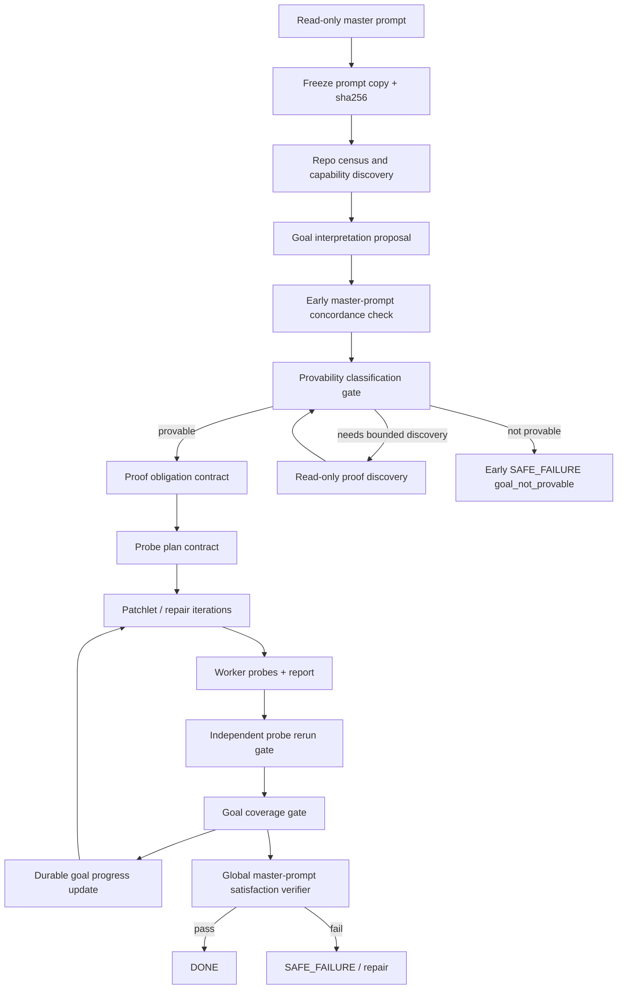

# Codex Orchestrator Architecture — General Goal Proof Contract, Master-Prompt Satisfaction, Early Provability, Progress Visibility, and Partial Apply

## 0. Purpose

This document updates the semantic-goal architecture after the operator correction that the system must not become a collection of hardcoded goal parsers or user-supplied acceptance-command requirements.

The goal is broader:

```text
cxor should work as a general Codex orchestration workflow for any repository and any master prompt.

The master prompt is read-only and is the source of truth.

The orchestrator may extract and structure the goal, but the final verifier must verify whether the master prompt goal itself was achieved, not only whether the derived goal interpretation and proof artifacts are internally consistent.

The orchestrator must decide early whether the goal is provable enough to run, before spending many iterations on work that can never be accepted.

The operator must have visibility into goal progress after each workflow iteration.

The operator must be able to stop the orchestrator safely at its current progress and apply the latest accepted progress.
```

The existing `v0.1.0-rc4` semantic goal implementation remains valuable because it proves the enforcement path: semantic criteria can be compiled, independently checked, gated before acceptance, included in transaction/global verification, surfaced in status/monitor, and made mandatory for `DONE` for a structured goal. The next architecture generalizes that enforcement path.

This document deliberately does not reduce the problem to:

```text
more hardcoded parsers
more user-supplied commands
trusting worker reports
trusting hidden model reasoning
waiting until the very end to discover that the goal was not provable
```

---

## 1. Correction summary and approved principles

### 1.1 Master prompt is read-only and source of truth

The master prompt must be copied and hashed at workflow start.

After that point:

```text
- The master prompt copy is immutable.
- Every goal interpretation references the master prompt hash.
- Every proof obligation references one or more source spans or source claims from the master prompt.
- Every proof plan references the proof obligations it claims to prove.
- Every goal progress update references the same immutable master prompt hash.
- Final verification must re-check master-prompt coverage, not just derived artifact consistency.
```

The master prompt is not a suggestion. It is the canonical user intent for the workflow.

### 1.2 The orchestrator may extract the goal, but extraction is not enough

The orchestrator can create a structured interpretation from the master prompt. That interpretation is useful for planning and verification, but it is not itself proof that the master prompt was satisfied.

Therefore, final verification must include two separate gates:

```text
1. Master Prompt Concordance Gate
   Does the derived goal/proof contract faithfully cover the master prompt?

2. Master Prompt Satisfaction Gate
   Does the accepted integration state satisfy the master prompt, using the proof obligations and independently verified evidence?
```

`DONE` requires both gates to pass.

### 1.3 Provability must be assessed early

The system must not wait until the final global verifier to discover:

```text
this goal cannot be proven
this goal is ambiguous
this goal has no executable/reviewable proof obligations
this goal needs external access not available to the worker
this goal is subjective and lacks objective acceptance criteria
```

Provability classification should occur before product-editing patchlets start.

Some goals need bounded repo discovery before provability can be known. That is acceptable, but the discovery phase must be read-only and must happen before implementation patchlets.

### 1.4 Goal progress must be visible after each workflow iteration

The operator should be able to answer at any point:

```text
What does cxor believe the master prompt asks for?
Which proof obligations exist?
Which obligations are proven?
Which obligations are currently being worked on?
Which obligations failed?
Which obligations are blocked?
Which probes support each obligation?
Which proof was independently rerun by the orchestrator?
What is the next action?
Can I safely stop and apply accepted progress?
```

Goal progress must be durable and visible through CLI/status/monitor/live progress.

### 1.5 Stop and apply partial progress must be supported safely

The operator must be able to stop the workflow and apply the latest accepted progress.

This does not mean applying unverified arbitrary worker edits.

The safe rule is:

```text
Only accepted integration checkpoints may be applied by default.
```

If a worker is in the middle of an attempt, that in-progress work may be preserved as evidence, but it must not be applied as product/runtime code unless it passes the same acceptance gates or the operator explicitly exports it as an unaccepted diagnostic patch.

---

## 2. New architecture overview



The core new artifacts are:

```text
.codex-orchestrator/master_prompt_frozen.json
.codex-orchestrator/goal_interpretation.json
.codex-orchestrator/provability/provability_result.json
.codex-orchestrator/proof_obligations.json
.codex-orchestrator/probe_plan.json
.codex-orchestrator/goal_progress.json
.codex-orchestrator/goal_progress.jsonl
.codex-orchestrator/runs/<attempt>/gates/independent_probe_rerun_result.json
.codex-orchestrator/runs/<attempt>/gates/goal_coverage_gate_result.json
.codex-orchestrator/global_verification/master_prompt_concordance_result.json
.codex-orchestrator/global_verification/master_prompt_satisfaction_result.json
.codex-orchestrator/control/stop_requested.json
.codex-orchestrator/control/stop_result.json
.codex-orchestrator/apply_results/partial_apply_result.json
```

---

## 3. Master Prompt Source of Truth Plane

### 3.1 Frozen master prompt artifact

Create or extend:

```text
.codex-orchestrator/master_prompt_frozen.json
```

Shape:

```json
{
  "schema_version": "1.0",
  "kind": "master_prompt_frozen",
  "workflow_id": "WF...",
  "run_id": "R0001",
  "source_path": "/abs/path/to/master_prompt.md",
  "frozen_copy_path": ".codex-orchestrator/master_prompt.md",
  "sha256": "...",
  "size_bytes": 123,
  "created_at": "...",
  "text_excerpt": "...",
  "read_only_source_of_truth": true
}
```

Every downstream artifact must reference:

```text
master_prompt_sha256
master_prompt_frozen_path
workflow_id
run_id
```

### 3.2 Source-span model

The orchestrator must represent goal extraction with source spans when possible.

A source span is:

```json
{
  "span_id": "MPS001",
  "start_offset": 0,
  "end_offset": 32,
  "text": "Make app return me and prove it.",
  "role": "goal_statement"
}
```

For markdown prompts, line/column metadata should also be recorded:

```json
{
  "line_start": 1,
  "line_end": 1,
  "column_start": 1,
  "column_end": 33
}
```

### 3.3 Master prompt immutability gate

Before every iteration and before final verification:

```text
- Recompute the source master prompt hash if the source file still exists.
- Verify the frozen copy hash matches workflow identity.
- Do not allow downstream artifacts to silently follow a changed source prompt.
- If source prompt changed after workflow start, report it as prompt_source_changed_after_freeze, but continue to use the frozen copy as the workflow source of truth.
```

The frozen prompt is the workflow contract.

---

## 4. Goal Interpretation Plane

### 4.1 Goal interpretation artifact

Create:

```text
.codex-orchestrator/goal_interpretation.json
```

Shape:

```json
{
  "schema_version": "1.0",
  "kind": "goal_interpretation",
  "workflow_id": "WF...",
  "run_id": "R0001",
  "master_prompt_sha256": "...",
  "interpretation_status": "DRAFT",
  "goal_summary": "The application should return the requested value and provide proof.",
  "goal_items": [
    {
      "goal_item_id": "GI001",
      "source_span_ids": ["MPS001"],
      "goal_type": "behavior_change",
      "subject": "app.py runtime behavior",
      "desired_state": "app.main() returns \"me\"",
      "must_change_product": "unknown",
      "acceptance_meaning": "A direct runtime check observes the expected value."
    }
  ],
  "non_goals": [],
  "ambiguities": [],
  "assumptions": [],
  "requires_external_resources": false
}
```

Allowed `interpretation_status`:

```text
DRAFT
CONCORDANT
INCOMPLETE
CONTRADICTORY
AMBIGUOUS
```

### 4.2 Goal interpretation is not final proof

The interpretation only describes what the goal means. It does not prove achievement.

The global verifier must later check:

```text
1. The interpretation still covers the frozen master prompt.
2. The proof obligations cover the interpretation.
3. The accepted integration state satisfies the obligations.
4. The resulting evidence supports the master prompt itself.
```

---

## 5. Early Provability Plane

### 5.1 Provability result artifact

Create:

```text
.codex-orchestrator/provability/provability_result.json
```

Shape:

```json
{
  "schema_version": "1.0",
  "kind": "provability_result",
  "workflow_id": "WF...",
  "run_id": "R0001",
  "master_prompt_sha256": "...",
  "created_at": "...",
  "provability_status": "PROVABLE",
  "provability_stage": "pre_patchlet",
  "reasons": [
    "The goal can be checked by direct runtime probe."
  ],
  "blocking_reasons": [],
  "required_capabilities": [
    "local_python_execution"
  ],
  "available_capabilities": [
    "local_python_execution"
  ],
  "missing_capabilities": [],
  "proof_obligation_count": 1,
  "probe_plan_required": true,
  "can_start_product_patchlets": true
}
```

Allowed `provability_status`:

```text
PROVABLE
PARTIALLY_PROVABLE
NEEDS_READ_ONLY_DISCOVERY
AMBIGUOUS
UNPROVABLE
BLOCKED_BY_MISSING_CAPABILITY
```

### 5.2 Provability timing

Provability must be assessed:

```text
1. after master prompt freeze
2. after deterministic repo census
3. after read-only proof discovery if needed
4. before product-editing patchlets start
```

The system must not wait until final verification to discover that a goal cannot be proven.

### 5.3 Early outcomes

If `PROVABLE`:

```text
Proceed to proof obligations and implementation patchlets.
```

If `PARTIALLY_PROVABLE`:

```text
Proceed only if unproven portions are explicitly marked non-blocking or operator policy allows partial progress. DONE cannot claim full master-prompt satisfaction.
```

If `NEEDS_READ_ONLY_DISCOVERY`:

```text
Run read-only proof discovery. Do not edit product files.
```

If `AMBIGUOUS`, `UNPROVABLE`, or `BLOCKED_BY_MISSING_CAPABILITY`:

```text
Stop early with SAFE_FAILURE: goal_not_provable or goal_ambiguous, preserving evidence.
```

This is an early stop, not a late final-verifier surprise.

---

## 6. General Proof Obligation Schema

### 6.1 Proof obligations artifact

Create:

```text
.codex-orchestrator/proof_obligations.json
```

Shape:

```json
{
  "schema_version": "1.0",
  "kind": "proof_obligations",
  "workflow_id": "WF...",
  "run_id": "R0001",
  "master_prompt_sha256": "...",
  "goal_interpretation_path": ".codex-orchestrator/goal_interpretation.json",
  "obligations": [
    {
      "obligation_id": "PO001",
      "goal_item_ids": ["GI001"],
      "source_span_ids": ["MPS001"],
      "obligation_type": "behavioral_runtime_claim",
      "statement": "app.main() returns \"me\" in the accepted integration state.",
      "required": true,
      "proof_kind": "executable_probe",
      "evidence_requirements": [
        "direct_runtime_probe",
        "orchestrator_rerun",
        "expected_actual_record"
      ],
      "acceptance_rule": {
        "type": "expected_actual_equal",
        "expected": "me"
      },
      "status": "UNPROVEN"
    }
  ]
}
```

Allowed obligation statuses:

```text
UNPROVEN
IN_PROGRESS
PROVEN_BY_WORKER
PROVEN_BY_ORCHESTRATOR
FAILED
BLOCKED
WAIVED_BY_POLICY
```

### 6.2 Obligation coverage rule

Every required goal item must have at least one required proof obligation.

Every required proof obligation must have at least one probe plan entry.

Every required proof obligation must be independently checked before `DONE`.

---

## 7. General Probe Plan Schema

### 7.1 Probe plan artifact

Create:

```text
.codex-orchestrator/probe_plan.json
```

Shape:

```json
{
  "schema_version": "1.0",
  "kind": "probe_plan",
  "workflow_id": "WF...",
  "run_id": "R0001",
  "master_prompt_sha256": "...",
  "proof_obligations_path": ".codex-orchestrator/proof_obligations.json",
  "probes": [
    {
      "probe_id": "GP001",
      "obligation_ids": ["PO001"],
      "probe_kind": "executable",
      "owner": "worker_proposed_or_orchestrator_generated",
      "command": "python -B .codex-orchestrator/generated_probes/GP001.py",
      "execution_context": "integration_candidate",
      "expected_outputs": [
        {
          "field": "actual",
          "comparison": "equals",
          "expected": "me"
        }
      ],
      "side_effect_policy": "no_product_mutation",
      "rerunnable_by_orchestrator": true,
      "status": "PLANNED"
    }
  ]
}
```

Allowed probe statuses:

```text
PLANNED
WORKER_RAN
ORCHESTRATOR_RERAN
PASSED
FAILED
BLOCKED
INVALID
```

### 7.2 Worker-proposed probes

Codex may propose probes, but the orchestrator must validate that:

```text
- the probe maps to at least one proof obligation
- the probe actually tests the obligation, not a nearby weaker behavior
- the probe is rerunnable
- the probe has bounded side effects
- the probe writes expected-vs-actual evidence
- the probe result cannot be marked pass when expected != actual
```

### 7.3 Orchestrator-owned rerun

The orchestrator must rerun or validate accepted proof probes in a controlled context.

This is the core rule:

```text
Codex may propose the proof, but the orchestrator owns acceptance.
```

---

## 8. Goal Coverage Progress Plane

### 8.1 Goal progress artifacts

Create:

```text
.codex-orchestrator/goal_progress.json
.codex-orchestrator/goal_progress.jsonl
```

`goal_progress.json` is the latest summary.

`goal_progress.jsonl` is an append-only timeline.

Shape:

```json
{
  "schema_version": "1.0",
  "kind": "goal_progress",
  "workflow_id": "WF...",
  "run_id": "R0001",
  "master_prompt_sha256": "...",
  "updated_at": "...",
  "workflow_iteration": 7,
  "overall_goal_status": "IN_PROGRESS",
  "provability_status": "PROVABLE",
  "counts": {
    "required_obligations": 3,
    "proven": 1,
    "failed": 1,
    "blocked": 0,
    "unproven": 1
  },
  "obligations": [
    {
      "obligation_id": "PO001",
      "status": "PROVEN_BY_ORCHESTRATOR",
      "last_patchlet_id": "P0002",
      "last_attempt_id": "P0002_attempt1",
      "evidence_paths": [
        ".codex-orchestrator/runs/P0002_attempt1/gates/independent_probe_rerun_result.json"
      ],
      "operator_summary": "app.main() returned \"me\" in the accepted integration state."
    }
  ],
  "next_action": "Continue with remaining unproven obligations."
}
```

Allowed `overall_goal_status`:

```text
NOT_STARTED
PROVABILITY_ASSESSMENT
PROVABLE
IN_PROGRESS
PARTIALLY_PROVEN
FAILED
BLOCKED
PROVEN
UNPROVABLE
```

### 8.2 Update points

Update goal progress after each workflow iteration and after every gate that changes proof state:

```text
- after master prompt freeze
- after goal interpretation
- after provability classification
- after proof obligation creation
- after probe plan creation
- after each patchlet attempt
- after each repair attempt
- after report ingestion
- after independent probe rerun
- after goal coverage gate
- after transaction group verification
- after global verification
- after stop request handling
```

### 8.3 Operator visibility

Expose progress through:

```text
cxor status --repo <repo> --json
cxor status --repo <repo> --goal
cxor monitor --repo <repo>
cxor goal-progress --repo <repo>
cxor goal-progress --repo <repo> --json
cxor auto --live-progress
```

Live progress should include compact lines like:

```text
[cxor +041s] goal progress: 1/3 obligations proven, 1 failed, 1 unproven.
[cxor +041s] PO002 failed: expected CLI flag --json to be accepted; command exited 2.
[cxor +041s] next action: repair patchlet for PO002.
```

---

## 9. Independent Probe Rerun Gate

### 9.1 Gate artifact

For each accepted attempt, write:

```text
.codex-orchestrator/runs/<attempt_id>/gates/independent_probe_rerun_result.json
```

Shape:

```json
{
  "schema_version": "1.0",
  "kind": "independent_probe_rerun_result",
  "workflow_id": "WF...",
  "run_id": "R0001",
  "patchlet_id": "P0002",
  "attempt_id": "P0002_attempt1",
  "master_prompt_sha256": "...",
  "accepted": true,
  "probe_results": [
    {
      "probe_id": "GP001",
      "obligation_ids": ["PO001"],
      "command": "...",
      "exit_code": 0,
      "passed": true,
      "expected_actual": {
        "expected": "me",
        "actual": "me"
      },
      "stdout_path": "...",
      "stderr_path": "..."
    }
  ],
  "failed_probe_ids": [],
  "blocked_probe_ids": []
}
```

### 9.2 Gate rule

Required proof obligations cannot be marked proven unless their mapped probes pass under orchestrator rerun or validation.

Worker-owned proof alone may set:

```text
PROVEN_BY_WORKER
```

but `DONE` requires:

```text
PROVEN_BY_ORCHESTRATOR
```

for required obligations.

---

## 10. Goal Coverage Gate

### 10.1 Gate artifact

Write:

```text
.codex-orchestrator/runs/<attempt_id>/gates/goal_coverage_gate_result.json
```

Shape:

```json
{
  "schema_version": "1.0",
  "kind": "goal_coverage_gate_result",
  "workflow_id": "WF...",
  "run_id": "R0001",
  "patchlet_id": "P0002",
  "attempt_id": "P0002_attempt1",
  "master_prompt_sha256": "...",
  "accepted": true,
  "coverage_status": "PASSED",
  "covered_goal_item_ids": ["GI001"],
  "covered_obligation_ids": ["PO001"],
  "uncovered_goal_item_ids": [],
  "failed_obligation_ids": [],
  "blocked_obligation_ids": [],
  "evidence_paths": [
    ".codex-orchestrator/runs/P0002_attempt1/gates/independent_probe_rerun_result.json"
  ]
}
```

Allowed `coverage_status`:

```text
PASSED
PARTIAL
FAILED
BLOCKED
UNSUPPORTED
```

### 10.2 `VERIFIED_NO_CHANGE_NEEDED` rule

`VERIFIED_NO_CHANGE_NEEDED` is accepted only if:

```text
- the master prompt is provable
- required proof obligations exist
- no product changes are needed because obligations already pass
- independent probe rerun proves obligations in the current accepted state
```

A report cannot say no change is needed just because a nearby old behavior is true.

---

## 11. Global Master Prompt Verification

### 11.1 Master Prompt Concordance Gate

Write:

```text
.codex-orchestrator/global_verification/master_prompt_concordance_result.json
```

This gate answers:

```text
Does the goal interpretation and proof obligation contract faithfully cover the frozen master prompt?
```

Shape:

```json
{
  "schema_version": "1.0",
  "kind": "master_prompt_concordance_result",
  "workflow_id": "WF...",
  "run_id": "R0001",
  "master_prompt_sha256": "...",
  "accepted": true,
  "coverage_status": "PASSED",
  "covered_source_span_ids": ["MPS001"],
  "uncovered_source_span_ids": [],
  "contradictions": [],
  "ambiguities": [],
  "evidence_paths": [
    ".codex-orchestrator/goal_interpretation.json",
    ".codex-orchestrator/proof_obligations.json"
  ]
}
```

### 11.2 Master Prompt Satisfaction Gate

Write:

```text
.codex-orchestrator/global_verification/master_prompt_satisfaction_result.json
```

This gate answers:

```text
Does the accepted integration state satisfy the frozen master prompt?
```

It does not merely ask whether the interpretation and proof artifacts are internally consistent.

Shape:

```json
{
  "schema_version": "1.0",
  "kind": "master_prompt_satisfaction_result",
  "workflow_id": "WF...",
  "run_id": "R0001",
  "master_prompt_sha256": "...",
  "accepted": true,
  "satisfaction_status": "SATISFIED",
  "proven_obligation_ids": ["PO001"],
  "failed_obligation_ids": [],
  "unproven_obligation_ids": [],
  "goal_progress_path": ".codex-orchestrator/goal_progress.json",
  "independent_probe_evidence": [
    ".codex-orchestrator/runs/P0002_attempt1/gates/independent_probe_rerun_result.json"
  ],
  "operator_summary": "The accepted integration state satisfies all required proof obligations derived from the master prompt."
}
```

Allowed `satisfaction_status`:

```text
SATISFIED
NOT_SATISFIED
PARTIALLY_SATISFIED
UNPROVABLE
AMBIGUOUS
BLOCKED
```

### 11.3 DONE eligibility rule

`DONE` requires:

```text
provability_status == PROVABLE or allowed PARTIALLY_PROVABLE policy
master_prompt_concordance_result.accepted == true
master_prompt_satisfaction_result.accepted == true
all required obligations are PROVEN_BY_ORCHESTRATOR or explicitly non-blocking by policy
no failed required obligations
no blocked required obligations
no unresolved failures
transaction groups pass
integration artifacts validate
hygiene passes
```

For full-success `DONE`, `PARTIALLY_PROVABLE` should not be accepted unless the master prompt explicitly allows partial completion.

---

## 12. Early Safe Failure for Unprovable Goals

### 12.1 Early stop artifact

If the goal cannot be proven before patchlets begin, write:

```text
.codex-orchestrator/provability/goal_not_provable_result.json
```

Shape:

```json
{
  "schema_version": "1.0",
  "kind": "goal_not_provable_result",
  "workflow_id": "WF...",
  "run_id": "R0001",
  "master_prompt_sha256": "...",
  "stage": "pre_patchlet",
  "status": "SAFE_FAILURE",
  "failure_signature": "goal_not_provable",
  "reasons": [
    "The goal requires subjective judgment and no objective proof obligations could be formed."
  ],
  "recommended_prompt_improvements": [],
  "created_artifacts": [
    ".codex-orchestrator/goal_interpretation.json",
    ".codex-orchestrator/provability/provability_result.json"
  ]
}
```

### 12.2 No late surprise rule

The system may still discover new proof gaps later, but the first provability classification must be early and durable.

If a late unprovability discovery occurs, that is itself a defect class:

```text
late_goal_unprovable_discovered
```

and must be recorded.

---

## 13. Stop and Apply Current Progress

### 13.1 Stop command

Add:

```bash
cxor stop --repo <repo>
cxor stop --repo <repo> --now
cxor stop --repo <repo> --after-current-attempt
cxor stop --repo <repo> --json
```

Default:

```text
--after-current-attempt
```

This writes:

```text
.codex-orchestrator/control/stop_requested.json
```

Shape:

```json
{
  "schema_version": "1.0",
  "kind": "stop_requested",
  "created_at": "...",
  "requested_mode": "after_current_attempt",
  "reason": "operator_requested",
  "requested_by": "operator"
}
```

When the orchestrator stops, write:

```text
.codex-orchestrator/control/stop_result.json
```

Shape:

```json
{
  "schema_version": "1.0",
  "kind": "stop_result",
  "stopped": true,
  "stopped_at": "...",
  "stop_stage": "PATCHLET_EXECUTION_COMPLETE",
  "latest_accepted_integration_ref": "refs/cxor/runs/R0001/integration",
  "latest_accepted_checkpoint": ".codex-orchestrator/integration/checkpoints/P0002.json",
  "goal_progress_path": ".codex-orchestrator/goal_progress.json",
  "applyable_progress": true
}
```

### 13.2 Ctrl-C behavior

If the operator interrupts `cxor auto` with Ctrl-C:

```text
- preserve current state
- write interrupted invocation evidence
- do not delete worker artifacts
- do not corrupt operator_events.jsonl
- mark workflow as STOPPED or INTERRUPTED_AT_SAFE_POINT where possible
- expose latest accepted checkpoint
```

If interruption occurs during a real Codex subprocess, the orchestrator should terminate or detach according to explicit policy and preserve command/stdout/stderr/progress evidence.

### 13.3 Apply latest accepted progress

Extend `apply-results`:

```bash
cxor apply-results --repo <repo> --mode patch --scope accepted
cxor apply-results --repo <repo> --mode branch --scope accepted
cxor apply-results --repo <repo> --mode working-tree --scope accepted
```

Add explicit partial flag:

```bash
cxor apply-results --repo <repo> --mode working-tree --scope accepted --allow-partial
```

Default behavior:

```text
If workflow is DONE, apply final result as before.
If workflow is STOPPED but has accepted checkpoints, require --allow-partial.
If workflow has no accepted checkpoints, refuse and explain that nothing is safely applyable.
If latest attempt is in progress or failed before acceptance, do not apply it by default.
```

Partial apply artifact:

```text
.codex-orchestrator/apply_results/partial_apply_result.json
```

Shape:

```json
{
  "schema_version": "1.0",
  "kind": "partial_apply_result",
  "mode": "working-tree",
  "scope": "accepted",
  "allow_partial": true,
  "workflow_stage": "STOPPED",
  "latest_accepted_integration_ref": "refs/cxor/runs/R0001/integration",
  "latest_accepted_checkpoint": ".codex-orchestrator/integration/checkpoints/P0002.json",
  "goal_progress_summary": {
    "overall_goal_status": "PARTIALLY_PROVEN",
    "proven": 2,
    "required_obligations": 5
  },
  "mutated_working_tree": true,
  "warnings": [
    "Applied latest accepted progress from a stopped workflow. The full master prompt may not be satisfied."
  ]
}
```

### 13.4 Applying in-progress work

Do not apply in-progress work by default.

A future diagnostic command may export unaccepted diff separately:

```bash
cxor export-attempt-diff --repo <repo> --attempt P0003_attempt1
```

That is not the same as accepted apply-results.

---

## 14. Workflow iteration progress visibility

### 14.1 Iteration definition

A workflow iteration is one pass through a meaningful state transition, typically:

```text
patchlet attempt
repair attempt
diagnosis iteration
report-only repair iteration
transaction group verification
global verification
```

Each iteration must append:

```text
.codex-orchestrator/goal_progress.jsonl
```

### 14.2 Progress event type

Add operator event:

```text
goal_progress_updated
```

Details:

```json
{
  "overall_goal_status": "IN_PROGRESS",
  "required_obligations": 5,
  "proven": 2,
  "failed": 1,
  "blocked": 0,
  "unproven": 2,
  "latest_failed_obligation_id": "PO003",
  "goal_progress_path": ".codex-orchestrator/goal_progress.json"
}
```

### 14.3 CLI command

Add:

```bash
cxor goal-progress --repo <repo>
cxor goal-progress --repo <repo> --json
cxor goal-progress --repo <repo> --watch
```

Human output example:

```text
Goal progress for workflow WF... / run R0001
Master prompt: sha256:...
Overall: IN_PROGRESS

Required obligations: 5
Proven: 2
Failed: 1
Blocked: 0
Unproven: 2

PO001 PROVEN_BY_ORCHESTRATOR — CLI accepts --json
PO002 PROVEN_BY_ORCHESTRATOR — parser handles empty input
PO003 FAILED — API returned 500, expected 200
PO004 UNPROVEN — docs update not checked yet
PO005 UNPROVEN — regression suite not rerun yet

Latest accepted checkpoint: P0002
Applyable progress: yes, with --allow-partial
```

---

## 15. Interaction with existing rc4 semantic goal implementation

The current `rc4` implementation is a specific instance of the general framework:

```text
semantic_goal_spec.json -> goal_interpretation.json + proof_obligations.json
semantic_goal_runner -> independent_probe_rerun_gate
semantic_goal_status -> goal_progress and master_prompt_satisfaction_result
SGC001 -> PO001/GP001
semantic_goal_unsatisfied -> goal_coverage_failed or master_prompt_not_satisfied
```

The existing `python_module_function_returns` compiler should remain as a fast path, but it must be expressed through the general proof-obligation model.

Do not remove the fast path.

Do not make the system only fast-path based.

---

## 16. Repair and loop behavior

When proof obligation fails:

```text
- create failure semantic_goal_unsatisfied or proof_obligation_failed
- link to obligation_id and probe_id
- feed the failed obligation into diagnosis
- generate repair plan specifically for that obligation
- update goal_progress
- continue only if loop governor permits
```

Loop governor signatures should include:

```text
goal_not_provable
master_prompt_concordance_failed
proof_obligation_failed
independent_probe_rerun_failed
goal_coverage_failed
partial_progress_stopped
```

---

## 17. Required tests by architecture area

### 17.1 Master prompt source-of-truth tests

```text
tests/unit/test_master_prompt_source_of_truth.py
```

Required behaviors:

```text
- frozen prompt artifact includes sha/path/copy
- downstream artifacts reference frozen prompt sha
- changed source prompt after freeze is detected
- workflow continues to use frozen copy
```

### 17.2 Provability tests

```text
tests/integration/test_goal_provability_gate.py
```

Required behaviors:

```text
- provable goal proceeds before patchlets
- ambiguous goal stops before product patchlets
- unprovable goal safe-fails before product patchlets
- needs-discovery goal performs read-only discovery only
- late unprovable discovery is recorded as defect evidence
```

### 17.3 Proof obligation and probe plan tests

```text
tests/integration/test_general_goal_proof_contract.py
```

Required behaviors:

```text
- every goal item has obligation coverage
- every required obligation has probe plan coverage
- worker-proposed probes map to obligations
- invalid probes cannot prove obligations
- expected-vs-actual mismatch fails
```

### 17.4 Goal progress tests

```text
tests/integration/test_goal_progress_visibility.py
```

Required behaviors:

```text
- goal_progress.json written after each iteration
- goal_progress.jsonl append-only timeline grows
- cxor goal-progress displays obligations
- cxor status includes progress summary
- cxor monitor shows goal_progress_updated events
```

### 17.5 Independent rerun and coverage tests

```text
tests/integration/test_independent_probe_rerun_gate.py
tests/integration/test_goal_coverage_gate.py
```

Required behaviors:

```text
- worker proof alone is insufficient
- orchestrator rerun can prove obligation
- failed rerun blocks coverage
- coverage gate blocks missing obligations
- VERIFIED_NO_CHANGE_NEEDED requires coverage pass
```

### 17.6 Master prompt final verifier tests

```text
tests/integration/test_master_prompt_satisfaction_verifier.py
```

Required behaviors:

```text
- global verifier checks concordance
- global verifier checks satisfaction
- DONE blocked if interpretation misses master prompt span
- DONE blocked if obligations pass but master prompt has uncovered required goal
- DONE allowed only with concordance + satisfaction
```

### 17.7 Stop and partial apply tests

```text
tests/integration/test_stop_and_partial_apply.py
```

Required behaviors:

```text
- cxor stop writes stop_requested.json
- graceful stop writes stop_result.json
- stopped workflow exposes latest accepted checkpoint
- apply-results --allow-partial applies latest accepted integration ref
- apply-results refuses stopped partial without --allow-partial
- apply-results refuses if no accepted checkpoint exists
- in-progress unaccepted attempt is not applied
```

---

## 18. Operator-facing command surface

Add or extend:

```bash
cxor goal-progress --repo <repo>
cxor goal-progress --repo <repo> --json
cxor goal-progress --repo <repo> --watch

cxor stop --repo <repo>
cxor stop --repo <repo> --now
cxor stop --repo <repo> --after-current-attempt
cxor stop --repo <repo> --json

cxor apply-results --repo <repo> --mode patch --scope accepted --allow-partial
cxor apply-results --repo <repo> --mode branch --scope accepted --allow-partial
cxor apply-results --repo <repo> --mode working-tree --scope accepted --allow-partial
```

Extend:

```bash
cxor status --repo <repo> --json
cxor monitor --repo <repo>
cxor auto --live-progress
```

with master-prompt proof status and current progress.

---

## 19. Release acceptance criteria for this architecture

A release candidate implementing this architecture is acceptable only when:

```text
1. Master prompt is frozen and referenced by downstream artifacts.
2. Early provability result exists before product patchlets.
3. Ambiguous/unprovable goals stop early with evidence.
4. Proof obligations cover goal items.
5. Probe plan covers required obligations.
6. Worker proof alone cannot produce DONE.
7. Independent probe rerun evidence is required for required obligations.
8. Goal coverage is updated after each workflow iteration.
9. Status/monitor/live progress show goal progress.
10. Global verifier checks master prompt concordance and master prompt satisfaction.
11. DONE is impossible if the frozen master prompt has uncovered required goals.
12. The operator can stop safely.
13. The operator can apply latest accepted progress with explicit partial flag.
14. In-progress unaccepted work is not applied by default.
15. Existing rc4 semantic app.main return-value proof still passes.
16. Existing rerun/reset/report-ingestion/visibility gates still pass.
17. Default real-Codex smoke remains opt-in.
```

---

## 20. Main risks

### Risk 1 — Over-trusting Codex-generated proof obligations

Mitigation:

```text
Master Prompt Concordance Gate
source spans
coverage requirements
independent verifier
```

### Risk 2 — Late discovery of unprovability

Mitigation:

```text
early provability gate
read-only discovery before product patchlets
late_goal_unprovable_discovered as explicit defect signature
```

### Risk 3 — Applying unsafe partial work

Mitigation:

```text
apply only accepted integration checkpoints by default
require --allow-partial
refuse unaccepted attempt diffs
write partial_apply_result.json with warnings
```

### Risk 4 — Goal progress noise

Mitigation:

```text
compact summaries in live progress
full detail in goal_progress.json
watch command for operators who want detail
```

### Risk 5 — General goal proof becomes impossible for subjective tasks

Mitigation:

```text
mark unprovable early
block before product patchlets
preserve clear evidence
allow future extensions without pretending proof exists
```

---

## 21. Final architectural decision

The next system layer is not more hardcoded parsers.

The next system layer is:

```text
master prompt as immutable source of truth
plus early provability
plus general proof obligations
plus general probe plan
plus independent rerun
plus goal coverage progress
plus master-prompt satisfaction verification
plus safe stop and partial apply
```

The orchestrator may extract, structure, and plan from the master prompt. Codex may propose interpretations, probes, and repairs. But `DONE` belongs to the orchestrator, and `DONE` means the frozen master prompt has been proven satisfied according to required obligations and independently verified evidence.
