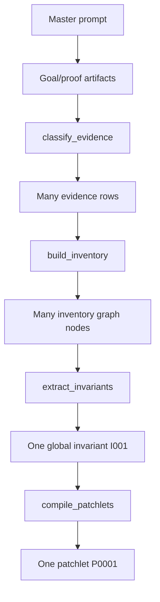
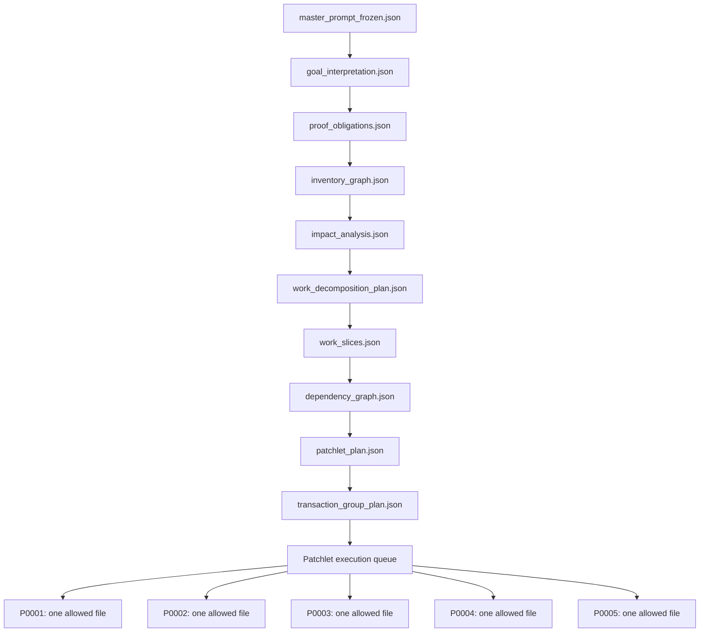
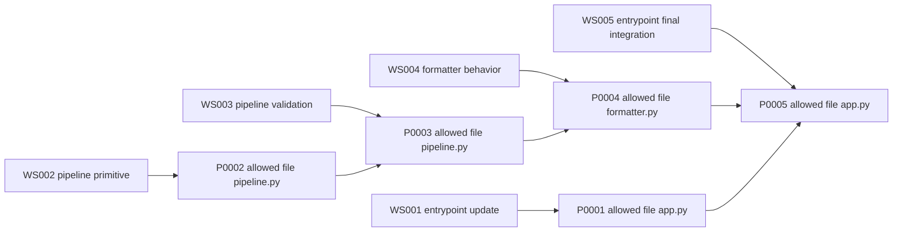
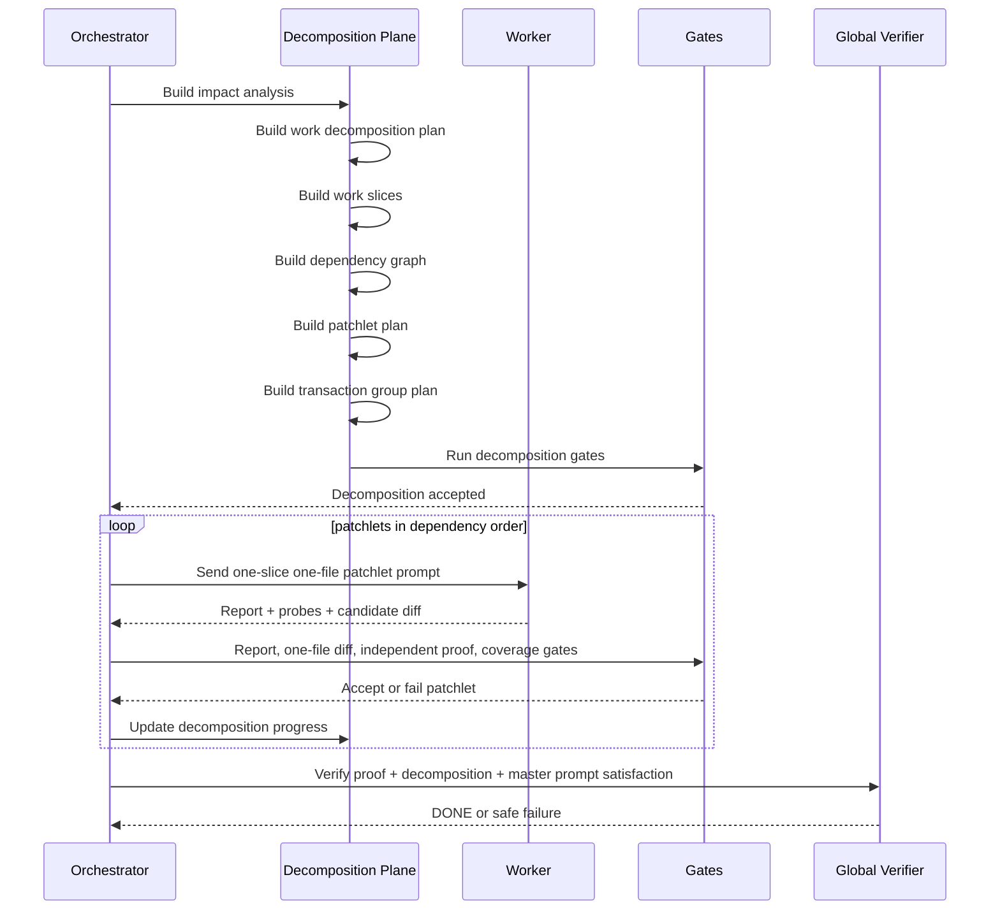

# Codex Orchestrator — General Work Decomposition, Multi-Patchlet Planning, and Transaction Graph Architecture

Version target: post-`v0.1.0-rc4` architecture layer  
Primary problem: the orchestrator has a strong proof/verification plane, but the current work-decomposition plane is too coarse.  
Primary correction: patchlets are **small bounded work units**, not files. Every patchlet has **exactly one allowed product/runtime file**, but two or more patchlets may target the same product/runtime file.

---

## 0. Executive summary

The current implementation has reached an important safety baseline:

- direct `cxor auto --live-progress` visibility works;
- workflow identity, rerun/reset, and invocation-scoped progress work;
- report ingestion and canonical `probe_artifact_refs` hardening work;
- semantic goal satisfaction prevents known false `DONE` cases;
- the general goal-proof contract adds master-prompt source of truth, proof obligations, probe plans, independent reruns, goal coverage, goal progress, stop, and partial apply.

However, the orchestration loop still has a work-decomposition bottleneck. Even when the target repository contains many runtime files and a broad master prompt, the current deterministic decomposition can collapse the whole target into one invariant, then compile one patchlet from that one invariant. The evidence report states that `extract_invariants` collapses to one invariant `I001`, and `compile_patchlets` creates one patchlet per invariant. Therefore complex targets still become `I001 -> P0001` unless the orchestrator gains a real work decomposition layer.

This document defines that missing layer.

The corrected architecture is **not**:

```text
one runtime file -> one patchlet
```

The corrected architecture is:

```text
one patchlet -> exactly one allowed product/runtime file
```

A single product/runtime file may receive multiple patchlets when the work is too large, sequential, risky, dependency-sensitive, proof-heavy, or too broad for one worker attempt. Patchlets are decomposed by **small work obligations**, not merely by file count.

Examples:

```text
P0001 -> app.py
P0002 -> app.py
P0003 -> app.py
```

or:

```text
P0001 -> app.py
P0002 -> service.py
P0003 -> formatter.py
P0004 -> service.py
P0005 -> app.py
```

The target outcome is a general work decomposition contract that transforms the frozen master prompt, goal interpretation, proof obligations, and repo inventory graph into small, ordered, dependency-aware work slices. Each work slice becomes one patchlet spec with a narrow task contract, one allowed product/runtime file, a bounded scope, explicit proof contribution, and a time budget compatible with `CODEX_PATCHLET_TIMEOUT_SECONDS` defaulting to `600` seconds.

---

## 1. Approved corrections and design principles

### 1.1 Master correction: patchlets are small work units, not files

The decomposition system must never assume that one runtime file equals one patchlet. That is too coarse in one direction and too rigid in another.

Correct rule:

```text
Every patchlet has exactly one allowed product/runtime file.
```

Corollary:

```text
Two or more patchlets may work the same product/runtime file.
```

Rationale:

- a large file may need several safe incremental edits;
- a file may need a preliminary refactor patchlet, a behavior patchlet, and a cleanup/proof patchlet;
- a downstream file may need to be updated before returning to the entrypoint file;
- repair patchlets may target the same file as the original patchlet;
- proof obligations may require staged implementation even within the same file;
- a patchlet must remain small enough to avoid worker context/memory compression and to fit inside the patchlet time budget.

### 1.2 Patchlets must be bounded by time and context

Every patchlet has a task time budget.

Default:

```text
CODEX_PATCHLET_TIMEOUT_SECONDS=600
```

The patchlet prompt must be scoped so that a worker can reasonably:

1. read the local contract;
2. run a direct probe;
3. perform the small allowed edit;
4. rerun focused proof;
5. write the required report and stage artifacts;
6. finish before the hard timeout.

A patchlet prompt that requires broad repository understanding, several independent features, multiple files, or long debugging is a decomposition failure.

### 1.3 Avoid memory compacting by design

The worker should not need to carry large workflow memory across many unrelated tasks. The orchestrator should decompose work so that each patchlet receives:

- a narrow goal slice;
- one allowed runtime file;
- relevant local context only;
- explicit dependencies;
- proof obligations that the slice contributes to;
- prior accepted patchlet outputs only when necessary;
- a focused prompt small enough to complete without memory compacting.

### 1.4 The proof plane and decomposition plane must be connected

The general goal-proof contract already asks:

```text
What must be proven for the frozen master prompt to be satisfied?
```

The work-decomposition layer asks:

```text
What small, ordered, one-file work units are needed to produce that proof?
```

The connection is mandatory:

- every work slice references proof obligations;
- every patchlet spec references one or more work slices;
- every patchlet accepted into integration must update goal progress;
- every accepted patchlet must contribute to proof obligations, dependency readiness, or explicit scaffolding needed by later proof obligations;
- global verification must see both proof coverage and decomposition completion.

### 1.5 Decomposition must be artifact-driven, not hidden reasoning

The orchestrator must write durable decomposition artifacts before patchlet execution begins. The operator must be able to inspect:

- why the work was split into these slices;
- why each slice has exactly one allowed product/runtime file;
- why the same file appears multiple times if it does;
- dependency order;
- transaction groups;
- task-size estimates;
- time budget per patchlet;
- proof obligations each patchlet contributes to;
- stop/apply safety after each accepted patchlet.

---

## 2. Current bottleneck and target replacement

### 2.1 Current observed pipeline



The bottleneck is `extract_invariants` plus the current `compile_patchlets` strategy:

```text
extract_invariants -> I001 only
compile_patchlets -> one patchlet per invariant
```

Even if the repo has twenty runtime files, the pipeline can still produce one invariant and one patchlet.

### 2.2 Target pipeline



### 2.3 Corrected patchlet mapping example



Notice:

```text
app.py appears in P0001 and P0005.
pipeline.py appears in P0002 and P0003.
Each patchlet still has exactly one allowed product/runtime file.
```

---

## 3. Architecture goals

1. Replace one-global-invariant patchlet compilation with a durable decomposition plan.
2. Preserve the invariant system where useful, but do not make invariants the only unit of patchlet creation.
3. Introduce work slices as the primary patchlet planning unit.
4. Bind every patchlet to exactly one allowed product/runtime file.
5. Permit multiple patchlets for the same file.
6. Keep patchlet prompts small and bounded for a 600-second default task budget.
7. Avoid memory compacting by splitting broad work into narrow, local patchlets.
8. Preserve dependency ordering between slices and patchlets.
9. Generate transaction groups from dependency graph and proof obligations.
10. Preserve stop/apply semantics after accepted patchlets.
11. Surface decomposition progress in live progress, monitor, status, and goal-progress output.
12. Preserve general goal-proof contract and master-prompt satisfaction rules.
13. Preserve rc4 semantic fast path and false-DONE prevention.
14. Preserve report-ingestion hardening and one-file diff boundaries.

---

## 4. Non-goals

This architecture does not require:

- one patchlet per file;
- exact perfect semantic decomposition for all natural language;
- arbitrary broad multi-file patchlets;
- applying unaccepted work;
- trusting worker-proposed decomposition without orchestrator gates;
- manually tampering with generated workflow artifacts to fake multi-patchlet behavior;
- running real Codex by default in tests;
- forcing the user to supply acceptance commands;
- weakening proof gates to get more patchlets.

---

## 5. New artifact set

All decomposition artifacts live under:

```text
.codex-orchestrator/decomposition/
```

Required artifacts:

```text
.codex-orchestrator/decomposition/impact_analysis.json
.codex-orchestrator/decomposition/work_decomposition_plan.json
.codex-orchestrator/decomposition/work_slices.json
.codex-orchestrator/decomposition/dependency_graph.json
.codex-orchestrator/decomposition/patchlet_plan.json
.codex-orchestrator/decomposition/transaction_group_plan.json
.codex-orchestrator/decomposition/decomposition_progress.json
.codex-orchestrator/decomposition/decomposition_progress.jsonl
```

Optional or future artifacts:

```text
.codex-orchestrator/decomposition/decomposition_decisions.jsonl
.codex-orchestrator/decomposition/slice_size_estimates.json
.codex-orchestrator/decomposition/prompt_budget_report.json
.codex-orchestrator/decomposition/rejected_slices.json
.codex-orchestrator/decomposition/decomposition_diagnostics.json
```

---

## 6. Schema: impact analysis

### 6.1 Purpose

`impact_analysis.json` identifies repo nodes that are likely relevant to the master prompt and proof obligations.

It does not yet create patchlets.

### 6.2 Path

```text
.codex-orchestrator/decomposition/impact_analysis.json
```

### 6.3 Shape

```json
{
  "schema_version": "1.0",
  "kind": "impact_analysis",
  "workflow_id": "WF...",
  "run_id": "R0001",
  "master_prompt_sha256": "<sha>",
  "inventory_graph_path": ".codex-orchestrator/inventory_graph.json",
  "proof_obligations_path": ".codex-orchestrator/proof_obligations.json",
  "impacted_nodes": [
    {
      "node_id": "N001",
      "path": "app.py",
      "node_kind": "runtime_file",
      "impact_score": 0.95,
      "impact_reasons": [
        "entrypoint-like file",
        "directly referenced by proof obligation PO001",
        "imports pipeline.py"
      ],
      "related_obligation_ids": ["PO001"],
      "dependency_paths": ["pipeline.py"]
    }
  ],
  "unimpacted_nodes": [],
  "unknown_nodes": [],
  "analysis_status": "COMPLETE"
}
```

### 6.4 Rules

- Impact analysis may over-include, but must explain reasons.
- It must not silently drop files that are directly referenced by obligations.
- It must preserve unknown/ambiguous nodes separately.
- It must not create patchlets directly.

---

## 7. Schema: work decomposition plan

### 7.1 Purpose

`work_decomposition_plan.json` records the high-level decomposition policy for this workflow.

It answers:

```text
How will the orchestrator split work into small bounded patchlets?
```

### 7.2 Path

```text
.codex-orchestrator/decomposition/work_decomposition_plan.json
```

### 7.3 Shape

```json
{
  "schema_version": "1.0",
  "kind": "work_decomposition_plan",
  "workflow_id": "WF...",
  "run_id": "R0001",
  "master_prompt_sha256": "<sha>",
  "strategy": "small_work_slices_one_allowed_file",
  "default_patchlet_time_budget_seconds": 600,
  "max_allowed_product_runtime_files_per_patchlet": 1,
  "allow_multiple_patchlets_per_file": true,
  "avoid_memory_compacting": true,
  "decomposition_inputs": {
    "master_prompt_frozen": ".codex-orchestrator/master_prompt_frozen.json",
    "goal_interpretation": ".codex-orchestrator/goal_interpretation.json",
    "proof_obligations": ".codex-orchestrator/proof_obligations.json",
    "inventory_graph": ".codex-orchestrator/inventory_graph.json",
    "impact_analysis": ".codex-orchestrator/decomposition/impact_analysis.json"
  },
  "decomposition_rules": [
    "Each patchlet may edit exactly one product/runtime file.",
    "Multiple patchlets may target the same product/runtime file.",
    "Each patchlet must fit the configured time budget.",
    "Each patchlet prompt must be narrow and self-contained.",
    "Each patchlet must reference proof obligations or explicit dependency-enabling work.",
    "Dependency order must be explicit."
  ],
  "planned_slice_count": 5,
  "planned_patchlet_count": 5,
  "status": "PLANNED"
}
```

---

## 8. Schema: work slices

### 8.1 Purpose

`work_slices.json` is the core decomposition artifact.

A work slice is a small unit of intended work. It is not yet an execution attempt. It becomes a patchlet spec through `patchlet_plan.json`.

### 8.2 Path

```text
.codex-orchestrator/decomposition/work_slices.json
```

### 8.3 Shape

```json
{
  "schema_version": "1.0",
  "kind": "work_slices",
  "workflow_id": "WF...",
  "run_id": "R0001",
  "master_prompt_sha256": "<sha>",
  "slices": [
    {
      "work_slice_id": "WS001",
      "title": "Update entrypoint to call pipeline interface",
      "description": "Make the app entrypoint delegate to the new pipeline interface after downstream behavior is available.",
      "slice_kind": "implementation",
      "allowed_product_runtime_file": "app.py",
      "target_node_ids": ["N001"],
      "proof_obligation_ids": ["PO001"],
      "dependency_slice_ids": [],
      "enables_slice_ids": ["WS005"],
      "estimated_complexity": "small",
      "estimated_time_budget_seconds": 600,
      "requires_worker_memory_compaction": false,
      "prompt_scope_summary": "Only inspect app.py and the accepted pipeline contract. Do not edit other runtime files.",
      "acceptance_contribution": "Entrypoint is prepared for final behavior proof.",
      "status": "PLANNED"
    }
  ]
}
```

### 8.4 Allowed slice kinds

```text
investigation
implementation
refactor
adapter
proof
cleanup
repair
integration_adjustment
```

### 8.5 Required constraints

For every slice:

```text
allowed_product_runtime_file must be exactly one path or null for artifact-only/proof-only slices.
If the slice can edit product/runtime code, allowed_product_runtime_file must be non-null.
No slice may list multiple allowed product/runtime files.
Multiple slices may share the same allowed_product_runtime_file.
Each slice must have dependency_slice_ids.
Each slice must have proof_obligation_ids or an explicit enables_slice_ids reason.
Each slice must have an estimated_time_budget_seconds.
```

---

## 9. Schema: dependency graph

### 9.1 Purpose

`dependency_graph.json` records ordering between slices and patchlets.

### 9.2 Path

```text
.codex-orchestrator/decomposition/dependency_graph.json
```

### 9.3 Shape

```json
{
  "schema_version": "1.0",
  "kind": "decomposition_dependency_graph",
  "workflow_id": "WF...",
  "run_id": "R0001",
  "nodes": [
    {
      "node_id": "WS001",
      "node_kind": "work_slice",
      "allowed_product_runtime_file": "app.py"
    }
  ],
  "edges": [
    {
      "from": "WS002",
      "to": "WS003",
      "edge_kind": "must_precede",
      "reason": "pipeline primitive must exist before validation branch"
    }
  ],
  "topological_order": ["WS001", "WS002", "WS003", "WS004", "WS005"],
  "cycles": [],
  "status": "ACYCLIC"
}
```

### 9.4 Gate

The dependency graph gate must reject:

- cycles;
- missing slice IDs;
- dependency on rejected slices;
- patchlet plan ordering that violates the graph;
- transaction group plans that run dependent slices in the same unsafe group.

---

## 10. Schema: patchlet plan

### 10.1 Purpose

`patchlet_plan.json` maps work slices to patchlets.

It is the artifact that replaces the current “one invariant creates one patchlet” bottleneck.

### 10.2 Path

```text
.codex-orchestrator/decomposition/patchlet_plan.json
```

### 10.3 Shape

```json
{
  "schema_version": "1.0",
  "kind": "patchlet_plan",
  "workflow_id": "WF...",
  "run_id": "R0001",
  "master_prompt_sha256": "<sha>",
  "patchlets": [
    {
      "patchlet_id": "P0001",
      "work_slice_id": "WS001",
      "allowed_product_runtime_file": "app.py",
      "proof_obligation_ids": ["PO001"],
      "dependency_patchlet_ids": [],
      "time_budget_seconds": 600,
      "soft_deadline_seconds": 540,
      "prompt_scope": {
        "max_context_policy": "narrow",
        "avoid_memory_compacting": true,
        "include_files": ["app.py"],
        "include_artifact_refs": [
          ".codex-orchestrator/proof_obligations.json",
          ".codex-orchestrator/decomposition/work_slices.json"
        ]
      },
      "task_contract_summary": "Implement only WS001. Edit only app.py. Preserve proof contract PO001.",
      "status": "READY"
    }
  ]
}
```

### 10.4 Required rule

Every patchlet that can edit product/runtime code must have exactly one allowed product/runtime file:

```text
len(allowed_product_runtime_files) == 1
```

Prefer a singular field:

```text
allowed_product_runtime_file
```

If backward compatibility still uses plural arrays, add a validation gate that enforces exactly one.

### 10.5 Same-file patchlets

The plan must allow:

```json
[
  {"patchlet_id": "P0001", "allowed_product_runtime_file": "app.py", "work_slice_id": "WS001"},
  {"patchlet_id": "P0005", "allowed_product_runtime_file": "app.py", "work_slice_id": "WS005"}
]
```

This is valid if dependency order is explicit.

---

## 11. Schema: transaction group plan

### 11.1 Purpose

`transaction_group_plan.json` defines group-level execution and verification order.

Transaction groups should reflect dependency boundaries, not merely all patchlets in one group.

### 11.2 Path

```text
.codex-orchestrator/decomposition/transaction_group_plan.json
```

### 11.3 Shape

```json
{
  "schema_version": "1.0",
  "kind": "transaction_group_plan",
  "workflow_id": "WF...",
  "run_id": "R0001",
  "transaction_groups": [
    {
      "transaction_group_id": "TG001",
      "patchlet_ids": ["P0001", "P0002"],
      "group_kind": "parallel_independent_or_ordered_batch",
      "dependency_group_ids": [],
      "proof_obligation_ids": ["PO001"],
      "verification_strategy": "after_all_patchlets_accepted",
      "status": "PLANNED"
    },
    {
      "transaction_group_id": "TG002",
      "patchlet_ids": ["P0003", "P0004", "P0005"],
      "dependency_group_ids": ["TG001"],
      "proof_obligation_ids": ["PO001"],
      "verification_strategy": "after_all_patchlets_accepted",
      "status": "PLANNED"
    }
  ]
}
```

### 11.4 Grouping rules

- Patchlets with direct dependency edges should not be treated as safely parallel.
- Same-file patchlets must be ordered unless proven independent.
- A transaction group may contain ordered patchlets if the group executor respects order.
- Group verification must know which obligations are expected after the group.

---

## 12. Decomposition gates

### 12.1 Work decomposition gate

Path:

```text
.codex-orchestrator/decomposition/gates/work_decomposition_gate_result.json
```

Checks:

```text
work_decomposition_plan exists
work_slices exist
planned_patchlet_count > 0 for provable goals requiring product work
slice IDs are unique
patchlet count matches plan expectations
no slice is too broad without explicit split reason
```

### 12.2 One-file patchlet gate

Path:

```text
.codex-orchestrator/decomposition/gates/one_file_patchlet_gate_result.json
```

Checks:

```text
every product-editing patchlet has exactly one allowed_product_runtime_file
no patchlet has multiple product/runtime files
multiple patchlets may target same file
artifact-only/proof-only patchlets are explicitly marked
```

### 12.3 Prompt budget gate

Path:

```text
.codex-orchestrator/decomposition/gates/patchlet_prompt_budget_gate_result.json
```

Checks:

```text
patchlet time_budget_seconds exists
hard budget defaults to CODEX_PATCHLET_TIMEOUT_SECONDS or 600
soft deadline is less than hard budget
prompt scope is narrow
prompt payload does not include whole repo unless justified
requires_worker_memory_compaction is false
```

### 12.4 Dependency graph gate

Path:

```text
.codex-orchestrator/decomposition/gates/dependency_graph_gate_result.json
```

Checks:

```text
graph acyclic
all dependencies point to existing slices/patchlets
topological order exists
same-file patchlets are ordered
transaction groups obey dependency graph
```

### 12.5 Proof contribution gate

Path:

```text
.codex-orchestrator/decomposition/gates/proof_contribution_gate_result.json
```

Checks:

```text
every implementation slice references proof obligations or enables a later slice that does
every patchlet has a contribution summary
no patchlet is unrelated to master prompt/proof obligations
```

---

## 13. Prompt contract changes

Every patchlet prompt must include:

```text
# Patchlet Decomposition Contract

- patchlet id: P0003
- work slice id: WS003
- allowed product/runtime file: pipeline.py
- hard time budget: 600 seconds
- soft deadline: 540 seconds
- edit exactly this product/runtime file and no other product/runtime file
- this file may appear in other patchlets; do not attempt to complete their tasks
- dependency patchlets already accepted: P0002
- dependency patchlets not yet accepted: P0004, P0005
- proof obligations this patchlet contributes to: PO001
- local acceptance contribution: add validation branch required by PO001
- do not broaden scope
- do not compact memory by taking on future patchlets
```

The prompt must explicitly forbid:

```text
editing another product/runtime file
attempting the entire master prompt in one patchlet
solving future slices
rewriting decomposition artifacts
marking unrelated obligations as proven
```

---

## 14. Execution flow with decomposition



---

## 15. Stop/apply interaction

The existing stop/partial apply layer becomes more useful once multiple accepted patchlets exist.

### 15.1 Stop behavior

If the operator stops after P0003:

```text
P0001 accepted
P0002 accepted
P0003 accepted
P0004 pending
P0005 pending
```

`stop_result.json` must record:

```text
latest accepted checkpoint
accepted patchlets
pending patchlets
proven obligations
unproven obligations
partial apply availability
```

### 15.2 Partial apply behavior

`apply-results --scope accepted --allow-partial` may apply only accepted integration state.

It must not apply:

```text
pending patchlets
failed patchlets
in-progress worktree diffs
worker scratch edits
unaccepted repair attempts
```

### 15.3 Goal progress after partial apply

`partial_apply_result.json` must state:

```text
full master prompt may not be satisfied
accepted progress was applied
remaining obligations are still unproven
```

---

## 16. Operator visibility

### 16.1 New CLI output

`cxor status --json` should include:

```json
{
  "decomposition": {
    "planned_work_slices": 5,
    "planned_patchlets": 5,
    "accepted_patchlets": 3,
    "pending_patchlets": 2,
    "failed_patchlets": 0,
    "files_with_multiple_patchlets": ["app.py", "pipeline.py"],
    "latest_decomposition_progress_path": ".codex-orchestrator/decomposition/decomposition_progress.json"
  }
}
```

Add:

```bash
cxor decomposition --repo <repo>
cxor decomposition --repo <repo> --json
cxor decomposition --repo <repo> --watch
```

### 16.2 Live progress examples

```text
[cxor +003s] decomposition planned: 5 work slices, 5 patchlets, 3 product files.
[cxor +003s] same-file sequencing: app.py has 2 patchlets; pipeline.py has 2 patchlets.
[cxor +004s] patchlet budget: default hard timeout 600s, soft deadline 540s.
[cxor +041s] accepted P0001 for WS001 app.py; progress 1/5 patchlets accepted.
[cxor +112s] accepted P0002 for WS002 pipeline.py; progress 2/5 patchlets accepted.
[cxor +190s] stop requested; will stop after current attempt.
[cxor +245s] workflow stopped after P0003; accepted progress applyable with --allow-partial.
```

---

## 17. Tests

### 17.1 Evidence and decomposition inspection tests

```text
tests/integration/test_work_decomposition_artifacts.py
```

Required tests:

```text
test_work_decomposition_plan_written
test_work_slices_written
test_dependency_graph_written
test_patchlet_plan_written
test_transaction_group_plan_written
test_decomposition_artifacts_reference_master_prompt_hash
test_decomposition_artifacts_reference_proof_obligations
test_decomposition_artifacts_schema_validate
```

### 17.2 One-file patchlet tests

```text
tests/integration/test_one_file_patchlet_contract.py
```

Required tests:

```text
test_each_patchlet_has_exactly_one_allowed_product_runtime_file
test_patchlet_with_multiple_runtime_files_is_rejected
test_multiple_patchlets_can_target_same_file
test_artifact_only_patchlet_requires_explicit_kind
test_worker_prompt_includes_single_allowed_file
test_run_patchlet_diff_gate_rejects_second_runtime_file
```

### 17.3 Small-slice decomposition tests

```text
tests/integration/test_small_work_slice_decomposition.py
```

Required tests:

```text
test_complex_repo_generates_multiple_work_slices
test_complex_repo_can_generate_five_patchlets
test_patchlets_are_ordered_by_dependency
test_same_file_patchlets_are_ordered
test_slice_has_time_budget
test_slice_declares_no_memory_compacting_required
test_slice_references_proof_obligation_or_enabling_slice
```

### 17.4 Prompt budget tests

```text
tests/integration/test_patchlet_prompt_budget.py
```

Required tests:

```text
test_patchlet_plan_uses_default_600_second_budget
test_patchlet_plan_uses_env_timeout_when_set
test_soft_deadline_less_than_hard_timeout
test_worker_prompt_mentions_patchlet_time_budget
test_worker_prompt_is_narrow_for_single_slice
test_prompt_budget_gate_rejects_broad_prompt_scope
```

### 17.5 Transaction graph tests

```text
tests/integration/test_transaction_graph_decomposition.py
```

Required tests:

```text
test_transaction_group_plan_written_from_dependency_graph
test_dependency_cycle_rejected
test_same_file_patchlets_not_parallel_without_order
test_transaction_group_respects_dependency_order
test_group_verifier_uses_group_plan
```

### 17.6 Stop/apply with multiple accepted patchlets tests

```text
tests/integration/test_stop_partial_apply_multi_patchlet.py
```

Required tests:

```text
test_stop_after_three_of_five_patchlets_records_accepted_progress
test_partial_apply_applies_only_accepted_patchlets
test_partial_apply_does_not_apply_pending_patchlets
test_goal_progress_shows_remaining_patchlets_after_partial_apply
test_status_shows_applyable_progress_after_stop
```

### 17.7 Operator visibility tests

```text
tests/integration/test_decomposition_operator_visibility.py
```

Required tests:

```text
test_status_json_includes_decomposition_summary
test_decomposition_cli_human_output
test_decomposition_cli_json_output
test_decomposition_cli_watch_output
test_monitor_shows_decomposition_events
test_live_progress_prints_decomposition_summary
test_live_progress_prints_patchlet_acceptance_progress
```

---

## 18. Commands

### 18.1 Focused tests

```bash
export UV_CACHE_DIR=/tmp/uv-cache

uv run --no-sync pytest -q tests/integration/test_work_decomposition_artifacts.py
uv run --no-sync pytest -q tests/integration/test_one_file_patchlet_contract.py
uv run --no-sync pytest -q tests/integration/test_small_work_slice_decomposition.py
uv run --no-sync pytest -q tests/integration/test_patchlet_prompt_budget.py
uv run --no-sync pytest -q tests/integration/test_transaction_graph_decomposition.py
uv run --no-sync pytest -q tests/integration/test_stop_partial_apply_multi_patchlet.py
uv run --no-sync pytest -q tests/integration/test_decomposition_operator_visibility.py
```

### 18.2 Regression tests

```bash
uv run --no-sync pytest -q tests/integration/test_general_goal_proof_contract.py
uv run --no-sync pytest -q tests/integration/test_general_probe_plan.py
uv run --no-sync pytest -q tests/integration/test_independent_probe_rerun_gate.py
uv run --no-sync pytest -q tests/integration/test_goal_coverage_gate.py
uv run --no-sync pytest -q tests/integration/test_master_prompt_satisfaction_verifier.py
uv run --no-sync pytest -q tests/integration/test_semantic_goal_false_done_chain.py
uv run --no-sync pytest -q tests/integration/test_auto_rerun_cli_semantics.py
uv run --no-sync pytest -q tests/integration/test_stop_and_partial_apply.py
uv run --no-sync pytest -q tests/integration/test_report_ingestion_gate.py
```

### 18.3 Full verification

```bash
uv run --no-sync pytest -q
uv run --no-sync python -m codex_orchestrator --version
uv run --no-sync cxor --version
uv run --no-sync codex-orchestrator --version
uv run --no-sync pytest -q tests/smoke/test_real_codex_auto_worktree.py
```

---

## 19. Risks and mitigations

### Risk 1 — Over-decomposition creates too many patchlets

Mitigation:

- max patchlet count policy;
- complexity scoring;
- merge adjacent small slices only when same file and safe;
- operator-visible decomposition plan;
- decomposition gate warnings.

### Risk 2 — Under-decomposition preserves old P0001-only behavior

Mitigation:

- tests requiring complex repo to produce at least five patchlets;
- decomposition plan must explain why patchlet count is one;
- broad slice rejection gate.

### Risk 3 — Same-file patchlets conflict

Mitigation:

- dependency graph ordering;
- same-file patchlets cannot run in parallel by default;
- integration checkpoint after each accepted patchlet;
- repair patchlets inherit dependency context.

### Risk 4 — Patchlet prompts become too large

Mitigation:

- prompt budget gate;
- one-slice prompt scope;
- only include local file and dependency summaries;
- include references to artifacts rather than full artifact bodies when possible;
- keep hard timeout and soft deadline visible.

### Risk 5 — Proof obligations drift from work slices

Mitigation:

- proof contribution gate;
- goal coverage gate;
- master prompt satisfaction verifier;
- every slice must reference obligations or enabling slices.

### Risk 6 — Partial apply applies incomplete work unsafely

Mitigation:

- accepted checkpoints only;
- explicit `--allow-partial`;
- warnings in `partial_apply_result.json`;
- no in-progress attempt application;
- status shows remaining obligations.

### Risk 7 — Decomposition conflicts with existing rc4 proof path

Mitigation:

- map SGC001 -> GI001 -> PO001 -> GP001;
- create one or more slices from the same proof obligation;
- keep false-DONE tests green;
- keep semantic gate before acceptance.

---

## 20. Acceptance criteria

This architecture is implemented when:

```text
1. Complex targets can produce multiple work slices and multiple patchlets without manual artifact tampering.
2. Every product-editing patchlet has exactly one allowed product/runtime file.
3. Multiple patchlets may target the same file and are ordered safely.
4. Patchlet prompts are narrow, self-contained, and budgeted for the default 600-second timeout.
5. The old one-global-invariant bottleneck no longer controls patchlet count.
6. Work slices reference proof obligations or dependency-enabling work.
7. Decomposition artifacts are durable and schema-valid.
8. Decomposition gates prevent broad or unsafe patchlets.
9. Transaction groups are derived from dependency graph and proof obligations.
10. Goal/decomposition progress is visible to the operator.
11. Stop and partial apply work with multiple accepted patchlets.
12. Existing general goal-proof and rc4 semantic false-DONE prevention remain green.
13. Default real-Codex smoke still skips.
14. Manual real-Codex multi-patchlet smoke can be attempted honestly without fabricating artifacts.
```

---

## 21. Final corrected design statement

The correct design is:

```text
The orchestrator decomposes the frozen master prompt into proof obligations and small work slices.
Each work slice becomes one patchlet.
Each product-editing patchlet has exactly one allowed product/runtime file.
The same file may appear in multiple patchlets.
Patchlets are ordered by dependency, proof contribution, risk, and task size.
Patchlet prompts are narrow and designed to finish within CODEX_PATCHLET_TIMEOUT_SECONDS, default 600 seconds.
The orchestrator gates every patchlet, independently reruns proof, tracks goal/decomposition progress, and allows safe stop/partial apply from accepted checkpoints only.
```
