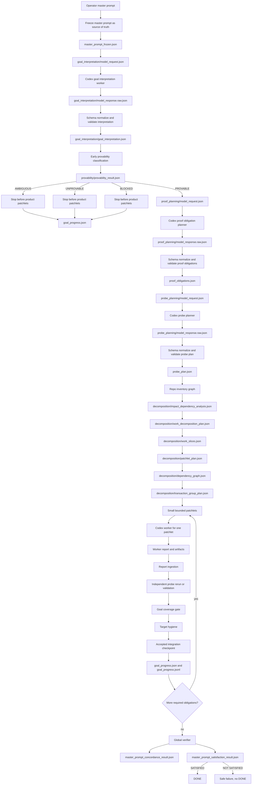

# Codex Orchestrator — No-Compatibility Repo-Agnostic Goal Proof and General Work Decomposition Architecture

## Document purpose

This document consolidates the approved reflections, corrections, additions, and architectural decisions from the latest design discussion.

It supersedes any earlier architecture that allowed any of the following as normal behavior:

```text
app.py-specific semantic parsing
app.main-specific semantic parsing
Python-specific semantic parsing
smoke-scenario regex patterns
legacy semantic fast paths
legacy compatibility adapters
legacy invariant-only patchlet compilation fallback
silent I001 -> P0001 collapse
old shortcut tests preserving the previous behavior
old docs presenting the shortcut behavior as supported architecture
```

The new architecture is intentionally stricter. It is a pre-release breaking correction. The goal is not backward compatibility. The goal is a correct general orchestration architecture.

The orchestrator must be repo-agnostic and language-agnostic by default. It must derive goals, proof obligations, probe plans, and work decomposition from the frozen master prompt, repo inventory, evidence, and model-mediated interpretation. If it cannot produce and validate those artifacts, it must stop early with evidence before product-editing patchlets begin.

---

## 1. Current evidence basis

The current implementation has already proven several valuable layers:

```text
report ingestion and canonical probe artifact references
workflow identity and rerun/reset semantics
invocation-scoped live progress
semantic goal satisfaction for a narrow app.main return-value family
general goal proof artifacts
stop and partial apply
multi-patchlet work decomposition artifacts
operator visibility
```

However, the latest reports also exposed important defects or design mismatches:

1. The system had a decomposition bottleneck where evidence and inventory could contain many rows/nodes, but invariant extraction could collapse the work to a single invariant `I001`, and patchlet compilation could therefore produce only one patchlet `P0001`.
2. The implementation report for general work decomposition still retained an invariant fallback and still modified `semantic_goals.py`, including smoke-specific semantic parser patterns.
3. The approved direction is now stricter: remove all backward compatibility and remove repo-specific semantic shortcuts entirely.
4. The architecture must not solve general goal interpretation by adding more regular expressions.
5. The architecture must not force a master prompt into `app.main()` or any fixed file/function/language shape.
6. The architecture must not preserve old tests whose purpose is keeping the `app.py` shortcut alive.
7. The architecture must not silently fall back to `I001 -> P0001` when decomposition artifacts are missing.

The current report confirms both the implemented decomposition layer and the remaining compatibility issues: `compile_patchlets` retained invariant fallback, `semantic_goals.py` remained modified, and the implementation report listed `rc4 semantic fast path` preservation as a regression goal. That is no longer accepted for the next architecture.

---

## 2. Final approved corrections

### 2.1 No target-specific semantic parser in the general architecture

The general architecture must not contain any hardcoded prompt patterns that map a master prompt to a fixed repo shape.

Forbidden examples:

```text
Make app return <value> and prove it. -> app.main() == <value>
Make app.py return <value> and prove it. -> app.main() == <value>
Make the app pipeline return <value> through the entrypoint and prove it. -> app.main() == <value>
Make app process input through validation/transformation/formatting so main returns <value>. -> app.main() == <value>
```

The issue is not only `app.py`. The issue is any rule that hardcodes a particular repo, language, file, function, framework, or smoke scenario into the general goal system.

The general architecture must not contain:

```text
app.py-specific rules
app.main-specific rules
Python-specific semantic assumptions
HTTP-specific assumptions unless model/proof artifacts derive them from repo context
pytest-specific assumptions unless model/proof artifacts derive them from repo context
CLI stdout-specific assumptions unless model/proof artifacts derive them from repo context
file-regex-specific assumptions unless model/proof artifacts derive them from repo context
smoke-prompt regex patterns
```

The orchestrator must be repo-agnostic and language-agnostic by default.

### 2.2 No backward compatibility shims

The new architecture removes all backward and compatibility shims related to the old shortcut architecture.

Required removals:

```text
Remove semantic_goals.py hardcoded PATTERNS, or remove semantic_goals.py entirely if nothing general remains.
Do not create legacy_builtin_goal_adapter.py.
Do not keep app.py/app.main compatibility behavior.
Do not keep tests named around rc4 semantic fast path unless rewritten to prove the new general path.
Do not keep docs that describe app.main as a supported general semantic fast path.
Do not keep compile_patchlets legacy invariant fallback as normal behavior.
Do not allow missing decomposition artifacts to fall back to one global invariant.
Do not allow unsupported or ambiguous goals to continue structurally.
Do not allow a workflow to reach DONE without model-mediated goal interpretation, proof obligations, probe plan, work decomposition, independent proof, goal coverage, and master-prompt satisfaction.
```

The new rule is:

```text
No backward compatibility with the old shortcut architecture.
The only accepted behavior is the new general, repo-agnostic, language-agnostic orchestration path.
```

### 2.3 Master prompt is the source of truth

The master prompt is read-only and is the source of truth for the orchestrator.

The model interpretation is not the source of truth.
The proof plan is not the source of truth.
The probe plan is not the source of truth.
The patchlet plan is not the source of truth.

Those artifacts are derived interpretations and plans. They must be validated against the frozen master prompt.

The final verifier must verify whether the frozen master prompt goal itself is achieved, not merely whether derived artifacts are internally consistent.

### 2.4 Model-mediated goal interpretation

Goal interpretation must be performed by a Codex goal-interpretation worker using the configured verifier/global-verifier model class.

The model must receive:

```text
frozen master prompt
master prompt source spans
repo census summary
repo inventory summary
language/framework observations from inventory, if any
orchestrator proof contract
schema instructions
strict output schema
```

The model must output a structured `goal_interpretation.json` artifact.

The orchestrator must:

```text
preserve model_request.json
preserve model_response.raw.json
validate normalized goal_interpretation.json against schema
check every goal item traces to master prompt source spans
check interpretation does not claim proof
check interpretation is not contradictory or ungrounded
```

### 2.5 Model-mediated proof obligation planning

Proof obligations must be proposed through a model-mediated proof-planning step, not hardcoded parser rules.

The model may propose:

```text
executable probes
static inspections
existing tests
artifact inspections
composite proofs
manual-blocked proof requirements
```

The orchestrator must validate:

```text
every required goal item has at least one proof obligation
every required proof obligation traces to goal item and master prompt span
every obligation has a proof strategy
every obligation has evidence requirements
every required obligation can be covered by a probe plan or else the workflow stops early
```

### 2.6 Model/repo-aware probe planning

Probe planning must also be repo-agnostic.

The probe plan must not assume Python, app.py, pytest, HTTP, CLI, or file regex unless those are derived from the actual target repo and goal interpretation.

The probe plan may include:

```text
executable probe
static probe
test probe
artifact inspection probe
composite probe
```

But every required proof obligation must have at least one rerunnable or independently validatable proof path.

Worker-proposed probes are not proof until the orchestrator validates or reruns them.

### 2.7 General work decomposition

The general work decomposition layer must replace the old invariant-collapse path.

The architecture is not:

```text
one file -> one patchlet
```

The architecture is:

```text
one patchlet -> exactly one allowed product/runtime file
```

This distinction is crucial.

A file may be targeted by multiple patchlets.

Examples:

```text
P0001 -> app.py
P0002 -> app.py
P0003 -> app.py
```

or:

```text
P0001 -> entrypoint.ts
P0002 -> service.ts
P0003 -> formatter.ts
P0004 -> service.ts
P0005 -> entrypoint.ts
```

The exact filenames must be derived from the actual target repo. They must not be hardcoded in the architecture.

### 2.8 Patchlets are small bounded work units

Each patchlet must be a small bounded work unit.

Each patchlet prompt must:

```text
have exactly one allowed product/runtime file
identify one work slice
identify proof obligations it contributes to
identify dependency patchlets
include a narrow scope statement
include forbidden product/runtime edit paths
include time budget seconds
include soft deadline
avoid memory compacting
avoid whole-repo refactor requests
avoid broad multi-file goals
```

Each patchlet must fit the default task time budget:

```text
CODEX_PATCHLET_TIMEOUT_SECONDS default 600 seconds
```

If `CODEX_PATCHLET_TIMEOUT_SECONDS` is set, the patchlet plan, worker prompt, worker memory, command timeout, operator event, and run manifest must all agree with the configured budget.

### 2.9 Early provability

The system must classify provability before product-editing patchlets begin.

It is not acceptable to discover only at the end that the goal was unsupported, ambiguous, or unprovable.

If the goal cannot be interpreted, proof-planned, probe-planned, or decomposed, the workflow must stop early with evidence.

Early stop outcomes include:

```text
goal_not_interpretable
goal_ambiguous
goal_unprovable
goal_blocked_by_missing_capability
proof_obligations_invalid
probe_plan_invalid
work_decomposition_invalid
```

### 2.10 Goal progress visibility

The operator must have visibility into goal progress after every workflow iteration.

Goal progress must include:

```text
frozen master prompt hash
interpretation status
provability status
proof obligation counts
probe plan counts
work slice counts
patchlet counts
accepted patchlets
pending patchlets
waiting patchlets
failed patchlets
blocked patchlets
per-file patchlet counts
same-file patchlet sequences
proven obligations
failed obligations
blocked obligations
unproven obligations
latest accepted checkpoint
whether partial progress is applyable
next recommended action
```

### 2.11 Stop and partial apply

The operator must be able to stop safely and apply the latest accepted progress.

Rules:

```text
cxor stop writes stop_requested.json.
auto loop honors stop at safe boundaries.
stop_result.json records latest accepted checkpoint.
partial apply requires --allow-partial.
partial apply uses accepted integration checkpoint only.
in-progress patchlet work is never applied.
failed patchlet work is never applied.
unaccepted worktree scratch is never applied.
partial apply warns the master prompt may not be fully satisfied.
```

---

## 3. Corrected target architecture overview



---

## 4. Required artifact layout

```text
.codex-orchestrator/
  master_prompt.md
  master_prompt_frozen.json

  goal_interpretation/
    model_request.json
    model_response.raw.json
    goal_interpretation.json
    validation_result.json

  proof_planning/
    model_request.json
    model_response.raw.json
    proof_obligations.json
    validation_result.json

  probe_planning/
    model_request.json
    model_response.raw.json
    probe_plan.json
    validation_result.json

  decomposition/
    impact_dependency_analysis.json
    work_decomposition_plan.json
    work_slices.json
    patchlet_plan.json
    dependency_graph.json
    transaction_group_plan.json

  patchlets/
    patchlet_index.json
    transaction_groups.json

  runs/
    P0001_attempt1/
      codex_task_prompt.md
      worker_memory/
        TASK_CONTRACT.md
        WORK_SLICE_CONTRACT.md
        PROOF_OBLIGATION_CONTRACT.md
        PROBE_PLAN_CONTRACT.md
      worker_stage/
      gates/
        report_ingestion_result.json
        report_validation_errors.json
        independent_probe_rerun_result.json
        goal_coverage_gate_result.json
        wrapper_gate_result.json
        target_hygiene_gate_result.json

  goal_progress.json
  goal_progress.jsonl

  global_verification/
    master_prompt_concordance_result.json
    master_prompt_satisfaction_result.json
    verification_matrix.json

  control/
    stop_requested.json
    stop_result.json

  apply_results/
    partial_apply_result.json
```

---

## 5. Schemas

### 5.1 `master_prompt_frozen.schema.json`

```json
{
  "schema_version": "1.0",
  "kind": "master_prompt_frozen",
  "workflow_id": "WF...",
  "run_id": "R0001",
  "source_path": "/absolute/path/to/master_prompt.md",
  "frozen_copy_path": ".codex-orchestrator/master_prompt.md",
  "sha256": "<sha256>",
  "size_bytes": 123,
  "created_at": "2026-07-04T00:00:00Z",
  "read_only_source_of_truth": true,
  "source_spans": [
    {
      "span_id": "MPS001",
      "line_start": 1,
      "line_end": 1,
      "column_start": 1,
      "column_end": 80,
      "text": "source text",
      "role": "goal_statement"
    }
  ]
}
```

### 5.2 `goal_interpretation.schema.json`

```json
{
  "schema_version": "1.0",
  "kind": "goal_interpretation",
  "workflow_id": "WF...",
  "run_id": "R0001",
  "master_prompt_sha256": "<sha256>",
  "master_prompt_frozen_path": ".codex-orchestrator/master_prompt_frozen.json",
  "interpretation_status": "CONCORDANT",
  "goal_items": [
    {
      "goal_item_id": "GI001",
      "source_span_ids": ["MPS001"],
      "goal_type": "behavioral_change",
      "repo_context": {
        "language_or_framework": "derived_from_repo",
        "entrypoints": ["derived_from_repo"],
        "affected_runtime_boundaries": ["derived_from_repo"]
      },
      "desired_state": "derived from frozen master prompt",
      "success_conditions": ["derived proof condition"],
      "required": true
    }
  ],
  "ambiguities": [],
  "assumptions": [],
  "proof_not_claimed_here": true
}
```

Allowed interpretation statuses:

```text
DRAFT
CONCORDANT
INCOMPLETE
CONTRADICTORY
AMBIGUOUS
INVALID
```

### 5.3 `provability_result.schema.json`

```json
{
  "schema_version": "1.0",
  "kind": "provability_result",
  "workflow_id": "WF...",
  "run_id": "R0001",
  "master_prompt_sha256": "<sha256>",
  "provability_status": "PROVABLE",
  "can_start_product_patchlets": true,
  "proof_obligation_count": 3,
  "blocking_reasons": [],
  "required_capabilities": ["local_execution"],
  "available_capabilities": ["local_execution"],
  "missing_capabilities": []
}
```

Allowed statuses:

```text
PROVABLE
PARTIALLY_PROVABLE
NEEDS_READ_ONLY_DISCOVERY
AMBIGUOUS
UNPROVABLE
BLOCKED_BY_MISSING_CAPABILITY
```

### 5.4 `proof_obligations.schema.json`

```json
{
  "schema_version": "1.0",
  "kind": "proof_obligations",
  "workflow_id": "WF...",
  "run_id": "R0001",
  "master_prompt_sha256": "<sha256>",
  "obligations": [
    {
      "obligation_id": "PO001",
      "goal_item_ids": ["GI001"],
      "source_span_ids": ["MPS001"],
      "obligation_type": "behavioral_runtime_claim",
      "claim": "The accepted integration state satisfies the requested behavior.",
      "proof_strategy": "executable_probe",
      "required": true,
      "language": "derived_or_unknown",
      "target_boundaries": ["derived_from_repo"],
      "status": "UNPROVEN",
      "evidence_requirements": [
        "expected_actual_record",
        "orchestrator_rerun_or_validation",
        "coverage_link_to_master_prompt"
      ]
    }
  ]
}
```

Allowed obligation statuses:

```text
UNPROVEN
IN_PROGRESS
PROVEN_BY_WORKER
PROVEN_BY_ORCHESTRATOR
FAILED
BLOCKED
WAIVED_BY_POLICY
```

`WAIVED_BY_POLICY` is not available by default. It requires an explicit policy artifact. It must not be used as a hidden compatibility escape.

### 5.5 `probe_plan.schema.json`

```json
{
  "schema_version": "1.0",
  "kind": "probe_plan",
  "workflow_id": "WF...",
  "run_id": "R0001",
  "master_prompt_sha256": "<sha256>",
  "probes": [
    {
      "probe_id": "GP001",
      "obligation_ids": ["PO001"],
      "probe_kind": "executable",
      "owner": "model_planned_orchestrator_validated",
      "execution_context": "integration_candidate",
      "command": null,
      "script_path": ".codex-orchestrator/probes/generated/GP001/probe",
      "expected_observation": {
        "type": "derived_from_proof_obligation"
      },
      "rerunnable_by_orchestrator": true,
      "side_effect_policy": "no_product_mutation"
    }
  ]
}
```

Allowed probe kinds:

```text
executable
static_inspection
existing_test
artifact_inspection
composite
```

Allowed owners:

```text
model_planned_orchestrator_validated
orchestrator_generated
worker_proposed
worker_proposed_validated
```

### 5.6 `work_decomposition_plan.schema.json`

```json
{
  "schema_version": "1.0",
  "kind": "work_decomposition_plan",
  "workflow_id": "WF...",
  "run_id": "R0001",
  "master_prompt_sha256": "<sha256>",
  "decomposition_strategy": "small_bounded_work_slices",
  "one_allowed_file_per_patchlet": true,
  "multiple_patchlets_per_file_allowed": true,
  "avoid_memory_compacting": true,
  "default_patchlet_timeout_seconds": 600,
  "work_slice_count": 5,
  "patchlet_count": 5,
  "transaction_group_count": 3
}
```

### 5.7 `work_slices.schema.json`

```json
{
  "schema_version": "1.0",
  "kind": "work_slices",
  "workflow_id": "WF...",
  "run_id": "R0001",
  "slices": [
    {
      "work_slice_id": "WS001",
      "title": "derived bounded task",
      "allowed_product_runtime_file": "derived/file/path",
      "slice_type": "derived_slice_type",
      "goal_item_ids": ["GI001"],
      "proof_obligation_ids": ["PO001"],
      "depends_on_work_slice_ids": [],
      "risk_level": "low",
      "estimated_complexity": "small",
      "time_budget_seconds": 600,
      "prompt_scope": {
        "allowed_context_files": ["derived/context/file"],
        "allowed_edit_file": "derived/file/path",
        "forbidden_edit_files": ["other/derived/file"],
        "memory_compacting_required": false
      }
    }
  ]
}
```

### 5.8 `patchlet_plan.schema.json`

```json
{
  "schema_version": "1.0",
  "kind": "patchlet_plan",
  "workflow_id": "WF...",
  "run_id": "R0001",
  "patchlets": [
    {
      "patchlet_id": "P0001",
      "work_slice_id": "WS001",
      "allowed_product_runtime_file": "derived/file/path",
      "proof_obligation_ids": ["PO001"],
      "goal_item_ids": ["GI001"],
      "dependency_patchlet_ids": [],
      "downstream_patchlet_ids": ["P0002"],
      "time_budget_seconds": 600,
      "prompt_budget_policy": {
        "must_fit_within_timeout": true,
        "avoid_memory_compacting": true,
        "max_product_runtime_edit_files": 1
      }
    }
  ]
}
```

### 5.9 `dependency_graph.schema.json`

```json
{
  "schema_version": "1.0",
  "kind": "decomposition_dependency_graph",
  "workflow_id": "WF...",
  "run_id": "R0001",
  "nodes": [
    {
      "node_id": "P0001",
      "node_type": "patchlet",
      "work_slice_id": "WS001",
      "allowed_product_runtime_file": "derived/file/path"
    }
  ],
  "edges": [
    {
      "from": "P0001",
      "to": "P0002",
      "edge_type": "must_complete_before",
      "reason": "derived dependency reason"
    }
  ],
  "has_cycles": false,
  "topological_order": ["P0001", "P0002"]
}
```

### 5.10 `transaction_group_plan.schema.json`

```json
{
  "schema_version": "1.0",
  "kind": "transaction_group_plan",
  "workflow_id": "WF...",
  "run_id": "R0001",
  "transaction_groups": [
    {
      "transaction_group_id": "TG001",
      "patchlet_ids": ["P0001"],
      "goal_item_ids": ["GI001"],
      "proof_obligation_ids": ["PO001"],
      "dependency_patchlet_ids": [],
      "group_type": "dependency_layer"
    }
  ]
}
```

---

## 6. Gates

### 6.1 Master prompt freeze gate

Blocks if:

```text
master prompt cannot be read
frozen copy cannot be written
sha256 cannot be calculated
source spans cannot be created
```

### 6.2 Goal interpretation gate

Blocks if:

```text
model_request.json missing
model_response.raw.json missing
model response invalid JSON
normalized goal_interpretation.json missing
schema invalid
no goal items
goal items do not reference source spans
interpretation claims proof
interpretation is contradictory
```

### 6.3 Provability gate

Blocks before product patchlets if:

```text
AMBIGUOUS
UNPROVABLE
BLOCKED_BY_MISSING_CAPABILITY
required proof obligations cannot be produced
required probe plan cannot be produced
```

### 6.4 Proof obligation gate

Blocks if:

```text
required goal item lacks proof obligation
proof obligation lacks source span link
proof obligation lacks proof strategy
proof obligation lacks evidence requirements
proof obligation cannot be independently verified
```

### 6.5 Probe plan gate

Blocks if:

```text
required obligation lacks probe
probe is not rerunnable or independently validatable
probe has unsafe side effects
probe lacks expected observation
probe depends on hidden model reasoning
```

### 6.6 Decomposition gate

Blocks if:

```text
impact analysis missing
work decomposition plan missing
work slices missing
patchlet plan missing
dependency graph missing
transaction group plan missing
patchlet has zero allowed files
patchlet has more than one allowed product/runtime file
patchlet lacks work slice
patchlet lacks proof obligation linkage
patchlet lacks time budget
patchlet requires memory compacting
cycle detected
```

### 6.7 Independent proof gate

Blocks if:

```text
worker proof was not rerun or validated
expected/actual mismatch
probe not safely rerunnable
probe output cannot be parsed
probe mutated product files
probe evidence not linked to obligation
```

### 6.8 Goal coverage gate

Blocks if:

```text
required obligation unproven
required goal item uncovered
failed obligation exists
blocked obligation exists
coverage evidence missing
```

### 6.9 Master prompt concordance gate

Blocks if:

```text
goal interpretation does not cover frozen prompt spans
proof obligations do not cover goal items
probe plan does not cover obligations
decomposition does not cover proof obligations
```

### 6.10 Master prompt satisfaction gate

Blocks DONE if:

```text
required obligations are not PROVEN_BY_ORCHESTRATOR
accepted integration state does not satisfy required obligations
master prompt satisfaction result is not accepted
```

---

## 7. Tests

### 7.1 Removal and no-compatibility tests

```text
test_no_app_main_regex_patterns_remain
test_no_pipeline_smoke_regex_patterns_remain
test_no_python_specific_semantic_parser_in_general_path
test_semantic_goals_py_removed_or_empty_of_hardcoded_patterns
test_old_rc4_fast_path_tests_removed_or_rewritten
test_compile_patchlets_requires_patchlet_plan
test_missing_decomposition_artifacts_do_not_fallback_to_I001_P0001
test_missing_goal_interpretation_safe_fails_before_workers
test_missing_proof_obligations_safe_fails_before_workers
test_missing_probe_plan_safe_fails_before_workers
```

### 7.2 Model-mediated goal interpretation tests

```text
test_goal_interpretation_model_request_written
test_goal_interpretation_raw_response_preserved
test_goal_interpretation_schema_validates
test_goal_interpretation_references_master_prompt_hash
test_goal_interpretation_references_source_spans
test_goal_interpretation_does_not_claim_proof
test_invalid_goal_interpretation_safe_fails
test_contradictory_goal_interpretation_safe_fails
test_ambiguous_goal_interpretation_safe_fails_before_product_patchlets
```

### 7.3 Proof obligation tests

```text
test_proof_planning_model_request_written
test_proof_planning_raw_response_preserved
test_proof_obligations_schema_validates
test_required_goal_item_requires_obligation
test_obligation_requires_source_span_link
test_obligation_requires_proof_strategy
test_obligation_requires_evidence_requirements
test_invalid_proof_obligation_safe_fails
```

### 7.4 Probe plan tests

```text
test_probe_planning_model_request_written
test_probe_planning_raw_response_preserved
test_probe_plan_schema_validates
test_required_obligation_requires_probe
test_required_probe_must_be_rerunnable_or_validatable
test_worker_proposed_probe_not_trusted_without_validation
test_probe_with_product_mutation_policy_rejected
test_probe_without_expected_observation_rejected
```

### 7.5 Work decomposition tests

```text
test_impact_dependency_analysis_written
test_work_decomposition_plan_written
test_work_slices_written
test_patchlet_plan_written
test_dependency_graph_written
test_transaction_group_plan_written
test_each_patchlet_has_exactly_one_allowed_product_runtime_file
test_multiple_patchlets_may_target_same_file
test_patchlet_plan_rejects_multiple_allowed_files
test_patchlet_prompt_includes_600_second_budget
test_patchlet_prompt_avoids_memory_compacting
test_dependency_graph_orders_same_file_patchlets
test_transaction_groups_derive_from_dependency_layers
```

### 7.6 Master prompt satisfaction tests

```text
test_done_requires_master_prompt_concordance
test_done_requires_master_prompt_satisfaction
test_done_blocked_when_goal_item_uncovered
test_done_blocked_when_obligation_unproven
test_done_blocked_when_probe_not_rerun
test_done_blocked_when_decomposition_missing
test_done_blocked_when_patchlet_plan_missing
```

### 7.7 Stop and partial apply tests

```text
test_stop_writes_stop_requested
test_auto_stops_at_safe_boundary
test_stop_result_records_latest_accepted_checkpoint
test_partial_apply_requires_allow_partial
test_partial_apply_uses_accepted_checkpoint_only
test_partial_apply_does_not_apply_in_progress_work
test_partial_apply_warns_master_prompt_may_not_be_satisfied
```

---

## 8. Commands

### 8.1 Baseline

```bash
export UV_CACHE_DIR=/tmp/uv-cache
uv run --no-sync pytest -q
uv run --no-sync pytest -q tests/smoke/test_real_codex_auto_worktree.py
uv run --no-sync python -m codex_orchestrator --version
uv run --no-sync cxor --version
uv run --no-sync codex-orchestrator --version
```

### 8.2 Focused suites

```bash
uv run --no-sync pytest -q tests/integration/test_no_compatibility_shortcuts.py
uv run --no-sync pytest -q tests/integration/test_model_mediated_goal_interpretation.py
uv run --no-sync pytest -q tests/integration/test_model_mediated_proof_planning.py
uv run --no-sync pytest -q tests/integration/test_model_mediated_probe_planning.py
uv run --no-sync pytest -q tests/integration/test_general_work_decomposition_no_fallbacks.py
uv run --no-sync pytest -q tests/integration/test_multi_patchlet_decomposition.py
uv run --no-sync pytest -q tests/integration/test_master_prompt_satisfaction_verifier.py
uv run --no-sync pytest -q tests/integration/test_stop_and_partial_apply.py
```

### 8.3 Full verification

```bash
uv run --no-sync pytest -q
uv run --no-sync python -m codex_orchestrator --version
uv run --no-sync cxor --version
uv run --no-sync codex-orchestrator --version
uv run --no-sync pytest -q tests/smoke/test_real_codex_auto_worktree.py
git status --short
```

---

## 9. Risks

| Risk | Impact | Mitigation |
|---|---|---|
| Model misinterprets master prompt | Wrong goal items could be generated. | Preserve raw model response, require source-span coverage, run concordance verifier, stop on ambiguity. |
| Proof obligations are too weak | System may prove the wrong thing. | Require proof obligations to map to goal items and source spans; final verifier checks master prompt satisfaction. |
| Probe plan is unsafe | Probe could mutate repo or be non-repeatable. | Side-effect policy, no product mutation, isolated execution, orchestrator validation. |
| Removing compatibility breaks old tests | Old shortcut tests will fail. | Rewrite tests to validate general architecture; do not preserve shortcut behavior. |
| Model-mediated path adds latency | More model calls before workers. | Early provability prevents wasted product patchlets; visibility explains progress. |
| Ambiguous goals stop earlier | Some prompts may no longer run. | Safer than false DONE; user gets evidence and can clarify master prompt. |
| Work decomposition produces too many patchlets | Workflow may become inefficient. | Task-size/risk budget, dependency graph, operator progress, stop/partial apply. |
| Work decomposition produces fake patchlets | Artificial patchlet count without value. | Every patchlet must map to work slice, proof obligation, dependency, and one allowed file. |
| Same-file patchlets conflict | Sequential edits may interfere. | Same-file patchlets ordered by default. |
| Partial apply applies unsafe state | Could leak unfinished work. | Apply accepted integration checkpoint only; never apply in-progress work. |

---

## 10. Final architecture acceptance checklist

```text
1. No app.py-specific semantic parser remains.
2. No app.main-specific semantic parser remains.
3. No Python-specific semantic parser remains in the general path.
4. No smoke-specific prompt regex remains.
5. No legacy semantic fast-path tests remain.
6. No docs present app.main as a supported general goal system.
7. No compile_patchlets invariant fallback silently creates I001 -> P0001.
8. Goal interpretation requires model-mediated artifacts.
9. Proof planning requires model-mediated artifacts.
10. Probe planning requires model/repo-aware artifacts.
11. Work decomposition artifacts are mandatory before patchlet compilation.
12. Every patchlet has exactly one allowed product/runtime file.
13. Multiple patchlets may target the same file.
14. Patchlet prompts include time budget and no-memory-compacting scope.
15. Unsupported or ambiguous goals stop early with evidence.
16. Worker proof alone cannot satisfy obligations.
17. Orchestrator-owned proof rerun or validation is required.
18. DONE requires master prompt satisfaction.
19. Stop and partial apply use accepted checkpoints only.
20. Full suite passes.
21. Default real-Codex smoke skips unless explicitly enabled.
```
