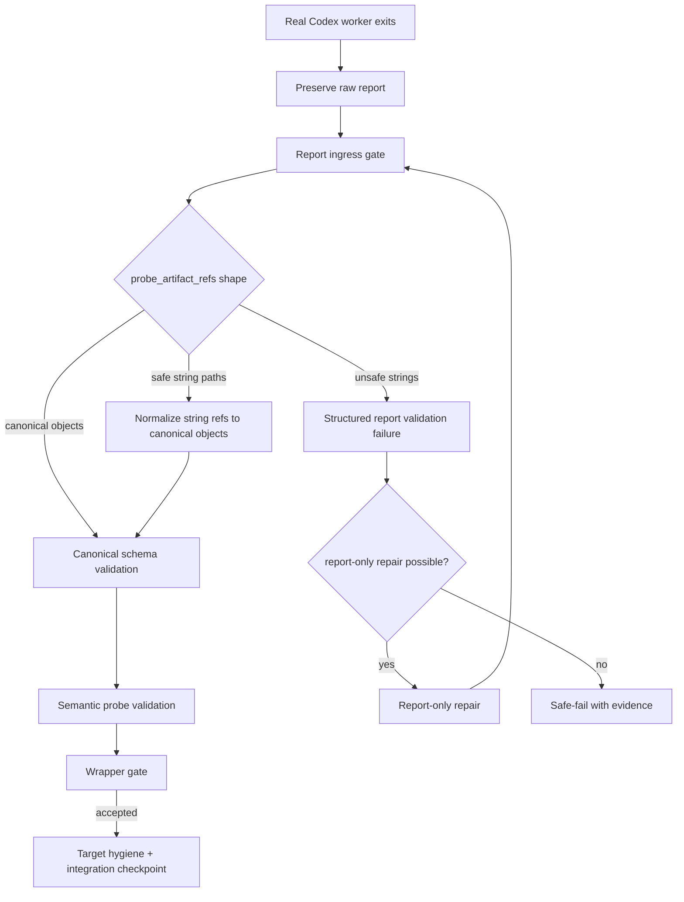

# Codex Orchestrator Architecture — Real-Codex Report Contract, Probe Artifact References, and Loop-Safe Report Repair

## 1. Purpose

This architecture addresses the next live blocker found after the direct `cxor auto --live-progress` visibility increment.

The visibility layer worked: direct `cxor auto --live-progress` printed stage-level progress, `cxor monitor` showed operator events, `cxor status --json` reported the active workflow, and `cxor prompts` exposed prompt lineage. The remaining blocker is functional: real Codex repeatedly produced reports where `probe_artifact_refs` was an array of file-path strings, while the current schema requires each item to be an object with `patchlet_id`, `probe_root`, and `run_id`.

The system then treated this as a full patchlet failure, generated repair patchlets, and repeated the same report-shape error. The loop governor detected repetition, but classified the repeated signature as `unknown_repeated_failure` because the flattened jsonschema message did not contain the field name `probe_artifact_refs`.

This architecture hardens the report-contract path without weakening product/runtime gates.

## 2. Evidence basis

The evidence report proves the following facts:

- P0001, P0002, and P0003 real-Codex workers exited with code 0.
- P0001, P0002, and P0003 reports failed schema validation before wrapper acceptance.
- The invalid field was `probe_artifact_refs`.
- The invalid values were strings, usually file paths under `.artifacts/probes/...`.
- The schema requires object entries with `patchlet_id`, `probe_root`, and `run_id`.
- The prompt contract listed `probe_artifact_refs` as required, but did not show an explicit object-shaped item example in the generated contract excerpts.
- Repair prompts carried human validation text, but did not convert it into schema-specific corrective instructions with a valid object-shaped example.
- Operator events preserved the human-readable error, but not a normalized signature, JSON pointer, or schema path.
- The loop governor reached threshold 3 but classified the repeated failure as `unknown_repeated_failure`.
- The target product file stayed clean; the product task may have been solved in execution worktrees but could not pass the report gate.

## 3. Architecture goals

The architecture must:

1. Preserve strict canonical report semantics.
2. Prevent report-shape errors from causing unbounded full patchlet regeneration.
3. Make `probe_artifact_refs` unambiguous to real Codex in every worker/report contract.
4. Accept and normalize safe legacy/string probe references at the report-ingress boundary without silently weakening canonical report validation.
5. Preserve raw worker output for audit.
6. Produce machine-readable validation errors with JSON pointer, schema path, field name, expected type, actual type, normalized signature, and repair hints.
7. Feed structured signatures to failure records, operator events, diagnosis, and loop governor.
8. Route report-shape failures to deterministic normalization or report-only repair before full patchlet regeneration.
9. Keep product/runtime files protected and target hygiene unchanged.
10. Keep direct auto operator visibility intact.

## 4. Non-goals

This increment must not:

- Make the wrapper gate accept arbitrary malformed reports.
- Remove strict canonical report validation.
- Accept probe paths outside `.artifacts/probes/`.
- Accept references to missing files without evidence.
- Delete or rewrite probe artifacts.
- Let report normalization hide actual product failures.
- Re-run full product patchlets for report-only shape errors when deterministic normalization is possible.
- Print full prompt bodies in live progress.
- Run real Codex in default tests.

## 5. Core architectural decision

### 5.1 Canonical schema remains object-based

The canonical `patchlet_report` schema keeps `probe_artifact_refs` as an array of objects.

Canonical object shape:

```json
{
  "patchlet_id": "P0001",
  "probe_root": ".artifacts/probes/P0001/run_001",
  "run_id": "run_001",
  "files": [
    {
      "path": ".artifacts/probes/P0001/run_001/before_state.json",
      "kind": "before_state",
      "sha256": "...",
      "size_bytes": 123
    }
  ]
}
```

The required fields remain:

```text
patchlet_id
probe_root
run_id
```

The `files` field should be optional initially, but strongly recommended. It lets the system preserve the exact file references that real Codex supplied as strings.

### 5.2 Raw report input may be normalized before canonical validation

Real Codex output is treated as raw input, not immediately as canonical report truth.

The report pipeline becomes:

```text
worker raw report
  -> raw report preserved
  -> report ingress parser
  -> probe ref normalizer
  -> canonical report candidate
  -> canonical schema validation
  -> semantic probe validation
  -> wrapper gate
```

String probe refs are allowed only at the raw-ingress layer.

Canonical reports stored for downstream gates must be object-shaped.

### 5.3 Safe string refs are coercible, unsafe string refs are structured failures

A string entry in `probe_artifact_refs` is coercible only if all conditions hold:

```text
1. The string is a path.
2. The path is inside the target repo or workflow artifact root.
3. The path resolves under .artifacts/probes/.
4. The path exists.
5. The patchlet id can be derived from the path or current patchlet context.
6. The probe root can be derived.
7. A run_id can be derived from a path segment such as run_001, or set to a deterministic fallback for flat probe roots.
8. The resulting canonical object validates against the canonical probe-ref schema.
```

If a path is outside `.artifacts/probes/`, missing, or ambiguous, normalization must fail with a structured report validation error.

### 5.4 Normalization is visible and auditable

Every normalization writes a durable artifact:

```text
.codex-orchestrator/runs/<attempt_id>/gates/report_ingestion_result.json
```

This artifact records:

- raw report path
- canonical report path
- normalization applied or not
- exact raw string refs
- canonical refs produced
- validation errors, if any
- normalized failure signature
- repair hint

### 5.5 Report-shape errors get report-specific handling

When the worker exits code 0 and the only failure is report shape, the system must not immediately route to full patchlet regeneration.

Use this order:

```text
1. Deterministic normalization, if safe.
2. Canonical report validation.
3. If still invalid but product diff/probes are present, perform report-only repair.
4. If report-only repair fails or is not possible, safe-fail with report-contract evidence.
5. Full patchlet regeneration is reserved for product/runtime failures, missing evidence, or report failures that cannot be isolated to report shape.
```

## 6. New architecture planes

### 6.1 Report ingress plane

The report ingress plane is responsible for raw worker report handling.

Inputs:

```text
attempt_id
patchlet_id
raw worker report path
expected report schema
target repo root
artifact root
probe root
run dir
```

Outputs:

```text
raw_report_preserved_path
canonical_report_path
report_ingestion_result.json
structured validation errors
normalized failure signature
operator events
```

### 6.2 Probe-ref canonicalization plane

The canonicalization plane maps raw string file paths to canonical probe-run objects.

It must handle:

```text
.artifacts/probes/P0001/run_001/before_state.json
/tmp/.../.artifacts/probes/P0001/run_001/before_state.json
.artifacts/probes/P0002/comparison.txt
/tmp/.../.artifacts/probes/P0003/proof_of_fix.json
```

Derived canonical object examples:

For nested run directory:

```json
{
  "patchlet_id": "P0001",
  "probe_root": ".artifacts/probes/P0001/run_001",
  "run_id": "run_001",
  "files": [
    {
      "path": ".artifacts/probes/P0001/run_001/before_state.json",
      "kind": "before_state",
      "sha256": "...",
      "size_bytes": 123
    }
  ]
}
```

For flat probe root:

```json
{
  "patchlet_id": "P0002",
  "probe_root": ".artifacts/probes/P0002",
  "run_id": "default",
  "files": [
    {
      "path": ".artifacts/probes/P0002/comparison.txt",
      "kind": "comparison",
      "sha256": "...",
      "size_bytes": 456
    }
  ]
}
```

Multiple file strings under the same probe root are grouped into one canonical object.

### 6.3 Structured validation-error plane

Instead of flattening jsonschema errors too early, preserve structured error objects.

Schema:

```json
{
  "schema_version": "1.0",
  "kind": "report_validation_error",
  "error_id": "RVE000001",
  "field": "probe_artifact_refs",
  "json_pointer": "/probe_artifact_refs/0",
  "schema_path": "/properties/probe_artifact_refs/items/type",
  "validator": "type",
  "expected_type": "object",
  "actual_type": "string",
  "invalid_value_excerpt": ".artifacts/probes/P0002/comparison.txt",
  "message": "'.artifacts/probes/P0002/comparison.txt' is not of type 'object'",
  "normalized_signature": "probe_artifact_refs_not_objects",
  "repair_hint": "Use object entries with patchlet_id, probe_root, and run_id. Do not put raw file-path strings directly in probe_artifact_refs."
}
```

### 6.4 Failure-signature plane

The loop governor must stop normalizing from free text when structured validation errors are available.

Priority order:

```text
1. report_ingestion_result.normalized_failure_signature
2. report_validation_error.normalized_signature
3. failure_record.failure_signature
4. operator_event.details.failure_signature
5. fallback text normalization
6. unknown_repeated_failure
```

### 6.5 Report-only repair plane

Report-only repair is a constrained worker operation that can rewrite only report artifacts, not product/runtime files.

Allowed writes:

```text
.codex-orchestrator/reports/<patchlet_id>.json
.codex-orchestrator/runs/<attempt_id>/worker_stage/05_final_report.md
.codex-orchestrator/runs/<attempt_id>/gates/report_repair_result.json
```

Disallowed writes:

```text
app.py
any product/runtime file
.artifacts/probes existing evidence
.codex-orchestrator/integration accepted state
```

If report-only repair is implemented in this increment, it must be deterministic/fake-testable and never run real Codex by default.

## 7. Updated workflow path



## 8. Report-ingestion artifact schema

File:

```text
src/codex_orchestrator/schemas/report_ingestion_result.schema.json
```

Artifact path:

```text
.codex-orchestrator/runs/<attempt_id>/gates/report_ingestion_result.json
```

Shape:

```json
{
  "schema_version": "1.0",
  "kind": "report_ingestion_result",
  "patchlet_id": "P0002",
  "attempt_id": "P0002_attempt1",
  "accepted": true,
  "raw_report_path": ".codex-orchestrator/reports/raw/P0002_attempt1.json",
  "canonical_report_path": ".codex-orchestrator/reports/P0002.json",
  "normalization_applied": true,
  "normalizations": [
    {
      "kind": "probe_artifact_ref_string_to_object",
      "raw_value": ".artifacts/probes/P0002/comparison.txt",
      "canonical_ref": {
        "patchlet_id": "P0002",
        "probe_root": ".artifacts/probes/P0002",
        "run_id": "default",
        "files": [
          {
            "path": ".artifacts/probes/P0002/comparison.txt",
            "kind": "comparison",
            "sha256": "...",
            "size_bytes": 456
          }
        ]
      }
    }
  ],
  "validation_errors": [],
  "normalized_failure_signature": null,
  "repair_hint": null,
  "operator_event_ids": ["OE000010"]
}
```

Failure shape:

```json
{
  "schema_version": "1.0",
  "kind": "report_ingestion_result",
  "patchlet_id": "P0002",
  "attempt_id": "P0002_attempt1",
  "accepted": false,
  "raw_report_path": ".codex-orchestrator/reports/raw/P0002_attempt1.json",
  "canonical_report_path": null,
  "normalization_applied": false,
  "normalizations": [],
  "validation_errors": [
    {
      "kind": "report_validation_error",
      "field": "probe_artifact_refs",
      "json_pointer": "/probe_artifact_refs/0",
      "schema_path": "/properties/probe_artifact_refs/items/type",
      "expected_type": "object",
      "actual_type": "string",
      "invalid_value_excerpt": "../outside.txt",
      "normalized_signature": "probe_artifact_refs_invalid_path",
      "repair_hint": "Probe artifact references must point inside .artifacts/probes/ and must canonicalize to object refs."
    }
  ],
  "normalized_failure_signature": "probe_artifact_refs_invalid_path",
  "repair_hint": "Use object-shaped probe refs inside .artifacts/probes/."
}
```

## 9. Prompt-contract hardening

Generated `REPORT_SCHEMA_CONTRACT.md` must include:

### 9.1 Valid minimal skeleton

```json
{
  "status": "VERIFIED_NO_CHANGE_NEEDED",
  "changed_product_runtime_file": null,
  "changed_product_runtime_files": [],
  "deterministic_run_counts": {},
  "before_after_state": {},
  "row_ledger": [],
  "trace_ledger": [],
  "cleanup_proof": "No cleanup required.",
  "probe_artifact_refs": [
    {
      "patchlet_id": "P0001",
      "probe_root": ".artifacts/probes/P0001/run_001",
      "run_id": "run_001"
    }
  ]
}
```

### 9.2 Explicit invalid example

```json
{
  "probe_artifact_refs": [
    ".artifacts/probes/P0001/run_001/before_state.json"
  ]
}
```

Required explanation:

```text
This is invalid because probe_artifact_refs entries must be objects, not raw file-path strings.
```

### 9.3 Object-shape rule

```text
Every probe_artifact_refs entry must be an object with patchlet_id, probe_root, and run_id.
Do not put raw strings in probe_artifact_refs.
If you created individual probe files, reference the probe run/root object, not each file as a string.
```

## 10. Failure records and operator events

Failure records should include:

```json
{
  "failure_signature": "probe_artifact_refs_not_objects",
  "structured_validation_errors": [],
  "report_ingestion_result_path": ".codex-orchestrator/runs/P0002_attempt1/gates/report_ingestion_result.json",
  "repair_hint": "Use object entries with patchlet_id, probe_root, and run_id."
}
```

Operator events should include:

```json
{
  "event_type": "patchlet_report_validated",
  "severity": "error",
  "summary": "Report validation failed for P0002: probe_artifact_refs entries must be objects, not strings.",
  "details": {
    "report_valid": false,
    "failure_signature": "probe_artifact_refs_not_objects",
    "validation_errors": [],
    "repair_hint": "Use object entries with patchlet_id, probe_root, and run_id."
  }
}
```

## 11. Loop-governor behavior

The loop governor must fingerprint this failure as:

```text
probe_artifact_refs_not_objects
```

It must not fall back to:

```text
unknown_repeated_failure
```

when structured report validation evidence is available.

Warning output:

```text
[cxor +447s] repeated report validation failure: probe_artifact_refs_not_objects count=3; report-only repair or safe-fail recommended
```

Safe-fail output:

```text
[cxor +447s] loop governor blocked repeated report validation failure probe_artifact_refs_not_objects after 3 occurrences; preserving evidence
```

## 12. Repair-routing policy

### 12.1 Deterministic normalization path

If all string refs are safe/coercible, normalize and continue. Do not repair.

### 12.2 Report-only repair path

If raw report has report-shape errors that cannot be normalized, create a report-only repair task.

Report-only repair task must include:

- exact invalid JSON pointer
- expected type
- actual type
- invalid value excerpt
- valid object-shaped example
- raw report path
- canonical schema path
- allowed output path
- explicit prohibition on product edits

### 12.3 Full patchlet regeneration path

Use full patchlet regeneration only when:

- product/runtime diff is wrong
- required probes are missing
- worker failed before producing enough evidence
- report errors are not report-shape-only
- report-only repair already failed with evidence

## 13. Gates

### 13.1 Report Ingress Gate

Input: raw report.

Output: canonical report or structured failure.

Accepted when:

```text
raw report is valid canonical report
or raw report is safely normalized to valid canonical report
```

Rejected when:

```text
raw report cannot be parsed
probe refs point outside allowed roots
probe refs cannot be canonicalized
required non-coercible fields are invalid
```

### 13.2 Probe Ref Canonicalization Gate

Accepted when:

```text
all string refs are inside .artifacts/probes/
all referenced files exist
patchlet ids match current patchlet or allowed predecessor references
probe root and run_id are derivable
canonical object validates
```

Rejected when:

```text
path missing
path outside .artifacts/probes/
path not under target/artifact root
patchlet mismatch not explicitly allowed
run_id cannot be derived and fallback policy disabled
```

### 13.3 Report-Only Repair Gate

Accepted when:

```text
report-only repair produces canonical report
product/runtime files unchanged
probe evidence unchanged
wrapper gate passes afterward
```

Rejected when:

```text
repair edits product files
repair changes probe evidence
repair report still invalid
repair produces non-canonical refs
```

### 13.4 Loop-Governor Signature Gate

Accepted when:

```text
structured signature is present for report validation failures
unknown_repeated_failure is used only when no structured signature can be derived
```

## 14. Test architecture

### 14.1 Unit tests

New tests:

```text
tests/unit/test_probe_artifact_ref_normalizer.py
tests/unit/test_structured_report_validation_errors.py
tests/unit/test_report_failure_signature_normalization.py
```

Coverage:

- absolute probe file strings normalize to canonical object refs
- relative probe file strings normalize to canonical object refs
- nested `run_001` roots derive `run_id=run_001`
- flat probe roots derive `run_id=default`
- multiple file strings group by probe root
- outside paths are rejected
- missing files are rejected
- structured jsonschema errors include pointer and schema path
- live text `'<path>' is not of type 'object'` normalizes to `probe_artifact_refs_not_objects` when field context exists

### 14.2 Integration tests

New tests:

```text
tests/integration/test_report_ingestion_probe_refs.py
tests/integration/test_report_contract_prompt_hardening.py
tests/integration/test_report_shape_failure_repair_routing.py
tests/integration/test_loop_governor_report_signature.py
tests/integration/test_real_codex_probe_ref_string_reproduction.py
```

Coverage:

- fake real-Codex worker writes `probe_artifact_refs` as string paths and workflow accepts after normalization
- canonical report is object-shaped after normalization
- raw report is preserved
- report_ingestion_result is written
- operator event includes signature and repair hint
- loop governor records `probe_artifact_refs_not_objects`
- no `unknown_repeated_failure` for this failure class
- report-only repair path is selected for non-coercible report-shape errors
- full patchlet regeneration is not selected for pure report-shape errors
- prompt contract includes valid object example and invalid string example

### 14.3 Smoke/manual tests

Optional after deterministic green:

```bash
CODEX_PATCHLET_TIMEOUT_SECONDS=600 \
uv run --no-sync cxor auto \
  --repo /tmp/cxor-target-report-contract-smoke \
  --master /tmp/cxor-target-report-contract-smoke/master_prompt.md \
  --until DONE \
  --worker-mode real_codex \
  --use-worktree \
  --live-progress \
  --loop-governor-mode safe-fail \
  --max-repeated-failure-signature 3
```

## 15. Commands for implementation verification

Focused:

```bash
uv run --no-sync pytest -q tests/unit/test_probe_artifact_ref_normalizer.py
uv run --no-sync pytest -q tests/unit/test_structured_report_validation_errors.py
uv run --no-sync pytest -q tests/unit/test_report_failure_signature_normalization.py
uv run --no-sync pytest -q tests/integration/test_report_ingestion_probe_refs.py
uv run --no-sync pytest -q tests/integration/test_report_contract_prompt_hardening.py
uv run --no-sync pytest -q tests/integration/test_report_shape_failure_repair_routing.py
uv run --no-sync pytest -q tests/integration/test_loop_governor_report_signature.py
uv run --no-sync pytest -q tests/integration/test_real_codex_probe_ref_string_reproduction.py
```

Full:

```bash
uv run --no-sync pytest -q
uv run --no-sync python -m codex_orchestrator --version
uv run --no-sync cxor --version
uv run --no-sync codex-orchestrator --version
uv run --no-sync pytest -q tests/smoke/test_real_codex_auto_worktree.py
```

## 16. Risks and mitigations

| Risk | Impact | Mitigation |
|---|---|---|
| Normalization silently accepts bad probe refs | False proof could pass | Accept only existing paths under `.artifacts/probes/`; record raw and canonical refs; validate canonical result |
| Schema compatibility breaks existing valid reports | Regression | Keep canonical object shape; add tests for current valid object refs |
| Report-only repair accidentally edits product files | Product safety violation | Strict allowed-write gate; diff check before and after report-only repair |
| Loop governor still reports unknown | Operator confusion | Feed structured signatures from report_ingestion_result before text fallback |
| Prompt hardening makes prompts too long | Latency | Use compact valid/invalid examples and schema summary, not full schema dump |
| Accepting string refs weakens worker contract | Contract drift | Accept only at raw ingress; canonical stored reports must be objects |
| Flat probe roots have ambiguous run_id | Bad canonical grouping | Use deterministic `default` run_id and record derivation in ingestion result |
| Existing artifacts lack raw/canonical split | Migration risk | Support legacy reports with no raw path; new attempts write both |

## 17. Acceptance criteria

This architecture is complete when:

```text
1. String probe refs from real Codex no longer create repeated full patchlet regeneration loops.
2. Safe string refs are normalized into canonical object refs with evidence.
3. Unsafe string refs fail with structured validation errors.
4. `REPORT_SCHEMA_CONTRACT.md` clearly shows object-shaped probe refs and forbids raw strings.
5. Failure records preserve structured validation errors.
6. Operator events include normalized failure signatures.
7. Loop governor fingerprints the live failure class as probe_artifact_refs_not_objects.
8. Report-shape failures route to normalization or report-only repair before full patchlet regeneration.
9. Full deterministic suite passes.
10. Default smoke remains skipped unless explicit real Codex is enabled.
```

