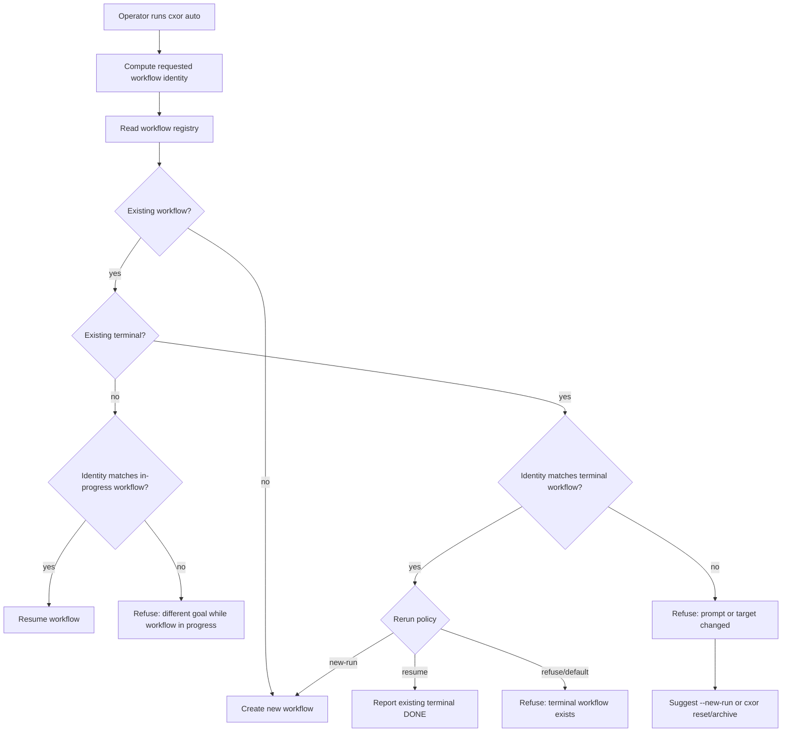
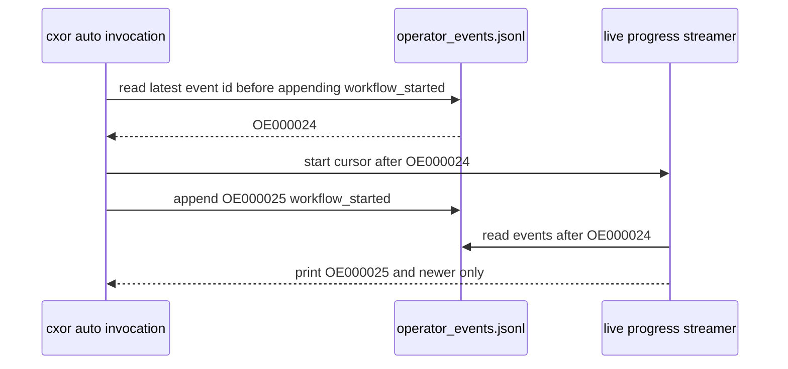
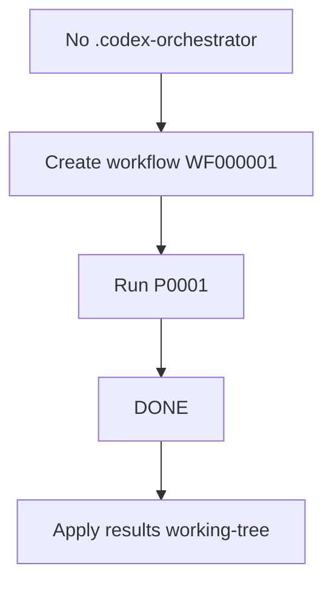
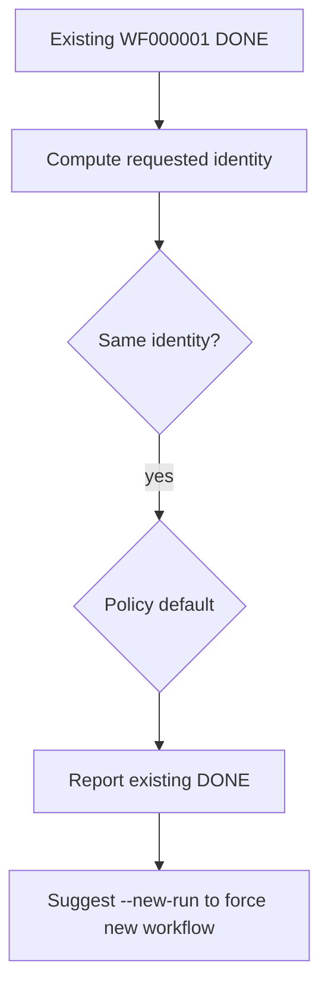
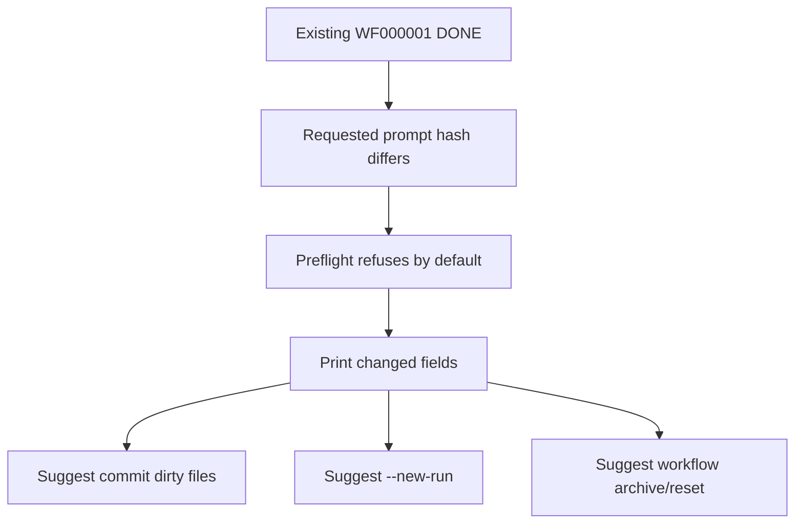
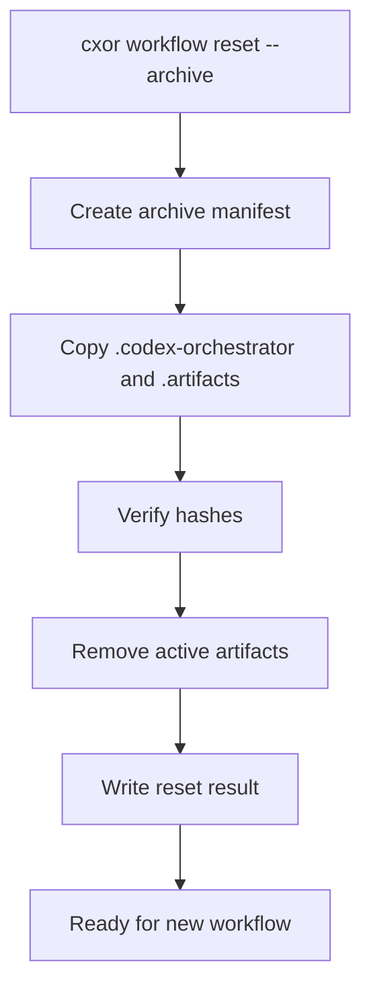

# Codex Orchestrator — Rerun, Reset, and Workflow Identity Architecture

Version target: post-`v0.1.0-rc3` architecture package  
Problem class: direct `cxor auto` re-run on a previously completed target silently reuses stale terminal workflow artifacts instead of starting or refusing a new goal.  
Status: architecture created from operator-provided reproduction and prior release-candidate evidence. Builder must gather local evidence before implementation.

---

## 1. Executive summary

The current release candidate has strong proof for a single clean workflow from a fresh target to `DONE`: direct real-Codex `cxor auto --live-progress` can run a patchlet, validate report ingestion, pass wrapper/target hygiene/integration gates, and reach `DONE`. The latest live proof after report-ingestion hardening showed real Codex emitted canonical object-shaped `probe_artifact_refs`, `report_ingestion_result.json` passed, `report_validation_errors.json` had no errors, wrapper gate accepted, integration validation passed, and target product files remained clean until explicit `apply-results`.

The new operator reproduction exposes a different lifecycle bug: after a workflow reaches `DONE` and results are applied to the target working tree, re-running `cxor auto` on the same repository appears to replay or reuse the previous terminal workflow. Even after the operator manually changes `app.py` from `"ok"` to `"ok me"`, and even after switching from `master_prompt.md` to a new `master_prompt_me.md`, `cxor auto` immediately reports `DONE` without doing meaningful new work. Live progress also appears to replay stale events or duplicate workflow-start events at `+000s`.

This architecture treats the issue as a workflow identity and lifecycle-boundary problem, not as a Codex worker problem. The orchestrator needs explicit semantics for:

1. When a workflow is resumed.
2. When a new workflow is created.
3. When an existing terminal workflow blocks a new request.
4. How master prompt changes are fingerprinted.
5. How target repository state changes are fingerprinted.
6. How manually applied or dirty working-tree changes are handled.
7. How stale operator events are kept out of a new live-progress stream.
8. How operators can safely archive, reset, or clear previous workflow artifacts.

---

## 2. Operator reproduction summary

The operator used a target repository whose `app.py` initially contained:

```python
def main():
    return "not ok"
```

The first direct real-Codex run used:

```bash
CODEX_PATCHLET_TIMEOUT_SECONDS=600 \
uv run --no-sync cxor auto \
  --repo /tmp/cxor-target \
  --master /tmp/cxor-target/master_prompt.md \
  --until DONE \
  --worker-mode real_codex \
  --use-worktree \
  --live-progress
```

That run reached `DONE`. The operator then applied results:

```bash
uv run --no-sync cxor apply-results --repo /tmp/cxor-target --mode working-tree
```

After apply-results, `app.py` became:

```python
def main():
    return "ok"
```

The operator then manually changed `app.py` to:

```python
def main():
    return "ok me"
```

A new direct `cxor auto` run on the original master prompt immediately reported `DONE`, with duplicated `workflow started` and old P0001 events. The operator then created a new prompt:

```text
Make app return me and prove it.
```

and ran `cxor auto` again with `--master /tmp/cxor-target/master_prompt_me.md`; it still immediately reported `DONE` and did not perform meaningful new work.

---

## 3. Known release-candidate baseline before this new problem

This new architecture does not replace the completed `v0.1.0-rc3` hardening. It builds on it.

The already proven capabilities include direct `cxor auto --live-progress` operator visibility, `operator_events.jsonl`, `cxor monitor`, `cxor status --json` and `--watch`, `cxor prompts`, `prompt_index.json`, loop governor warning and safe-failure modes, raw/canonical report ingestion, safe `probe_artifact_refs` normalization, structured report validation errors, report-contract prompt hardening, and a real-Codex live `DONE` proof on a fresh target.

This architecture must not regress any of those.

---

## 4. Problem statement

The orchestrator currently appears to treat the existence of `.codex-orchestrator/` and a terminal `DONE` state as enough to satisfy subsequent `cxor auto --until DONE` calls, even when the user's intent may have changed.

The user expectation is different:

- If the target repository changes after a previous fix, a subsequent `cxor auto` should either create a new workflow or refuse with a clear explanation.
- If the master prompt content or path changes, a subsequent `cxor auto` should not silently reuse the old workflow.
- If previous workflow artifacts exist and the user wants to start over, there must be a safe clear/archive/reset command.
- If the target working tree is dirty because of `apply-results --mode working-tree` or manual edits, the preflight must surface that state and give explicit choices.
- Live progress must show events for the current workflow invocation only. It must not replay stale events from an old terminal workflow as if they were current work.

---

## 5. Evidence still required before implementation

Implementation must not start until the builder produces an evidence report proving or disproving the following:

1. Whether `cxor auto` resumes a terminal `DONE` workflow by default.
2. Whether the master prompt path/content is included in any workflow identity.
3. Whether target HEAD/tree/working-tree dirtiness is included in any workflow identity.
4. Whether `apply-results --mode working-tree` result state is recorded and considered by later `auto` runs.
5. Whether the second and third `auto` runs actually invoked real Codex or merely replayed existing events.
6. Whether live progress starts reading `operator_events.jsonl` from the beginning instead of from the current invocation cursor.
7. Whether repeated `workflow started` lines are newly appended events, stale replayed events, or both.
8. Whether prompt index entries `PR000001` to `PR000003` are regenerated, overwritten, or replayed.
9. Whether run IDs remain fixed as `R0001` across repeated invocations.
10. Whether `.codex-orchestrator/state.json` stores only stage, not workflow identity.
11. Whether there is an existing reset/clear/archive command.
12. Whether manual dirty product files are ignored by preflight.
13. Whether the second prompt file `master_prompt_me.md` was untracked and whether that matters.
14. Whether `cxor status --json` can distinguish an existing terminal workflow from a new requested workflow.

---

## 6. Root-cause hypotheses

### 6.1 Terminal-state reuse hypothesis

`cxor auto --until DONE` may observe `state.stage == DONE` and return immediately, without comparing the requested master prompt or target state against the workflow that previously reached `DONE`.

### 6.2 Missing goal fingerprint hypothesis

The orchestrator may not persist a strong goal fingerprint containing master prompt absolute path, master prompt content SHA-256, target HEAD SHA at workflow creation, target tree SHA at workflow creation, target dirty status at workflow creation, orchestrator command options, worker mode, worktree mode, and apply-results state. Without this fingerprint, it cannot know that the operator is asking a new question.

### 6.3 Missing terminal workflow preflight hypothesis

The `auto` command may not have a preflight gate that says: existing workflow is terminal `DONE`; the requested prompt or target state differs; choose `--new-run`, `--resume`, or `cxor reset/archive`.

### 6.4 Missing safe reset/archive hypothesis

The operator cannot clear previous work through a supported CLI. Manual deletion of `.codex-orchestrator/` and `.artifacts/` is risky because it destroys evidence and can break hidden refs.

### 6.5 Dirty working-tree ambiguity hypothesis

After `apply-results --mode working-tree`, the target working tree is mutated. If the user does not commit the result and then manually edits the file again, the target is dirty. The orchestrator may neither refuse nor snapshot this state explicitly.

### 6.6 Stale live-progress replay hypothesis

The direct auto live-progress streamer may replay `operator_events.jsonl` from the beginning of the file on every invocation, instead of starting from an event cursor established at invocation start.

### 6.7 Artifact namespace collision hypothesis

Attempt IDs, prompt IDs, operator event IDs, run IDs, and patchlet IDs may be scoped only to the repository root rather than to a new workflow instance. Reusing P0001/PR000001/OE000001 semantics across reruns may hide whether current events are fresh.

### 6.8 Master prompt path/content change not represented hypothesis

Switching from `master_prompt.md` to `master_prompt_me.md` may not create a new goal because only the copied `.codex-orchestrator/master_prompt.md` from the previous run is read after the first initialization.

---

## 7. Architecture principles

1. Terminal workflows are immutable unless explicitly resumed for inspection.
2. New requested goals must be compared to persisted identity.
3. Ambiguous reruns must be refused, not guessed.
4. Operators need explicit lifecycle verbs: resume, start new workflow, archive, reset, list, and inspect workflow identity.
5. Reset must preserve evidence by default.
6. Live progress belongs to an invocation cursor.
7. Dirty target state is a first-class precondition.

---

## 8. Proposed architecture overview

The architecture adds five planes:

1. Workflow identity plane.
2. Rerun preflight plane.
3. Workflow registry and namespace plane.
4. Reset/archive plane.
5. Invocation-scoped operator event cursor plane.



---

## 9. Workflow identity model

A workflow identity is a persisted object representing what the workflow was created to do.

Suggested path:

```text
.codex-orchestrator/workflow_identity.json
```

If workflow namespacing is added, use:

```text
.codex-orchestrator/workflows/<workflow_id>/workflow_identity.json
```

Schema shape:

```json
{
  "schema_version": "1.0",
  "kind": "workflow_identity",
  "workflow_id": "WF000001",
  "run_id": "R0001",
  "created_at": "2026-07-03T21:40:01Z",
  "repo_root": "/tmp/cxor-target",
  "target_head_sha": "64ed3e2e9e0c8e82bf217e1f598528e86cc404cf",
  "target_tree_sha": "<git tree sha>",
  "target_dirty_status_at_start": [],
  "master_prompt_path": "/tmp/cxor-target/master_prompt.md",
  "master_prompt_sha256": "<sha256>",
  "master_prompt_size_bytes": 31,
  "master_prompt_first_line": "Make app return ok and prove it.",
  "worker_mode": "real_codex",
  "use_worktree": true,
  "until": "DONE",
  "orchestrator_version": "0.1.0",
  "command_args": {
    "worker_mode": "real_codex",
    "use_worktree": true,
    "until": "DONE"
  },
  "goal_fingerprint": "sha256:<hash>"
}
```

`goal_fingerprint` must be deterministic over target repository root canonical path, target HEAD SHA, target tree SHA, target dirty status policy, master prompt content SHA-256, master prompt path, worker mode, worktree setting, until target, and orchestrator major workflow schema version. The fingerprint must not include timestamps.

---

## 10. Rerun preflight gate

Write:

```text
.codex-orchestrator/rerun_preflight_result.json
```

or, with namespaces:

```text
.codex-orchestrator/workflows/<workflow_id>/rerun_preflight_result.json
```

The gate must compute requested workflow identity, read active/latest workflow identity, read workflow terminal state, read target git status, detect prompt path/content changes, detect target HEAD/tree changes, detect target working-tree dirtiness, detect previous apply-results mutation state, decide whether to create/resume/refuse/require explicit flags, and emit operator events plus CLI guidance.

Default policy should be conservative:

- No existing workflow: create new workflow.
- Existing in-progress workflow with same identity: resume.
- Existing in-progress workflow with different identity: refuse.
- Existing terminal workflow with same identity: report existing terminal state unless `--new-run` is supplied.
- Existing terminal workflow with different identity: refuse and suggest `--new-run` or reset/archive.
- Dirty product/runtime working tree at start: refuse by default unless a deliberately designed dirty-start mode exists.

---

## 11. CLI semantics

Add explicit flags:

```bash
cxor auto ... --resume
cxor auto ... --new-run
cxor auto ... --rerun-policy refuse|resume|new
cxor auto ... --allow-dirty-target-start
```

Add workflow lifecycle commands:

```bash
cxor workflow list --repo /tmp/cxor-target
cxor workflow list --repo /tmp/cxor-target --json
cxor workflow current --repo /tmp/cxor-target --json
cxor workflow archive --repo /tmp/cxor-target
cxor workflow archive --repo /tmp/cxor-target --out /tmp/cxor-archive.zip
cxor workflow reset --repo /tmp/cxor-target --archive
cxor workflow reset --repo /tmp/cxor-target --archive --yes
```

Existing commands must become workflow-aware: `cxor status`, `cxor monitor`, `cxor prompts`, `cxor validate-integration-artifacts`, and `cxor apply-results`.

---

## 12. Workflow registry and artifact namespace

Preferred long-term layout:

```text
.codex-orchestrator/
  workflow_registry.json
  current_workflow.json
  workflows/
    WF000001/
      state.json
      run_manifest.json
      operator_events.jsonl
      prompt_index.json
      patchlets/
      runs/
      reports/
      repair_plans/
      failures/
      integration/
  aliases/
    current -> workflows/WF000001
```

The existing top-level layout must continue to work. The first implementation may add identity and preflight gates without fully moving all artifacts. However, if top-level artifacts remain, new-run behavior must avoid overwriting old terminal evidence.

Two acceptable incremental options:

- Full workflow namespace migration.
- Archive-before-new-run as an incremental bridge.

---

## 13. Reset/archive architecture

Reset must preserve evidence by default.

Archive path suggestion:

```text
.cxor-archive/<timestamp>-<workflow_id>/
```

Archive manifest shape:

```json
{
  "schema_version": "1.0",
  "kind": "workflow_archive_manifest",
  "created_at": "2026-07-03T22:00:00Z",
  "repo_root": "/tmp/cxor-target",
  "workflow_id": "WF000001",
  "run_id": "R0001",
  "source_paths": [
    ".codex-orchestrator/",
    ".artifacts/"
  ],
  "archive_path": ".cxor-archive/20260703T220000-WF000001",
  "files": [
    {
      "path": ".codex-orchestrator/state.json",
      "size_bytes": 123,
      "sha256": "..."
    }
  ],
  "target_head_sha": "...",
  "target_status_before_archive": [],
  "destructive_delete": false
}
```

A destructive reset must require `--hard`, `--yes`, archive disabled only if explicitly requested, and a clear warning in CLI. First implementation should prefer archive-only reset.

---

## 14. Apply-results and rerun policy

`apply-results --mode working-tree` mutates the target working tree. If the user does not commit, subsequent `cxor auto` starts from a dirty target. If the user manually edits again, the target is even more ambiguous.

By default, a new workflow should require `git status --short` to have no product/runtime dirtiness. Allowed untracked evidence directories are `.codex-orchestrator/`, `.artifacts/`, and `.cxor-archive/`.

If `app.py` is dirty, `cxor auto --new-run` should refuse and print:

```text
Target product/runtime files are dirty. Commit, stash, or reset them before starting a new workflow.
```

After `apply-results --mode working-tree`, docs should recommend committing the result before a new workflow:

```bash
git -C /tmp/cxor-target status --short
git -C /tmp/cxor-target add app.py
git -C /tmp/cxor-target commit -m "Apply cxor result"
```

---

## 15. Invocation-scoped live progress

At command start, direct auto must read the last event ID from the active workflow's `operator_events.jsonl`. The live progress streamer for this invocation must subscribe only to events after that cursor.



`cxor monitor` may keep replay behavior. Direct auto live progress should not replay by default.

---

## 16. Rerun lifecycle examples

### 16.1 First run on fresh repo



### 16.2 Rerun same prompt without changes



### 16.3 Rerun different prompt



### 16.4 Clear previous work safely



---

## 17. Gates

### 17.1 Rerun preflight gate

Runs before any patchlet compilation or worker invocation. It rejects different prompts on existing terminal workflow without `--new-run`, changed target HEAD/tree on existing terminal workflow without `--new-run`, dirty product/runtime files by default, in-progress workflow with different identity, missing target git repository, and missing master prompt.

### 17.2 Workflow namespace gate

Ensures a new workflow will not overwrite old terminal evidence. It rejects new workflow writing to same run ID, new workflow writing to same attempt/prompt IDs without namespace/archive, and current pointer mismatch.

### 17.3 Reset/archive gate

Ensures reset preserves evidence unless explicitly destructive. It rejects reset without archive and without `--hard --yes`, archive hash mismatch, path traversal or symlink escape in archive paths, and removing product/runtime files.

### 17.4 Live-progress cursor gate

Ensures direct auto progress prints only current invocation events. It rejects or warns if the cursor cannot be established, event file is truncated unexpectedly, or new invocation receives old event IDs.

---

## 18. Schemas

Add or update:

- `workflow_identity.schema.json`
- `workflow_registry.schema.json`
- `rerun_preflight_result.schema.json`
- `workflow_archive_manifest.schema.json`
- `workflow_reset_result.schema.json`

---

## 19. Tests

### 19.1 Unit tests

Create tests for workflow identity hashing, prompt SHA detection, target tree SHA detection, dirty status classification, preflight difference comparison, event cursor behavior, registry read/write, and archive manifest hashing.

### 19.2 Integration tests

Create tests for first auto creating workflow identity, rerun same prompt on `DONE`, rerun different prompt on `DONE`, rerun after target file changed, `--new-run`, dirty product file blocking, committed new target state allowing new workflow, reset archiving artifacts, reset preserving product files, live progress not replaying stale events, status showing terminal workflow mismatch, and prompts command selecting workflow.

### 19.3 Regression tests

Must keep green: direct auto live progress, monitor/status/prompts, report ingestion, target hygiene, integration checkpoint validation, runbook validation/export/list, and apply-results behavior.

---

## 20. Risks

- Backward compatibility risk: moving artifacts under workflow namespaces may break commands that assume top-level paths.
- Evidence loss risk: reset could delete valuable evidence if not archive-first.
- Dirty target ambiguity risk: dirty-start workflows may be unreproducible.
- Event replay confusion risk: changing cursor behavior may hide old events in direct auto.
- Hidden ref cleanup risk: resetting artifacts may leave hidden integration refs.

---

## 21. Acceptance criteria

The architecture is complete when:

1. `cxor auto` no longer silently treats a previous `DONE` workflow as satisfying a changed prompt or changed target state.
2. A changed master prompt is detected by path and content SHA.
3. Dirty product/runtime files are detected before new workflow creation.
4. Operators can explicitly start a new workflow with `--new-run` after satisfying preconditions.
5. Operators can safely archive/reset previous workflow artifacts.
6. Live progress no longer replays stale events during a new invocation.
7. `cxor status` explains whether the current terminal state belongs to the requested goal.
8. `cxor prompts` and `cxor monitor` can operate against the intended workflow.
9. All prior `v0.1.0-rc3` gates remain green.

---

## 22. Architecture decision points for the builder evidence report

The builder must report enough evidence for these decisions:

1. Full workflow namespace now, or archive-before-new-run as the first increment?
2. Should `cxor auto` default to refusing terminal workflow reuse, or should same-identity terminal reuse print existing `DONE`?
3. Should `--new-run` require clean product files only, or should a dirty-start snapshot mode exist?
4. Should reset archive into target repo or orchestrator repo?
5. Should hidden integration refs be archived, pruned, or left intact?
6. Should workflow IDs be global per target or reset after archive?
7. Should prompt IDs and operator event IDs be workflow-scoped or globally monotonic?
8. Should `apply-results --mode working-tree` write a rerun warning artifact?
9. Should changing only master prompt path but not content count as a new goal?
10. Should untracked new master prompt files be allowed as master prompt input?
