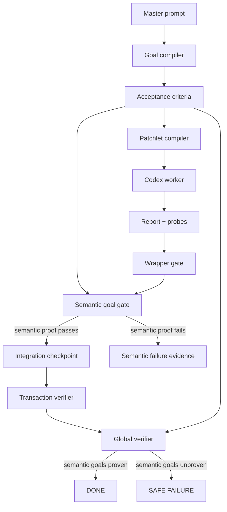

# Codex Orchestrator — Semantic Goal Satisfaction Architecture

Version target: after `v0.1.0-rc3` and after rerun/reset workflow identity hardening  
Architecture focus: prevent `DONE` when the requested semantic goal is unsatisfied  
Primary defect class: a fresh workflow for a changed master prompt reached `DONE` although `app.py` still returned the previous value

---

## 0. Executive summary

The rerun/reset lifecycle bug was fixed: a second run using `--new-run` created a new workflow ID, a new run ID, archived the previous workflow, and did not replay stale live-progress events.

The new evidence proves a different bug: **workflow-internal `DONE` is not equivalent to user-goal semantic satisfaction**.

The second workflow correctly recorded the new prompt:

```text
Make app return me and prove it.
```

However, the workflow accepted a `VERIFIED_NO_CHANGE_NEEDED` report, produced an empty final diff, and reached `DONE` while `app.py` still returned:

```python
def main():
    return "ok"
```

The system therefore needs a semantic goal-satisfaction plane that is independent of the worker's report. The plane must bind the master prompt to machine-checkable acceptance criteria, require those criteria to be proven by durable evidence, and make global verification fail when the requested behavior is not proven.

---

## 1. Evidence basis

The evidence report established these facts:

```text
- active workflow id: 20260703-225901-7753b788
- active run id: R0002
- active master prompt path: master_prompt_me.md
- active master prompt first line: Make app return me and prove it.
- second workflow reached DONE
- report status: VERIFIED_NO_CHANGE_NEEDED
- changed_product_runtime_file: None
- final_diff.patch size: 0
- integration ref app.py still returns "ok"
- target app.py still returns "ok"
- no independent verifier evidence proves app.main() == "me"
```

The worker's probe evidence is especially important. It included positive checks for `"ok"` and negative controls showing `"me"` failed, yet the report still claimed no change was needed:

```text
positive_control_main_returns_ok: pass
negative_control_main_returns_me: false/fail
status: VERIFIED_NO_CHANGE_NEEDED
acceptance_criteria_result: pass
```

This is a direct contradiction. The system accepted evidence that proved the *new* goal was not satisfied.

---

## 2. Root causes

### 2.1 Primary root cause

The orchestrator currently lacks a machine-checkable semantic goal contract. It can prove that a workflow is internally consistent, but not that the final product behavior satisfies the user's prompt.

### 2.2 Secondary root causes

1. The patchlet compiler does not preserve the changed prompt as structured acceptance criteria.
2. The worker prompt allows Codex to infer the expected behavior and to self-author probes.
3. The wrapper gate accepts schema-valid reports without independently checking the report's expected-vs-actual semantics against the requested goal.
4. `VERIFIED_NO_CHANGE_NEEDED` is trusted too much.
5. Transaction-group and global verifiers are deterministic but mostly internal-consistency verifiers.
6. Final verification can mark `G001` proven without a linked semantic proof.
7. Status surfaces workflow `DONE`, not semantic `DONE`.

---

## 3. Non-goals

This architecture does not attempt to solve every natural-language prompt.

It does not claim that arbitrary prompts can always be converted to executable checks.

It does not weaken existing gates.

It does not remove worker-authored probes.

It does not make real Codex optional or trusted for semantic truth.

It does not accept `DONE` based on prompt text alone.

It adds an independent semantic proof plane, starting with conservative built-in goal extraction for simple targets and a fallback requiring explicit acceptance criteria.

---

## 4. Design principles

1. **DONE must mean workflow-internal completion plus semantic goal satisfaction.**
2. **The master prompt must be preserved as data, not only text.**
3. **Structured acceptance criteria must be generated before patchlet execution.**
4. **Worker reports can support semantic proof but cannot be the only authority.**
5. **`VERIFIED_NO_CHANGE_NEEDED` requires independent verification.**
6. **If acceptance criteria cannot be derived, the workflow must ask for explicit criteria or safe-fail with evidence.**
7. **Semantic proof must be durable, machine-readable, and linked to final verification.**
8. **Global verification must re-run or validate semantic goal checks against the final integration ref.**
9. **Status must distinguish `workflow_done` from `semantic_done`.**
10. **Existing safety planes remain intact: report ingestion, target hygiene, integration validation, workflow identity, and live progress.**

---

## 5. Architecture overview



The key new component is the **Semantic Goal Gate**. It consumes:

```text
- structured goal spec
- acceptance criteria
- final integration candidate
- worker report
- worker probes
- orchestrator-owned semantic probes
```

It produces:

```text
.codex-orchestrator/semantic/goal_spec.json
.codex-orchestrator/semantic/acceptance_criteria.json
.codex-orchestrator/semantic/goal_verification_result.json
.codex-orchestrator/semantic/probes/<goal_id>/...
```

---

## 6. Semantic goal model

### 6.1 Artifact

```text
.codex-orchestrator/semantic/goal_spec.json
```

### 6.2 Schema

```json
{
  "schema_version": "1.0",
  "kind": "semantic_goal_spec",
  "workflow_id": "WF...",
  "run_id": "R0002",
  "master_prompt_path": "/tmp/.../master_prompt_me.md",
  "master_prompt_sha256": "f9f9...",
  "master_prompt_text": "Make app return me and prove it.",
  "goals": [
    {
      "goal_id": "G001",
      "goal_type": "python_function_return",
      "source": "builtin_prompt_parser",
      "confidence": "high",
      "target_file": "app.py",
      "function_name": "main",
      "expected_return_value": "me",
      "expected_return_type": "str",
      "requires_independent_verification": true,
      "acceptance_criteria_ids": ["AC001"]
    }
  ],
  "unparsed_requirements": [],
  "requires_explicit_acceptance_criteria": false
}
```

### 6.3 Supported initial goal type

Initial support should be deliberately narrow:

```text
python_function_return
```

Recognize patterns like:

```text
Make app return ok and prove it.
Make app return me and prove it.
Make app.py return "ready" and prove it.
Make main return done.
```

Do not overgeneralize. If the parser is uncertain, mark the goal as unparsed and require explicit criteria.

### 6.4 Unparsed goal behavior

If no machine-checkable criteria can be derived:

```json
{
  "requires_explicit_acceptance_criteria": true,
  "unparsed_requirements": [
    "Make the API safer and prove it."
  ]
}
```

The workflow may proceed only under a policy that allows unverifiable goals, and that policy must prevent semantic `DONE`. The default should be:

```text
safe-fail or refuse before real worker execution
```

---

## 7. Acceptance criteria model

### 7.1 Artifact

```text
.codex-orchestrator/semantic/acceptance_criteria.json
```

### 7.2 Schema

```json
{
  "schema_version": "1.0",
  "kind": "acceptance_criteria",
  "workflow_id": "WF...",
  "run_id": "R0002",
  "criteria": [
    {
      "criterion_id": "AC001",
      "goal_id": "G001",
      "criterion_type": "python_function_return_equals",
      "target_file": "app.py",
      "function_name": "main",
      "expected_value": "me",
      "expected_type": "str",
      "probe_command_template": "PYTHONDONTWRITEBYTECODE=1 python -B <probe>",
      "must_pass_before_done": true,
      "must_pass_for_verified_no_change_needed": true
    }
  ]
}
```

### 7.3 Acceptance criteria must flow into prompts

Patchlet subprompt and worker prompt must include:

```text
Semantic acceptance criteria:
- AC001: app.py main() must return "me".
- VERIFIED_NO_CHANGE_NEEDED is allowed only if AC001 already passes before any edit.
- If AC001 fails, do not report VERIFIED_NO_CHANGE_NEEDED.
- If AC001 fails and you can edit app.py, implement the smallest change and prove AC001 passes.
```

This is the direct correction for the failure mode where Codex checked `"ok"` instead of `"me"`.

---

## 8. Orchestrator-owned semantic probes

### 8.1 Artifact root

```text
.codex-orchestrator/semantic/probes/G001/
```

### 8.2 Probe result

```text
.codex-orchestrator/semantic/probes/G001/semantic_probe_result.json
```

### 8.3 Result schema

```json
{
  "schema_version": "1.0",
  "kind": "semantic_probe_result",
  "goal_id": "G001",
  "criterion_id": "AC001",
  "workflow_id": "WF...",
  "run_id": "R0002",
  "target_ref": "refs/cxor/runs/R0002/integration",
  "target_file": "app.py",
  "function_name": "main",
  "expected_value": "me",
  "actual_value": "ok",
  "passed": false,
  "probe_command": "PYTHONDONTWRITEBYTECODE=1 python -B ...",
  "stdout": "ok\n",
  "stderr": "",
  "created_at": "..."
}
```

### 8.4 Probe execution target

The semantic gate must run against the candidate final state, not only the target working tree.

Preferred order:

```text
1. integration ref / integration worktree
2. execution root candidate before acceptance
3. target working tree only for status display after apply-results
```

The semantic gate must not rely on stale target-root state.

---

## 9. Semantic goal gate

### 9.1 Gate artifact

```text
.codex-orchestrator/semantic/goal_verification_result.json
```

### 9.2 Result schema

```json
{
  "schema_version": "1.0",
  "kind": "semantic_goal_verification_result",
  "workflow_id": "WF...",
  "run_id": "R0002",
  "valid": false,
  "semantic_done": false,
  "goals": [
    {
      "goal_id": "G001",
      "status": "FAILED",
      "criterion_results": [
        {
          "criterion_id": "AC001",
          "expected_value": "me",
          "actual_value": "ok",
          "passed": false,
          "probe_result_path": ".codex-orchestrator/semantic/probes/G001/semantic_probe_result.json"
        }
      ]
    }
  ],
  "failed_goal_ids": ["G001"],
  "proven_goal_ids": [],
  "operator_summary": "Goal G001 failed: app.main() returned 'ok', expected 'me'."
}
```

### 9.3 Gate placement

The semantic gate must run in two places:

```text
1. Before accepting a patchlet with COMPLETE or VERIFIED_NO_CHANGE_NEEDED.
2. During global verification before DONE.
```

A worker can still produce a report, but the orchestrator-owned semantic gate must confirm it.

### 9.4 Acceptance policy

A patchlet may be accepted only if:

```text
wrapper gate accepted
target hygiene passed
integration validation passed
semantic goal gate passed for all must-pass criteria
```

For `VERIFIED_NO_CHANGE_NEEDED`, semantic proof is stricter:

```text
semantic criteria must pass before any edit or against current candidate state
changed_product_runtime_file must be null
final diff may be empty
but the expected behavior must already be true
```

The observed bad case must now fail:

```text
status: VERIFIED_NO_CHANGE_NEEDED
expected: "me"
actual: "ok"
=> semantic gate rejects
```

---

## 10. Global verifier changes

Global verification must include:

```text
- semantic goal verification result path
- proven semantic goal IDs
- unproven semantic goal IDs
- failed semantic goal IDs
- acceptance criteria result summary
```

`final_verification.json` must distinguish:

```text
workflow_artifacts_valid
transaction_groups_valid
semantic_goals_valid
status
```

Example:

```json
{
  "status": "SAFE_FAILURE",
  "workflow_artifacts_valid": true,
  "transaction_groups_valid": true,
  "semantic_goals_valid": false,
  "proven_goal_ids": [],
  "unproven_goal_ids": ["G001"],
  "failed_goal_ids": ["G001"],
  "semantic_goal_verification_result": ".codex-orchestrator/semantic/goal_verification_result.json"
}
```

`DONE` is allowed only when:

```text
workflow_artifacts_valid == true
transaction_groups_valid == true
semantic_goals_valid == true
unresolved_failures == []
```

---

## 11. Report schema additions

Patchlet reports should include structured semantic evidence fields.

Add optional fields first, then require them when a semantic goal spec exists:

```json
{
  "semantic_goal_results": [
    {
      "goal_id": "G001",
      "criterion_id": "AC001",
      "expected_value": "me",
      "actual_value": "ok",
      "passed": false,
      "probe_artifact_refs": []
    }
  ],
  "verified_no_change_reason": {
    "goal_id": "G001",
    "criterion_id": "AC001",
    "existing_behavior_satisfies_goal": false
  }
}
```

If `status` is `VERIFIED_NO_CHANGE_NEEDED`, the report must prove:

```text
semantic_goal_results[].passed == true
```

or the wrapper/semantic gate must reject it.

---

## 12. Failure categories

Add precise semantic categories:

```text
semantic_goal_not_satisfied
semantic_goal_unparsed
semantic_acceptance_criteria_missing
verified_no_change_without_semantic_proof
semantic_probe_failed
semantic_verifier_missing
```

These must appear in:

```text
failure records
operator events
diagnostics
loop governor
status
final verification
```

---

## 13. Operator visibility

### 13.1 Live progress examples

```text
[cxor +001s] semantic goal G001: app.py main() must return "me"
[cxor +010s] semantic probe G001 failed: expected "me", got "ok"
[cxor +010s] report P0001 claimed VERIFIED_NO_CHANGE_NEEDED but semantic goal failed
[cxor +011s] patchlet P0001 rejected: semantic_goal_not_satisfied
```

### 13.2 Status additions

`cxor status --json` should include:

```json
{
  "semantic": {
    "semantic_done": false,
    "goals": [
      {
        "goal_id": "G001",
        "expected": "me",
        "actual": "ok",
        "status": "FAILED"
      }
    ],
    "goal_verification_result": ".codex-orchestrator/semantic/goal_verification_result.json"
  }
}
```

---

## 14. CLI support for explicit acceptance criteria

Natural-language parsing should be conservative. Add optional CLI support:

```bash
cxor auto \
  --repo <target> \
  --master <prompt> \
  --acceptance "python:app.py:main==me"
```

Or a file-based form:

```bash
cxor auto \
  --repo <target> \
  --master <prompt> \
  --acceptance-file acceptance.json
```

Initial architecture can implement built-in parser first and leave CLI acceptance as a follow-up, but the design should reserve schema space.

---

## 15. Tests

### 15.1 Goal parser tests

```text
tests/unit/test_semantic_goal_parser.py
```

Cases:

```text
Make app return me and prove it. -> app.py main == "me"
Make app return ok and prove it. -> app.py main == "ok"
Make app.py return "ready" and prove it. -> app.py main == "ready"
ambiguous prompt -> unparsed, requires explicit criteria
```

### 15.2 Acceptance criteria artifact tests

```text
tests/integration/test_acceptance_criteria_artifacts.py
```

Verify:

```text
goal_spec.json written
acceptance_criteria.json written
workflow identity links to goal fingerprint
prompt includes acceptance criteria
prompt index references goal spec
```

### 15.3 Semantic probe tests

```text
tests/integration/test_semantic_goal_probe.py
```

Verify:

```text
semantic probe passes when main returns expected value
semantic probe fails when main returns wrong value
semantic probe runs against integration ref/candidate
semantic probe records expected and actual
semantic probe uses python -B / PYTHONDONTWRITEBYTECODE
```

### 15.4 Wrapper/semantic gate tests

```text
tests/integration/test_semantic_goal_gate.py
```

Cases:

```text
VERIFIED_NO_CHANGE_NEEDED rejected when expected me actual ok
VERIFIED_NO_CHANGE_NEEDED accepted when expected ok actual ok
COMPLETE accepted only when semantic probe passes
COMPLETE rejected when product diff exists but semantic probe fails
semantic gate result artifact validates
operator event emitted on failure
```

### 15.5 Global verifier tests

```text
tests/integration/test_global_verifier_semantic_goal.py
```

Cases:

```text
global verifier refuses DONE when semantic goals fail
global verifier allows DONE when semantic goals pass
final_verification.json includes semantic_goals_valid
status reflects semantic failure
```

### 15.6 Full-chain fake reproduction

```text
tests/integration/test_semantic_false_done_chain.py
```

Reproduce:

```text
target app.py returns "ok"
master_prompt_me.md says return me
fake worker writes VERIFIED_NO_CHANGE_NEEDED
report structurally valid
semantic gate rejects
workflow does not reach DONE
failure category semantic_goal_not_satisfied
```

---

## 16. Risk analysis

| Risk | Impact | Mitigation |
|---|---|---|
| Natural-language parsing is too broad | false criteria | keep parser narrow and explicit |
| Goal parser misses valid prompts | safe failure | allow explicit acceptance criteria file |
| Semantic probe mutates target | target pollution | run in isolated integration worktree and use python -B |
| Worker-authored evidence conflicts with orchestrator probe | confusion | orchestrator semantic probe is authoritative |
| Existing tests assume DONE means artifact-only valid | regressions | update tests to include semantic validity |
| False positives for `VERIFIED_NO_CHANGE_NEEDED` continue | severe | require semantic proof for that status |
| Complex prompts cannot be verified | safe failure | expose clear explicit-criteria path |

---

## 17. Rollout plan

Phase 1: Evidence and architecture approval.  
Phase 2: Goal parser for simple Python return prompts.  
Phase 3: Acceptance criteria artifacts.  
Phase 4: Orchestrator-owned semantic probes.  
Phase 5: Semantic gate before patchlet acceptance.  
Phase 6: Global verifier semantic enforcement.  
Phase 7: Report schema/status/operator event integration.  
Phase 8: Documentation.  
Phase 9: Deterministic full-chain reproduction.  
Phase 10: Manual real-Codex rerun smoke.

---

## 18. Acceptance criteria for the architecture

The architecture is successful when the observed bad case is impossible:

```text
master_prompt_me.md: Make app return me and prove it.
app.py: return "ok"
worker report: VERIFIED_NO_CHANGE_NEEDED
```

must produce:

```text
semantic_goal_not_satisfied
workflow not DONE
operator-visible expected="me", actual="ok"
durable semantic probe evidence
```

A valid no-change case remains possible:

```text
master_prompt.md: Make app return ok and prove it.
app.py: return "ok"
worker report: VERIFIED_NO_CHANGE_NEEDED
semantic probe: pass
workflow: DONE
```

Final DONE now means:

```text
artifact gates pass
report gates pass
target hygiene passes
integration validates
transaction groups pass
semantic goals pass
global verifier passes
```
