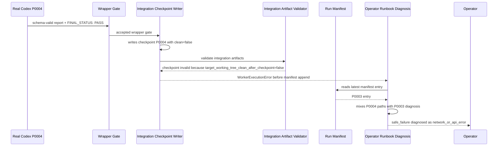
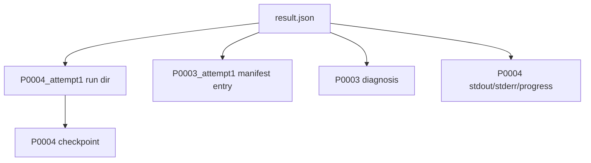
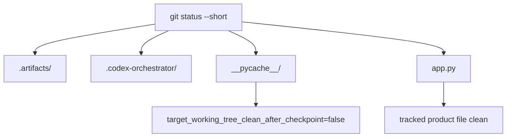
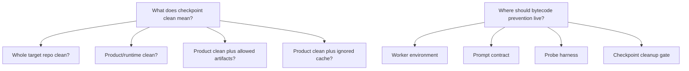

# Evidence Report — P0004 Integration Checkpoint Cleanliness, Manifest/Diagnosis Mismatch, and Misclassified Network Diagnosis

## 1. Investigation scope

- implementation stopped: yes
- no code changes made: yes
- no tests changed: yes
- no docs changed: yes
- real Codex rerun performed: no during this investigation; existing preserved bundle from the prior operator-approved rerun was inspected
- evidence files created: `p0004_integration_checkpoint_failure_evidence_report.md`, `p0004_integration_checkpoint_failure_evidence_raw_commands.md`, `p0004_integration_checkpoint_failure_artifact_index.json`

## 2. Baseline

- Python: Python 3.10.20
- uv: uv 0.11.23 (x86_64-unknown-linux-gnu)
- codex version: codex-cli 0.142.4
- initial full test result: 819 passed, 2 skipped in 61.20s
- git status at start: existing uncommitted implementation/test/doc changes from prior increments; listed in raw command appendix
- current branch: main
- HEAD: 0941c7e76648fb79b98da83cf957d137caec8bfb
- version command outputs: `codex-orchestrator 0.1.0` for `python -m codex_orchestrator`, `cxor --version`, and `codex-orchestrator --version`

## 3. Latest operator-run bundle

- latest run dir: `.operator-runs/real-codex-smoke/2026-07-03T16-28-35-real-codex-smoke`
- list command: `uv run --no-sync cxor list-real-codex-smoke-runbooks --latest --json`
- list output: latest bundle valid, `outcome=safe_failure`, `diagnosis_primary_category=network_or_api_error`, `model=gpt-5.4-mini`, `reasoning=medium`, `timeout_seconds=600`, `timed_out=false`
- validation command: `uv run --no-sync cxor validate-real-codex-smoke-runbook --run-dir .operator-runs/real-codex-smoke/2026-07-03T16-28-35-real-codex-smoke`
- validation output: `valid=true`, `errors=[]`, `warnings=[]`
- export command: `uv run --no-sync cxor export-real-codex-smoke-runbook --run-dir .operator-runs/real-codex-smoke/2026-07-03T16-28-35-real-codex-smoke`
- export output: archive `.operator-runs/exports/2026-07-03T16-28-35-real-codex-smoke.zip`, manifest `.operator-runs/exports/2026-07-03T16-28-35-real-codex-smoke.zip.manifest.json`, `valid=true`
- artifact index path: `p0004_integration_checkpoint_failure_artifact_index.json`

## 4. Bundle artifact inventory

- files: 14 files under the latest runbook bundle
- sizes: recorded per file in `p0004_integration_checkpoint_failure_artifact_index.json`
- sha256: recorded per file in `p0004_integration_checkpoint_failure_artifact_index.json`
- copied diagnosis artifacts: `diagnosis.json`, `diagnosis.md`
- result.json summary: safe_failure, parsed error `WorkerExecutionError: integration artifact validation failed`, top-level diagnosis `network_or_api_error`
- validation_result.json summary: bundle validation valid with no errors/warnings
- diagnosis_paths.json summary: copied diagnosis files point to P0003 diagnosis; stdout/stderr/output/progress/run_dir point to P0004
- selected_policy.json summary: real run, not dry run, live progress enabled, model `gpt-5.4-mini`, reasoning `medium`, patchlet timeout 600 seconds

## 5. Result.json evidence

- explicit_smoke outcome: safe_failure
- explicit_smoke exit_code: 0
- parsed_smoke attempt_id: P0003_attempt1
- parsed_smoke error_type: WorkerExecutionError
- parsed_smoke error_message: integration artifact validation failed
- parsed_smoke diagnosis_primary_category: network_or_api_error
- parsed_smoke run_dir: `/tmp/pytest-of-theyeq-admin-lap/pytest-459/test_real_codex_auto_worktree_0/target/.codex-orchestrator/runs/P0004_attempt1`
- parsed_smoke output_jsonl_path: P0004 output path
- parsed_smoke progress_path: P0004 progress path
- run_manifest_entry attempt_id: P0003_attempt1
- run_manifest_entry patchlet_id: P0003
- run_manifest_entry status: VERIFIED_NO_CHANGE_NEEDED
- run_manifest_entry report_valid: true
- mismatch evidence: `result.json` combines P0004 run paths with P0003 manifest/diagnosis fields. The explicit failure message is integration artifact validation failure, but diagnosis was generated for P0003.

## 6. Diagnosis evidence

- diagnosis JSON path: target `.codex-orchestrator/diagnostics/real_codex/P0003_attempt1_diagnosis.json`, copied as bundle `diagnosis.json`
- diagnosis MD path: target `.codex-orchestrator/diagnostics/real_codex/P0003_attempt1_diagnosis.md`, copied as bundle `diagnosis.md`
- diagnosis attempt_id: P0003_attempt1
- diagnosis patchlet_id: P0003
- primary category: network_or_api_error
- summary: captured stderr or output.jsonl contains network, API, timeout, or model availability error text
- error_type: none in diagnosis worker_failure block
- error_message: empty in diagnosis worker_failure block
- referenced paths: mostly P0003 stdout/stderr/output/progress/command, but prompt_artifact references P0004 `codex_task_prompt.md`
- whether diagnosis matches failing attempt: no; failing run artifacts are P0004, diagnosis object is P0003
- evidence for stale diagnosis: P0004 checkpoint/validation failure exists, P0004 run dir exists, P0004 report exists, but run_manifest has only P0001-P0003 and diagnosis was generated from latest manifest entry P0003
- evidence against stale diagnosis: none found

## 7. Target repo evidence

- target repo path: `/tmp/pytest-of-theyeq-admin-lap/pytest-459/test_real_codex_auto_worktree_0/target`
- target exists: yes
- git status --short: `?? .artifacts/`, `?? .codex-orchestrator/`, `?? __pycache__/`
- git status --porcelain: same three untracked roots
- app.py diff: empty
- git diff --stat: empty
- untracked files: `.artifacts/...`, `.codex-orchestrator/...`, `__pycache__/app.cpython-310.pyc`
- __pycache__ paths: `/tmp/pytest-of-theyeq-admin-lap/pytest-459/test_real_codex_auto_worktree_0/target/__pycache__/app.cpython-310.pyc`, size 279, mtime Jul 3 16:38 local
- classification table:

| Path | Git status | Category | Product/runtime? | Artifact? | Cache? | Should checkpoint count as dirty? |
|---|---|---|---|---|---|---|
| `.artifacts/` | untracked | probe evidence | no | yes | no | current code ignores |
| `.codex-orchestrator/` | untracked | workflow evidence | no | yes | no | current code ignores |
| `__pycache__/app.cpython-310.pyc` | untracked | Python bytecode cache | no source product file, but derived from target app.py | no | yes | current code counts as dirty |
| `app.py` | clean | product/runtime | yes | no | no | no dirty evidence |

## 8. P0004 run evidence

- P0004 run dir: target `.codex-orchestrator/runs/P0004_attempt1`
- command.json facts: real Codex exited 0, timed_out false, timeout_seconds 600, model `gpt-5.4-mini`, reasoning `medium`
- execution_root: `/tmp/cxor-p0004-zbebnxgi`
- target_root: `/tmp/pytest-of-theyeq-admin-lap/pytest-459/test_real_codex_auto_worktree_0/target`
- artifact_root: target repo root
- env facts: command metadata did not show `PYTHONDONTWRITEBYTECODE`, `PYTHONPYCACHEPREFIX`, or `python -B` enforcement
- timeout facts: duration about 216 seconds, no timeout
- stdout/stderr/progress facts: P0004 stdout shows probe creation, canonical final report, `git status --short` inside execution root reported `?? __pycache__/`, then Codex cleaned `/tmp/cxor-p0004-zbebnxgi/__pycache__`; stderr shows an attempted `rm -rf` rejected and an `apply_patch` failure on binary pyc, followed by Python cleanup
- wrapper gate result: accepted true, final_status_gate present, final_status_marker `FINAL_STATUS: PASS`, canonical true, reasons empty
- final report marker: first line exactly `FINAL_STATUS: PASS`
- report JSON summary: schema-valid report, status VERIFIED_NO_CHANGE_NEEDED, changed_product_runtime_file null, probe proves target/execution app.py hashes equal and app.main returns ok
- probe artifact summary: P0004 probe file and run_001 JSON/JSONL artifacts exist under `.artifacts/probes/P0004`
- search results for __pycache__/target imports: P0004 probe uses `importlib.util.spec_from_file_location`; P0004 report includes `python .../.artifacts/probes/P0004/probe.py`; stdout records execution-root cache cleanup; target pyc metadata names target-root app.py
- evidence that P0004 created cache: strongly supported by P0004 probe importing target-root app.py without bytecode suppression and target pyc code filename referencing target-root app.py; exact creator event for target-root pyc is not directly logged
- evidence against P0004 creating cache: none direct, but P0004 stdout only explicitly mentions cleaning execution-root cache, not target-root cache
- unresolved facts: exact command/process that wrote target-root pyc is not logged as a pyc creation event

## 9. Integration checkpoint evidence

- checkpoint path: target `.codex-orchestrator/integration/checkpoints/P0004.json`
- checkpoint JSON: patchlet P0004, attempt P0004_attempt1, changed_product_runtime_files empty, previous and new integration SHA identical, wrapper gate points to P0004, `target_working_tree_clean_after_checkpoint=false`
- target_working_tree_clean_after_checkpoint value: false
- integration validation command: `uv run --no-sync cxor validate-integration-artifacts --repo /tmp/pytest-of-theyeq-admin-lap/pytest-459/test_real_codex_auto_worktree_0/target`
- integration validation output: invalid; error path `.codex-orchestrator/integration/checkpoints/P0004.json`, schema `integration_checkpoint.schema.json`, message `True was expected`
- schema path: `src/codex_orchestrator/schemas/integration_checkpoint.schema.json`
- schema constraint: `target_working_tree_clean_after_checkpoint` has `const: true`
- related tests/docs: `test_integration_checkpoint_schema_rejects_dirty_target_flag_false` asserts false is invalid; architecture docs describe target working tree remains clean between patchlets
- interpretation: current checkpoint writer wrote false because git status included a non-ignored path (`__pycache__/`), not because product/runtime `app.py` was dirty

## 10. Checkpoint writer source evidence

- functions inspected: `record_accepted_change`, `_target_product_runtime_clean`, `_write_integration_validation_result`, `snapshot_status`
- cleanliness function name: `_target_product_runtime_clean`
- exact ignored paths: `.codex-orchestrator/`, `.artifacts/`
- whether __pycache__ is ignored: no
- whether product/runtime dirtiness is separated: no; any non-ignored git status path returns false
- whether artifact dirtiness is separated: only by prefix skip for `.codex-orchestrator/` and `.artifacts/`
- whether whole repo cleanliness is checked: effectively yes for every path not under the two ignored artifact prefixes
- where checkpoint is written: `record_accepted_change()` writes P0004 checkpoint
- where validation is called: `run_patchlet.py` calls `_write_integration_validation_result(ctx)` immediately after `record_accepted_change()`
- whether validation can fail before manifest append: yes; source lines show `raise WorkerExecutionError("integration artifact validation failed")` before `append_run_record(...)`

## 11. Run manifest evidence

- run_manifest path: target `.codex-orchestrator/run_manifest.json`
- run entries summary: three entries only: P0001, P0002, P0003
- P0001 entry: FAILED_WITH_EVIDENCE, report_valid false
- P0002 entry: FAILED_WITH_EVIDENCE, report_valid false
- P0003 entry: VERIFIED_NO_CHANGE_NEEDED, report_valid true, integration validation valid true
- P0004 entry: absent
- P0004 run dir exists: yes
- P0004 command exists: yes
- P0004 report exists: yes
- P0004 wrapper gate exists: yes
- P0004 checkpoint exists: yes
- evidence for missing P0004 manifest entry: run_manifest count is 3; no P0004 entry; source ordering raises before append
- evidence against missing P0004 manifest entry: none found

## 12. Runbook diagnosis-selection evidence

- source files inspected: `src/codex_orchestrator/real_codex_smoke.py`, `src/codex_orchestrator/diagnostics.py`
- latest run dir selection: `_latest_run_dir()` sorts run dirs and chooses latest, P0004
- latest manifest entry selection: `_latest_patchlet_run_entry()` chooses last manifest run, P0003
- diagnosis attempt selection: `_smoke_result()` calls `diagnose_real_codex_attempt()` with `run_manifest_entry["attempt_id"]`, P0003
- stdout/stderr/progress path selection: `_smoke_result()` records paths from latest run dir, P0004
- result.json field mapping: P0004 paths plus P0003 manifest/diagnosis fields
- evidence of P0004/P0003 mismatch: result.json and diagnosis_paths.json explicitly show P0004 run paths while diagnosis_json_path is P0003
- unresolved facts: none for this mismatch; source and artifact evidence align

## 13. Diagnosis classifier evidence

- classifier source inspected: `src/codex_orchestrator/diagnostics.py`
- network keyword triggers: combined stdout/stderr/output_jsonl scan for `network`, `api`, `rate limit`, `timeout`, `connection`, `model unavailable`
- structured category precedence: worker capsule, report schema, wrapper marker, stage/TG routing, target-dirty integration, then broad output scan
- integration validation category exists: no evidence found
- checkpoint cleanliness category exists: no evidence found
- stage precondition category exists: yes, but it depends on manifest worker_failure; P0004 has no manifest entry
- keyword hits in P0004 output: many hits in normal contract/metadata, including timeout budget and model fields; P0003 diagnosis was actually produced from P0003 output
- keyword hit context classification: prompt/contract/time-budget/model metadata, not proven external network/API failure
- evidence for misclassification: failure message was integration artifact validation failed; preserved validation result identifies checkpoint schema error; diagnosis category was network_or_api_error from stale P0003 evidence
- evidence against misclassification: none found

## 14. Bytecode/cache behavior evidence

- command metadata: P0004 command uses `codex exec --cd /tmp/cxor-p0004-zbebnxgi`; no bytecode-related env fields recorded
- PYTHONDONTWRITEBYTECODE present: not found
- PYTHONPYCACHEPREFIX present: not found
- python -B used: not found in P0004 probe command
- prompt/capsule mentions bytecode: no bytecode/cache prohibition found in inspected P0004 prompt/capsule search results
- probe imports target root: yes, `TARGET_APP = TARGET_ROOT / "app.py"` and `spec.loader.exec_module(module)`
- subprocess cwd target root: an early failed probe used subprocess `python -c 'import app; print(app.main())'`; final probe used importlib direct load
- cleanup evidence: execution-root cache was cleaned; no target-root cache cleanup evidence found
- exact cache files: target `__pycache__/app.cpython-310.pyc`, code filename target `app.py`, source size 28, source mtime 2026-07-03T14:28:35Z
- timestamps if available: filesystem listing showed Jul 3 16:38 local for target pyc

## 15. Evidence graphs

### 15.1 Observed live failure sequence



### 15.2 Artifact/path mismatch map



### 15.3 Cleanliness classification



### 15.4 Architecture decision questions



## 16. Root-cause evidence matrix

| Candidate Root Cause | Evidence For | Evidence Against | Proven Status | Missing Evidence | Impacted Architecture Area |
|---|---|---|---|---|---|
| P0004 left target-root __pycache__ | target status shows `?? __pycache__/`; pyc code filename is target `app.py`; P0004 probe imported target app | no direct log line saying target pyc created | Strongly supported | exact creation event | probe/cache policy, checkpoint cleanliness |
| P0004 imported target-root app.py without bytecode suppression | P0004 probe uses `spec_from_file_location` on target app; command was `python probe.py`; no `-B` found | none | Proven | none | Worker/probe contract |
| checkpoint cleanliness check is broader than intended | function name says product runtime clean but returns false for any non-ignored path | could be intentionally strict by schema/docs | Strongly supported | architecture intent decision | integration checkpoint semantics |
| checkpoint cleanliness schema is stricter than current writer semantics | schema requires true; writer can write false | strictness may be intentional | Proven | intended response to false | schema/writer contract |
| run_manifest append happens after integration validation and can be skipped by exception | source ordering shows raise before append; artifacts show no P0004 manifest entry | none | Proven | none | run lifecycle/evidence durability |
| operator runbook diagnosis selects stale manifest entry when latest attempt lacks manifest entry | source selects latest run dir separately from latest manifest entry; result mixes P0004 paths and P0003 entry | none | Proven | none | runbook evidence selection |
| diagnosis classifier lacks integration artifact validation category | no category found; failure classified network/API | maybe future uninspected branch elsewhere, but diagnostics source is direct path | Proven | none | diagnosis taxonomy |
| network_or_api_error keyword matching is too broad | classifier scans combined output for broad words; diagnosis support is output.jsonl; context contains normal timeout/model text | no actual network/API error found | Strongly supported | exact keyword hit in P0003 event not isolated line-by-line | diagnosis precedence/filtering |
| Worker Capsule/prompt lacks bytecode-cache instructions | searches found no bytecode suppression instructions | prompt could imply cleanup generally | Strongly supported | full prompt not manually read end-to-end after truncation | Worker Capsule/probe contract |
| target-root artifact/cache policy is under-specified | artifacts ignored, cache not ignored; schema says clean true only | docs say target clean but not cache-specific in inspected output | Strongly supported | architect decision | cleanliness taxonomy |

## 17. Proven facts

- Latest bundle validates and exports.
- Latest bundle outcome is safe_failure, not timeout.
- P0004 report exists and is schema-valid by observed gate/report artifacts.
- P0004 wrapper gate accepted with canonical `FINAL_STATUS: PASS`.
- Target `app.py` has no git diff.
- Target repo has untracked `.artifacts/`, `.codex-orchestrator/`, and `__pycache__/`.
- P0004 checkpoint recorded `target_working_tree_clean_after_checkpoint=false`.
- Integration validation failed because checkpoint schema expected true for that field.
- P0004 has no run_manifest entry.
- Source order can raise integration validation failure before `append_run_record()`.
- Runbook result mixes P0004 run paths with P0003 manifest/diagnosis evidence.

## 18. Strongly supported but not fully proven facts

- P0004’s target-root import created the target-root pyc.
- The target-root pyc was the non-ignored path that made `_target_product_runtime_clean()` return false.
- `network_or_api_error` was caused by broad keyword matching on stale/non-failure output rather than a real external API/network error.

## 19. Disproven hypotheses

- P0004 failed because of a non-canonical final marker: disproven; marker was canonical and wrapper gate accepted.
- P0004 failed because report JSON was invalid: disproven by wrapper gate/report evidence.
- P0004 dirtied `app.py`: disproven by empty `git diff -- app.py`.
- P0004 timed out: disproven by command metadata and runbook listing.

## 20. Unknowns and missing evidence

- Exact file creation event for target `__pycache__/app.cpython-310.pyc` is not logged.
- Whether target-root cache should be ignored, prevented, cleaned, or treated as violation is an architecture decision.
- Whether checkpoint cleanliness should mean whole-repo clean or product/runtime clean is not settled by evidence alone.
- Whether runbook result schemas should enforce attempt consistency is an architecture decision.

## 21. Architecture input questions

1. Should target_working_tree_clean_after_checkpoint mean whole Git tree clean, or product/runtime clean?
2. Should .codex-orchestrator/ and .artifacts/ always be ignored for checkpoint cleanliness?
3. Should __pycache__/ be ignored, prevented, cleaned, or treated as a violation?
4. Should workers be launched with PYTHONDONTWRITEBYTECODE=1?
5. Should probes be required to use python -B?
6. Should target-root imports be forbidden unless bytecode suppression is active?
7. Should checkpoint schema include separate fields for product_runtime_clean, artifact_clean, cache_clean, and whole_repo_clean?
8. Should integration validation fail on cache dirtiness or classify it separately?
9. Should run_manifest entries be appended before integration validation, after integration validation, or both with a pending/final lifecycle?
10. Should runbook diagnosis prefer latest run dir evidence over latest manifest entry if manifest append failed?
11. Should diagnosis have categories for integration_artifact_validation_error and integration_checkpoint_target_cleanliness_error?
12. Should network_or_api_error require actual external error evidence instead of broad keyword hits?
13. Should operator-run bundles detect attempt mismatches between run_dir, manifest_entry, diagnosis, stdout/stderr/progress paths?
14. Should a StagePreconditionError always record the stage name, artifact path, and validation error in result.json?

## 22. Commands appendix

See `p0004_integration_checkpoint_failure_evidence_raw_commands.md`.

## 23. Final git status

```text
 M IMPLEMENTATION_STATUS.md
 M README.md
 M docs/cli.md
 M docs/real_codex_smoke.md
 M docs/release.md
 M docs/runbooks/real_codex_smoke_runbook.md
 M src/codex_orchestrator/diagnostics.py
 M src/codex_orchestrator/prompt_templates/real_codex_patchlet_contract.md
 M src/codex_orchestrator/stages/regenerate_patchlets.py
 M src/codex_orchestrator/stages/run_patchlet.py
 M src/codex_orchestrator/stages/verify_group.py
 M src/codex_orchestrator/worker_capsule.py
 M src/codex_orchestrator/workers/codex_exec.py
 M tests/integration/test_real_codex_failure_diagnosis.py
?? p0004_integration_checkpoint_failure_artifact_index.json
?? p0004_integration_checkpoint_failure_evidence_raw_commands.md
?? p0004_integration_checkpoint_failure_evidence_report.md
?? real_codex_report_contract_failure_evidence_note.md
?? real_codex_tg001_routing_failure_evidence_note.md
?? repair_patchlet_report_contract_hardening_implementation_note.md
?? tests/integration/test_real_codex_prompt_contract.py
?? tests/integration/test_real_codex_report_contract_enforcement.py
?? tests/integration/test_real_codex_verified_no_change_chain.py
?? tests/integration/test_regenerate_patchlets_transaction_group_source_resolution.py
?? tests/integration/test_transaction_group_failure_source_modeling.py
?? tests/integration/test_worker_capsule_final_report_contract.py
?? tests/integration/test_worker_capsule_report_contract.py
?? tests/integration/test_wrapper_gate_final_status_marker.py
?? tests/unit/test_docs_report_contract_hardening.py
?? tests/unit/test_docs_wrapper_gate_and_tg_routing_hardening.py
?? verified_no_change_wrapper_gate_and_tg_repair_routing_implementation_note.md
```

## 24. Final conclusion

The evidence proves that P0004 itself reached a valid no-change worker outcome: schema-valid report, canonical final marker, accepted wrapper gate, clean product/runtime file. The failure occurred after acceptance when checkpoint validation rejected P0004 because `target_working_tree_clean_after_checkpoint` was false. The false value is explained by current cleanliness code counting non-ignored untracked paths, and the target had an untracked `__pycache__/` while `app.py` was clean.

The evidence also proves a manifest/diagnosis mismatch: P0004 artifacts exist, but P0004 was not appended to run_manifest because integration validation raised first. The runbook then selected P0004 as latest run dir and P0003 as latest manifest entry, producing a stale P0003 diagnosis with P0004 paths. The network/API diagnosis is not supported by the structured failure; the structured failure is integration artifact/checkpoint validation.

The evidence is sufficient for the Architect Layer to design checkpoint cleanliness semantics, bytecode/cache policy, manifest lifecycle, runbook attempt consistency checks, and diagnosis categories. The only important missing evidence is a direct logged file-creation event for target-root `__pycache__`; the pyc metadata and P0004 probe behavior strongly support but do not independently timestamp the creator command.
